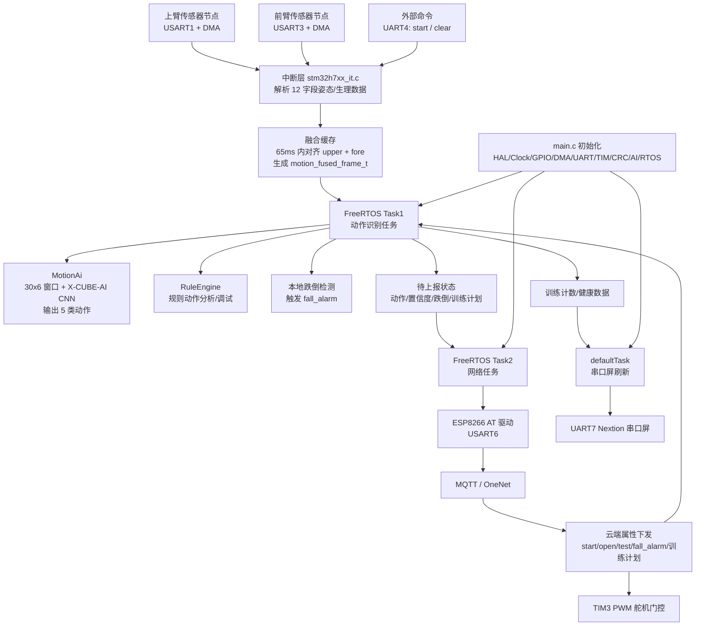

# 帮我滤清一下这整个H743项目的架构以及配置和使用，并且给我看一下架构示意图
_Exported on 06/03/2026 at 10:08:38 GMT+8 from OpenAI Codex via WayLog_

**OpenAI Codex**

<permissions instructions>
Filesystem sandboxing defines which files can be read or written. `sandbox_mode` is `workspace-write`: The sandbox permits reading files, and editing files in `cwd` and `writable_roots`. Editing files in other directories requires approval. Network access is restricted.
# Escalation Requests

Commands are run outside the sandbox if they are approved by the user, or match an existing rule that allows it to run unrestricted. The command string is split into independent command segments at shell control operators, including but not limited to:

- Pipes: |
- Logical operators: &&, ||
- Command separators: ;
- Subshell boundaries: (...), $(...)

Each resulting segment is evaluated independently for sandbox restrictions and approval requirements.

Example:

git pull | tee output.txt

This is treated as two command segments:

["git", "pull"]

["tee", "output.txt"]

Commands that use more advanced shell features like redirection (>, >>, <), substitutions ($(...), ...), environment variables (FOO=bar), or wildcard patterns (*, ?) will not be evaluated against rules, to limit the scope of what an approved rule allows.

## How to request escalation

IMPORTANT: To request approval to execute a command that will require escalated privileges:

- Provide the `sandbox_permissions` parameter with the value `"require_escalated"`
- Include a short question asking the user if they want to allow the action in `justification` parameter. e.g. "Do you want to download and install dependencies for this project?"
- Optionally suggest a `prefix_rule` - this will be shown to the user with an option to persist the rule approval for future sessions.

If you run a command that is important to solving the user's query, but it fails because of sandboxing or with a likely sandbox-related network error (for example DNS/host resolution, registry/index access, or dependency download failure), rerun the command with "require_escalated". ALWAYS proceed to use the `justification` parameter - do not message the user before requesting approval for the command.

## When to request escalation

While commands are running inside the sandbox, here are some scenarios that will require escalation outside the sandbox:

- You need to run a command that writes to a directory that requires it (e.g. running tests that write to /var)
- You need to run a GUI app (e.g., open/xdg-open/osascript) to open browsers or files.
- If you run a command that is important to solving the user's query, but it fails because of sandboxing or with a likely sandbox-related network error (for example DNS/host resolution, registry/index access, or dependency download failure), rerun the command with `require_escalated`. ALWAYS proceed to use the `sandbox_permissions` and `justification` parameters. do not message the user before requesting approval for the command.
- You are about to take a potentially destructive action such as an `rm` or `git reset` that the user did not explicitly ask for.
- Be judicious with escalating, but if completing the user's request requires it, you should do so - don't try and circumvent approvals by using other tools.

## prefix_rule guidance

When choosing a `prefix_rule`, request one that will allow you to fulfill similar requests from the user in the future without re-requesting escalation. It should be categorical and reasonably scoped to similar capabilities. You should rarely pass the entire command into `prefix_rule`.

### Banned prefix_rules 
Avoid requesting overly broad prefixes that the user would be ill-advised to approve. For example, do not request ["python3"], ["python", "-"], or other similar prefixes that would allow arbitrary scripting.
NEVER provide a prefix_rule argument for destructive commands like rm.
NEVER provide a prefix_rule if your command uses a heredoc or herestring. 

### Examples
Good examples of prefixes:
- ["npm", "run", "dev"]
- ["gh", "pr", "check"]
- ["cargo", "test"]

## Approved command prefixes
The following prefix rules have already been approved: - ["C:\\WINDOWS\\System32\\WindowsPowerShell\\v1.0\\powershell.exe", "-Command", "Get-ChildItem source/img | Select-Object Name,Length"]
- ["C:\\WINDOWS\\System32\\WindowsPowerShell\\v1.0\\powershell.exe", "-Command", "git mv source/img/background.jpg source/img/backgroud.jpg"]
- ["C:\\WINDOWS\\System32\\WindowsPowerShell\\v1.0\\powershell.exe", "-Command", "Get-Help Format-Hex -Parameter * | Select-Object -First 60"]
- ["C:\\WINDOWS\\System32\\WindowsPowerShell\\v1.0\\powershell.exe", "-Command", "Get-ChildItem -Force source/img | Select-Object Name,Length,LastWriteTime"]
- ["C:\\WINDOWS\\System32\\WindowsPowerShell\\v1.0\\powershell.exe", "-Command", "Select-String -Path _config.fluid.yml -Pattern 'emo_fish|menu' -Context 0,3"]
- ["C:\\WINDOWS\\System32\\WindowsPowerShell\\v1.0\\powershell.exe", "-Command", "if(Test-Path source/emo/index.html){Get-Content -Raw source/emo/index.html}"]
- ["C:\\WINDOWS\\System32\\WindowsPowerShell\\v1.0\\powershell.exe", "-Command", "if (Test-Path .gitignore) { Get-Content -Raw .gitignore } else { 'NO_GITIGNORE' }"]
- ["C:\\WINDOWS\\System32\\WindowsPowerShell\\v1.0\\powershell.exe", "-Command", "Move-Item -LiteralPath source/img/background.jpg -Destination source/img/backgroud.jpg"]
- ["C:\\WINDOWS\\System32\\WindowsPowerShell\\v1.0\\powershell.exe", "-Command", "Get-ChildItem -Recurse -File source/login,source/gift,source/imgs,source/css | Select-Object FullName"]
- ["C:\\WINDOWS\\System32\\WindowsPowerShell\\v1.0\\powershell.exe", "-Command", "$b = Get-Content -Encoding Byte -TotalCount 3 _config.fluid.yml; $b | ForEach-Object { '{0:X2}' -f $_ }"]
- ["C:\\WINDOWS\\System32\\WindowsPowerShell\\v1.0\\powershell.exe", "-Command", "if (Test-Path source/css/custom.css) { Get-Content -Raw source/css/custom.css } else { 'NO_CUSTOM_CSS' }"]
- ["C:\\WINDOWS\\System32\\WindowsPowerShell\\v1.0\\powershell.exe", "-Command", "$tmp=[System.IO.Path]::GetTempFileName(); Copy-Item source/gift/index.html $tmp -Force; Write-Output $tmp"]
- ["C:\\WINDOWS\\System32\\WindowsPowerShell\\v1.0\\powershell.exe", "-Command", "$tmp=[System.IO.Path]::GetTempFileName(); Copy-Item source/login/index.html $tmp -Force; Write-Output $tmp"]
- ["C:\\WINDOWS\\System32\\WindowsPowerShell\\v1.0\\powershell.exe", "-Command", "$i=0; Get-Content -Encoding UTF8 source/gift/index.html | % { $i++; if($i -le 20){ '{0,4}: {1}' -f $i, $_ } }"]
- ["C:\\WINDOWS\\System32\\WindowsPowerShell\\v1.0\\powershell.exe", "-Command", "$i=0; Get-Content -Encoding UTF8 source/gift/index.html | ForEach-Object { $i++; if($i -le 30){ '{0,4}: {1}' -f $i, $_ } }"]
- ["C:\\WINDOWS\\System32\\WindowsPowerShell\\v1.0\\powershell.exe", "-Command", "$i=0; Get-Content themes/fluid/_config.yml | ForEach-Object { $i++; if($i -ge 220 -and $i -le 260){ '{0,4}: {1}' -f $i, $_ } }"]
- ["C:\\WINDOWS\\System32\\WindowsPowerShell\\v1.0\\powershell.exe", "-Command", "Get-ChildItem -Recurse -File source | Where-Object { $_.Name -match '^favicon\\.(png|ico|jpg|jpeg)$' } | Select-Object FullName,Name"]
- ["C:\\WINDOWS\\System32\\WindowsPowerShell\\v1.0\\powershell.exe", "-Command", "rg -n \"给 XX|把想说的话|照片故事|六张小小|最后一个小彩蛋|secretText|emo🐟 生日快乐\" source/gift/index.html"]
- ["C:\\WINDOWS\\System32\\WindowsPowerShell\\v1.0\\powershell.exe", "-Command", "Select-String -Path _config.fluid.yml -Encoding utf8 -Pattern 'blog_title|emo🐟|生日快乐' -AllMatches | ForEach-Object { $_.Line }"]
- ["C:\\WINDOWS\\System32\\WindowsPowerShell\\v1.0\\powershell.exe", "-Command", "$i=0; Get-Content -Encoding UTF8 source/gift/index.html | ForEach-Object { $i++; if($i -ge 120 -and $i -le 260){ '{0,4}: {1}' -f $i, $_ } }"]
- ["C:\\WINDOWS\\System32\\WindowsPowerShell\\v1.0\\powershell.exe", "-Command", "$i=0; Get-Content -Encoding UTF8 source/gift/index.html | ForEach-Object { $i++; if($i -ge 270 -and $i -le 380){ '{0,4}: {1}' -f $i, $_ } }"]
- ["C:\\WINDOWS\\System32\\WindowsPowerShell\\v1.0\\powershell.exe", "-Command", "$i=0; Get-Content -Encoding UTF8 source/gift/index.html | ForEach-Object { $i++; if($i -ge 280 -and $i -le 390){ '{0,4}: {1}' -f $i, $_ } }"]
- ["C:\\WINDOWS\\System32\\WindowsPowerShell\\v1.0\\powershell.exe", "-Command", "$i=0; Get-Content -Encoding UTF8 source/gift/index.html | ForEach-Object { $i++; if($i -ge 318 -and $i -le 372){ '{0,4}: {1}' -f $i, $_ } }"]
- ["C:\\WINDOWS\\System32\\WindowsPowerShell\\v1.0\\powershell.exe", "-Command", "$i=0; Get-Content -Encoding UTF8 source/gift/index.html | ForEach-Object { $i++; if($i -ge 392 -and $i -le 520){ '{0,4}: {1}' -f $i, $_ } }"]
- ["C:\\WINDOWS\\System32\\WindowsPowerShell\\v1.0\\powershell.exe", "-Command", "$i=0; Get-Content -Encoding UTF8 source/login/index.html | ForEach-Object { $i++; if($i -ge 180 -and $i -le 260){ '{0,4}: {1}' -f $i, $_ } }"]
- ["C:\\WINDOWS\\System32\\WindowsPowerShell\\v1.0\\powershell.exe", "-Command", "Test-Path source/img/backgroud.jpg; if(Test-Path source/img/backgroud.jpg){ Get-Item source/img/backgroud.jpg | Select-Object FullName,Length,LastWriteTime }"]
- ["C:\\WINDOWS\\System32\...
[Some commands were truncated]

`approvals_reviewer` is `auto_review`: Sandbox escalations with require_escalated will be reviewed for compliance with the policy. If a rejection happens, you should proceed only with a materially safer alternative, or inform the user of the risk and send a final message to ask for approval.
 The writable root is `D:\Qian Start\Smart Watch\H743`.
</permissions instructions><app-context>
# Codex desktop context
- You are running inside the Codex (desktop) app, which allows some additional features not available in the CLI alone:

### Images/Visuals/Files
- In the app, the model can display images and videos using standard Markdown image syntax: 
- When sending or referencing a local image or video, always use an absolute filesystem path in the Markdown image tag (e.g., ); relative paths and plain text will not render the media.
- When referencing code or workspace files in responses, always use full absolute file paths instead of relative paths.
- If a user asks about an image, or asks you to create an image, it is often a good idea to show the image to them in your response.
- Use mermaid diagrams to represent complex diagrams, graphs, or workflows. Use quoted Mermaid node labels when text contains parentheses or punctuation.
- Return web URLs as Markdown links (e.g., [label](https://example.com)).

### Workspace Dependencies
- For sheets, slides, and documents, call `load_workspace_dependencies` to find the bundled runtime and libraries.

### Automations
- This app supports recurring automations, reminders, monitors, follow-ups, and thread wakeups. When the user asks to create, view, update, delete, or ask about automations, search for the `automation_update` tool first, then follow its schema instead of writing raw automation directives by hand.

### Inline Code Comments
- Use the ::code-comment{...} directive when you need to attach feedback directly to specific code lines.
- Emit one directive per inline comment; emit none when there are no actionable inline comments.
- Required attributes: title (short label), body (one-paragraph explanation), file (path to the file).
- Optional attributes: start, end (1-based line numbers), priority (0-3).
- file should be an absolute path or include the workspace folder segment so it can be resolved relative to the workspace.
- Keep line ranges tight; end defaults to start.
- Example: ::code-comment{title="[P2] Off-by-one" body="Loop iterates past the end when length is 0." file="/path/to/foo.ts" start=10 end=11 priority=2}

### Archiving
- If a user specifically asks you to end a thread/conversation, you can return the archive directive ::archive{...} to archive the thread/conversation.
- Example: ::archive{reason="User requested to end conversation"}
</app-context><collaboration_mode># Collaboration Mode: Default

You are now in Default mode. Any previous instructions for other modes (e.g. Plan mode) are no longer active.

Your active mode changes only when new developer instructions with a different `<collaboration_mode>...</collaboration_mode>` change it; user requests or tool descriptions do not change mode by themselves. Known mode names are Default and Plan.

## request_user_input availability

Use the `request_user_input` tool only when it is listed in the available tools for this turn.

In Default mode, strongly prefer making reasonable assumptions and executing the user's request rather than stopping to ask questions. If you absolutely must ask a question because the answer cannot be discovered from local context and a reasonable assumption would be risky, ask the user directly with a concise plain-text question. Never write a multiple choice question as a textual assistant message.
</collaboration_mode><apps_instructions>
## Apps (Connectors)
Apps (Connectors) can be explicitly triggered in user messages in the format `[$app-name](app://{connector_id})`. Apps can also be implicitly triggered as long as the context suggests usage of available apps.
An app is equivalent to a set of MCP tools within the `codex_apps` MCP.
An installed app's MCP tools are either provided to you already, or can be lazy-loaded through the `tool_search` tool. If `tool_search` is available, the apps that are searchable by `tools_search` will be listed by it.
Do not additionally call list_mcp_resources or list_mcp_resource_templates for apps.
</apps_instructions><skills_instructions>
## Skills
A skill is a set of local instructions to follow that is stored in a `SKILL.md` file. Below is the list of skills that can be used. Each entry includes a name, description, and file path so you can open the source for full instructions when using a specific skill.
### Available skills
- imagegen: Generate or edit raster images when the task benefits from AI-created bitmap visuals such as photos, illustrations, textures, sprites, mockups, or transparent-background cutouts. Use when Codex should create a brand-new image, transform an existing image, or derive visual variants from references, and the output should be a bitmap asset rather than repo-native code or vector. Do not use when the task is better handled by editing existing SVG/vector/code-native assets, extending an established icon or logo system, or building the visual directly in HTML/CSS/canvas. (file: C:/Users/33709/.codex/skills/.system/imagegen/SKILL.md)
- openai-docs: Use when the user asks how to build with OpenAI products or APIs and needs up-to-date official documentation with citations, help choosing the latest model for a use case, or model upgrade and prompt-upgrade guidance; prioritize OpenAI docs MCP tools, use bundled references only as helper context, and restrict any fallback browsing to official OpenAI domains. (file: C:/Users/33709/.codex/skills/.system/openai-docs/SKILL.md)
- plugin-creator: Create and scaffold plugin directories for Codex with a required `.codex-plugin/plugin.json`, optional plugin folders/files, valid manifest defaults, and personal-marketplace entries by default. Use when Codex needs to create a new personal plugin, add optional plugin structure, generate or update marketplace entries for plugin ordering and availability metadata, or update an existing local plugin during development with the CLI-driven cachebuster and reinstall flow. (file: C:/Users/33709/.codex/skills/.system/plugin-creator/SKILL.md)
- skill-creator: Guide for creating effective skills. This skill should be used when users want to create a new skill (or update an existing skill) that extends Codex's capabilities with specialized knowledge, workflows, or tool integrations. (file: C:/Users/33709/.codex/skills/.system/skill-creator/SKILL.md)
- skill-installer: Install Codex skills into $CODEX_HOME/skills from a curated list or a GitHub repo path. Use when a user asks to list installable skills, install a curated skill, or install a skill from another repo (including private repos). (file: C:/Users/33709/.codex/skills/.system/skill-installer/SKILL.md)
- canva:canva-branded-presentation: Create on-brand Canva presentations from a brief, outline, existing Canva doc, or design link. Use when the user wants a branded slide deck, wants to turn notes into a presentation, or needs a presentation generated in Canva with the right brand kit and a clear slide plan. (file: C:/Users/33709/.codex/plugins/cache/openai-curated/canva/6188456f/skills/canva-branded-presentation/SKILL.md)
- canva:canva-resize-for-all-social-media: Resize a Canva design into standard social media formats and prepare export-ready results. Use when the user wants one Canva design adapted across multiple social platforms such as Facebook, Instagram, and LinkedIn, especially when they want all variants produced in one pass. (file: C:/Users/33709/.codex/plugins/cache/openai-curated/canva/6188456f/skills/canva-resize-for-all-social-media/SKILL.md)
- canva:canva-translate-design: Translate the text in a Canva design into another language while preserving the original layout as much as possible. Use when the user wants a localized or translated version of an existing Canva design and expects the original file to remain unchanged. (file: C:/Users/33709/.codex/plugins/cache/openai-curated/canva/6188456f/skills/canva-translate-design/SKILL.md)
- documents:documents: Create, edit, redline, and comment on `.docx`, Word, and Google Docs-targeted document artifacts inside the container, with a strict render-and-verify workflow. Use `render_docx.py` to generate page PNGs (and optional PDF) for visual QA, then iterate until layout is flawless before delivering the final document. (file: C:/Users/33709/.codex/plugins/cache/openai-primary-runtime/documents/26.521.10419/skills/documents/SKILL.md)
- docx: Use this skill whenever the user wants to create, read, edit, or manipulate Word documents (.docx files). Triggers include: any mention of 'Word doc', 'word document', '.docx', or requests to produce professional documents with formatting like tables of contents, headings, page numbers, or letterheads. Also use when extracting or reorganizing content from .docx files, inserting or replacing images in documents, performing find-and-replace in Word files, working with tracked changes or comments, or converting content into a polished Word document. If the user asks for a 'report', 'memo', 'letter', 'template', or similar deliverable as a Word or .docx file, use this skill. Do NOT use for PDFs, spreadsheets, Google Docs, or general coding tasks unrelated to document generation. (file: C:/Users/33709/.codex/skills/docx/SKILL.md)
- drawio-skill: Use when user requests diagrams, flowcharts, architecture charts, or visualizations. Also use proactively when explaining systems with 3+ components, complex data flows, or relationships that benefit from visual representation. Generates .drawio XML files and exports to PNG/SVG/PDF locally using the native draw.io desktop CLI. (file: C:/Users/33709/.agents/skills/drawio-skill/SKILL.md)
- find-skills: Helps users discover and install agent skills when they ask questions like "how do I do X", "find a skill for X", "is there a skill that can...", or express interest in extending capabilities. This skill should be used when the user is looking for functionality that might exist as an installable skill. (file: C:/Users/33709/.agents/skills/find-skills/SKILL.md)
- frontend-design: Frontend design skill for Claude Code, Codex, and Gemini CLI. Eight aesthetic anchors, each locking palette, typography, and texture to specific CSS tokens. Pick one per brief. (file: C:/Users/33709/.codex/skills/frontend-design/SKILL.md)
- frontend-slides: Create stunning, animation-rich HTML presentations from scratch or by converting PowerPoint files. Use when the user wants to build a presentation, convert a PPT/PPTX to web, or create slides for a talk/pitch. Helps non-designers discover their aesthetic through visual exploration rather than abstract choices. (file: C:/Users/33709/.agents/skills/frontend-slides/SKILL.md)
- github:gh-address-comments: Address actionable GitHub pull request review feedback. Use when the user wants to inspect unresolved review threads, requested changes, or inline review comments on a PR, then implement selected fixes. Use the GitHub app for PR metadata and flat comment reads, and use the bundled GraphQL script via `gh` whenever thread-level state, resolution status, or inline review context matters. (file: C:/Users/33709/.codex/plugins/cache/openai-curated/github/6188456f/skills/gh-address-comments/SKILL.md)
- github:gh-fix-ci: Use when a user asks to debug or fix failing GitHub PR checks that run in GitHub Actions. Use the GitHub app from this plugin for PR metadata and patch context, and use `gh` for Actions check and log inspection before implementing any approved fix. (file: C:/Users/33709/.codex/plugins/cache/openai-curated/github/6188456f/skills/gh-fix-ci/SKILL.md)
- github:github: Triage and orient GitHub repository, pull request, and issue work through the connected GitHub app. Use when the user asks for general GitHub help, wants PR or issue summaries, or needs repository context before choosing a more specific GitHub workflow. (file: C:/Users/33709/.codex/plugins/cache/openai-curated/github/6188456f/skills/github/SKILL.md)
- github:yeet: Publish local changes to GitHub by confirming scope, committing intentionally, pushing the branch, and opening a draft PR through the GitHub app from this plugin, with `gh` used only as a fallback where connector coverage is insufficient. (file: C:/Users/33709/.codex/plugins/cache/openai-curated/github/6188456f/skills/yeet/SKILL.md)
- karpathy-guidelines: Behavioral guidelines to reduce common LLM coding mistakes. Use when writing, reviewing, or refactoring code to avoid overcomplication, make surgical changes, surface assumptions, and define verifiable success criteria. (file: C:/Users/33709/.codex/skills/karpathy-guidelines/SKILL.md)
- planning-with-files:planning-with-files: Implements Manus-style file-based planning to organize and track progress on complex tasks. Creates task_plan.md, findings.md, and progress.md. Use when asked to plan out, break down, or organize a multi-step project, research task, or any work requiring 5+ tool calls. Supports automatic session recovery after /clear. (file: C:/Users/33709/.codex/skills/planning-with-files/skills/planning-with-files/SKILL.md)
- planning-with-files:planning-with-files-zh: 基于 Manus 风格的文件规划系统，用于组织和跟踪复杂任务的进度。创建 task_plan.md、findings.md 和 progress.md 三个文件。当用户要求规划、拆解或组织多步骤项目、研究任务或需要超过5次工具调用的工作时使用。支持 /clear 后的自动会话恢复。触发词：任务规划、项目计划、制定计划、分解任务、多步骤规划、进度跟踪、文件规划、帮我规划、拆解项目 (file: C:/Users/33709/.codex/skills/planning-with-files/skills/planning-with-files-zh/SKILL.md)
- pptx: Use this skill any time a .pptx file is involved in any way — as input, output, or both. This includes: creating slide decks, pitch decks, or presentations; reading, parsing, or extracting text from any .pptx file (even if the extracted content will be used elsewhere, like in an email or summary); editing, modifying, or updating existing presentations; combining or splitting slide files; working with templates, layouts, speaker notes, or comments. Trigger whenever the user mentions "deck," "slides," "presentation," or references a .pptx filename, regardless of what they plan to do with the content afterward. If a .pptx file needs to be opened, created, or touched, use this skill. (file: C:/Users/33709/.codex/skills/pptx/SKILL.md)
- presentations:Presentations: Build PowerPoint PPTX decks with artifact-tool presentation JSX (file: C:/Users/33709/.codex/plugins/cache/openai-primary-runtime/presentations/26.521.10419/skills/presentations/SKILL.md)
- spreadsheets:Spreadsheets: Use this skill when a user requests to create, modify, analyze, visualize, or work with spreadsheet files (`.xlsx`, `.xls`, `.csv`, `.tsv`) or Google Sheets-targeted spreadsheet artifacts with formulas, formatting, charts, tables, and recalculation. (file: C:/Users/33709/.codex/plugins/cache/openai-primary-runtime/spreadsheets/26.521.10419/skills/spreadsheets/SKILL.md)
- wechat-miniprogram-skill: Expert guidelines for Native WeChat Mini Program development focusing on performance, code size, and native compatibility. Use when developing WeChat Mini Programs in native JavaScript. (file: C:/Users/33709/.agents/skills/wechat-miniprogram-skill/SKILL.md)
### How to use skills
- Discovery: The list above is the skills available in this session (name + description + file path). Skill bodies live on disk at the listed paths.
- Trigger rules: If the user names a skill (with `$SkillName` or plain text) OR the task clearly matches a skill's description shown above, you must use that skill for that turn. Multiple mentions mean use them all. Do not carry skills across turns unless re-mentioned.
- Missing/blocked: If a named skill isn't in the list or the path can't be read, say so briefly and continue with the best fallback.
- How to use a skill (progressive disclosure):
  1) After deciding to use a skill, open its `SKILL.md`. Read only enough to follow the workflow.
  2) When `SKILL.md` references relative paths (e.g., `scripts/foo.py`), resolve them relative to the skill directory listed above first, and only consider other paths if needed.
  3) If `SKILL.md` points to extra folders such as `references/`, load only the specific files needed for the request; don't bulk-load everything.
  4) If `scripts/` exist, prefer running or patching them instead of retyping large code blocks.
  5) If `assets/` or templates exist, reuse them instead of recreating from scratch.
- Coordination and sequencing:
  - If multiple skills apply, choose the minimal set that covers the request and state the order you'll use them.
  - Announce which skill(s) you're using and why (one short line). If you skip an obvious skill, say why.
- Context hygiene:
  - Keep context small: summarize long sections instead of pasting them; only load extra files when needed.
  - Avoid deep reference-chasing: prefer opening only files directly linked from `SKILL.md` unless you're blocked.
  - When variants exist (frameworks, providers, domains), pick only the relevant reference file(s) and note that choice.
- Safety and fallback: If a skill can't be applied cleanly (missing files, unclear instructions), state the issue, pick the next-best approach, and continue.
</skills_instructions><plugins_instructions>
## Plugins
A plugin is a local bundle of skills, MCP servers, and apps. Below is the list of plugins that are enabled and available in this session.
### Available plugins
- `Canva`: Search, create, edit designs
- `Documents`: Create and edit document artifacts in Codex, including Word files and Google Docs.
- `GitHub`: Inspect repositories, triage pull requests and issues, debug CI, and publish changes through a hybrid GitHub connector and CLI workflow.
- `Presentations`: Create, edit, render, verify, and export presentation slide decks. Use when Codex needs to build or modify a deck, slidedeck, presentation deck, slide deck, slides, PowerPoint, Google Slides, PPT, PPTX, .ppt, or .pptx file.
- `Spreadsheets`: Create, edit, analyze, visualize, render, and export spreadsheets or Google Sheets-ready workbooks in Codex.
### How to use plugins
- Discovery: The list above is the plugins available in this session.
- Skill naming: If a plugin contributes skills, those skill entries are prefixed with `plugin_name:` in the Skills list.
- Trigger rules: If the user explicitly names a plugin, prefer capabilities associated with that plugin for that turn.
- Relationship to capabilities: Plugins are not invoked directly. Use their underlying skills, MCP tools, and app tools to help solve the task.
- Preference: When a relevant plugin is available, prefer using capabilities associated with that plugin over standalone capabilities that provide similar functionality.
- Missing/blocked: If the user requests a plugin that is not listed above, or the plugin does not have relevant callable capabilities for the task, say so briefly and continue with the best fallback.
</plugins_instructions>

---

**User**

帮我滤清一下这整个H743项目的架构以及配置和使用，并且给我看一下架构示意图

---

**OpenAI Codex**

我会只读取当前 `H743` 项目内容，不做任何修改。先从目录结构、构建配置、入口文件和 README/脚本入手，再把模块关系和使用方式整理成一张示意图。

---

**OpenAI Codex**

`rg` 在这个环境里被拒绝执行，我改用 PowerShell 原生命令递归列文件。现在重点看工程元数据、启动入口、BSP、AI 中间件和 MDK 工程配置。

---

**OpenAI Codex**

目前看这是 STM32CubeMX 生成的 STM32H743 工程，外加用户层 BSP、FreeRTOS 和 X-CUBE-AI。接下来我会缩小到业务代码，确认各串口、任务、AI 推理和云/屏幕模块的实际调用链。

---

**OpenAI Codex**

业务主线已经比较清楚：两个传感器串口输入在中断里对齐融合，Task1 做动作识别/规则/跌倒逻辑，Task2 负责 ESP8266 + MQTT + OneNet，defaultTask 刷串口屏。我再核对 MDK 工程、外设引脚和最终编译入口，避免只按源码猜测。

---

**OpenAI Codex**

我只读了当前 `D:\Qian Start\Smart Watch\H743` 项目，没有改文件。

**整体定位**
这是一个基于 `STM32H743ZIT6` 的主控工程：接收两个传感器节点数据，做姿态融合、动作识别、规则分析、跌倒告警，并通过 `ESP8266 + MQTT` 接入 OneNet，同时驱动串口屏和舵机门控。项目说明也这么描述：[说明文档.txt](<D:/Qian Start/Smart Watch/H743/说明文档.txt:1>)。

**架构示意图**

**目录分层**
`Core` 是 CubeMX 生成加用户业务逻辑的核心层，入口在 [Core/Src/main.c](<D:/Qian Start/Smart Watch/H743/Core/Src/main.c:83>)，FreeRTOS 任务在 [Core/Src/freertos.c](<D:/Qian Start/Smart Watch/H743/Core/Src/freertos.c:229>)，串口中断和传感器融合在 [Core/Src/stm32h7xx_it.c](<D:/Qian Start/Smart Watch/H743/Core/Src/stm32h7xx_it.c:377>)。

`BSP` 是板级业务驱动：`ESP8266`、`MqttKit`、`onenet`、`uart_screen`、`health_monitor`、`debug_uart7`。云平台配置在 [BSP/onenet.h](<D:/Qian Start/Smart Watch/H743/BSP/onenet.h:6>)，Wi-Fi/OneNet 主机配置在 [BSP/ESP8266.h](<D:/Qian Start/Smart Watch/H743/BSP/ESP8266.h:6>)。

`X-CUBE-AI` 是 STM32Cube.AI 生成的神经网络代码，封装入口是 `AppXCubeAI_Run()`：[X-CUBE-AI/App/app_x-cube-ai.c](<D:/Qian Start/Smart Watch/H743/X-CUBE-AI/App/app_x-cube-ai.c:145>)。

`Middlewares` 放 FreeRTOS 和 ST AI runtime，`Drivers` 放 CMSIS/HAL，`SYSTEM` 是正点原子的 delay/sys/usart 基础库，`MDK-ARM` 是 Keil 工程。

**关键配置**
MCU 是 `STM32H743ZIT6 / STM32H743ZITx`，CubeMX 版本 `6.17.0`，固件包 `STM32Cube FW_H7 V1.12.1`，工具链 `MDK-ARM V5.32`：[Master.ioc](<D:/Qian Start/Smart Watch/H743/Master.ioc:187>)。

主频配置为 CPU `480MHz`，HCLK `240MHz`：[Master.ioc](<D:/Qian Start/Smart Watch/H743/Master.ioc:333>)。FreeRTOS 使用 CMSIS-RTOS v2，创建 `defaultTask`、`Task1`、`Task2` 三个线程：[Core/Src/freertos.c](<D:/Qian Start/Smart Watch/H743/Core/Src/freertos.c:229>)。

串口配置基本都是 `115200`。当前角色大致是：
`USART1` 接上臂传感器，`USART3` 接前臂传感器，`UART4` 接收 `start/clear` 控制命令，`USART6` 接 ESP8266，`UART7` 当前配置为串口屏，`USART2` 主要用于 printf/调试链路。UART7 当前角色在 [BSP/uart7_role.h](<D:/Qian Start/Smart Watch/H743/BSP/uart7_role.h:13>)。

AI 模型输入是 `30 x 6` 浮点窗口，输出 `5` 类动作：[X-CUBE-AI/App/app_x-cube-ai.h](<D:/Qian Start/Smart Watch/H743/X-CUBE-AI/App/app_x-cube-ai.h:14>)。模型报告显示是 Keras `action_cnn`，`134,192 MACC`，总占用约 `57,868B Flash`、`8,068B RAM`：[X-CUBE-AI/App/network_generate_report.txt](<D:/Qian Start/Smart Watch/H743/X-CUBE-AI/App/network_generate_report.txt:1>)。

**运行流程**
上电后 `main()` 依次初始化 MPU、HAL、时钟、GPIO、DMA、多个 UART、TIM2/TIM3、CRC、X-CUBE-AI，然后初始化舵机门控并启动 FreeRTOS：[Core/Src/main.c](<D:/Qian Start/Smart Watch/H743/Core/Src/main.c:102>)。

传感器数据通过 `USART1_IRQHandler` 和 `USART3_IRQHandler` 接收，解析后按 `65ms` 阈值对齐融合：[Core/Src/stm32h7xx_it.c](<D:/Qian Start/Smart Watch/H743/Core/Src/stm32h7xx_it.c:65>)。

`Task1` 初始化 `MotionAi`、`MotionWindowTest`、`RuleEngine`，循环消费融合帧，执行动作识别、规则分析和本地跌倒判断：[Core/Src/freertos.c](<D:/Qian Start/Smart Watch/H743/Core/Src/freertos.c:339>)。

`Task2` 初始化 ESP8266，连接 OneNet MQTT，周期上报属性，同时解析云端下发的属性控制：[Core/Src/freertos.c](<D:/Qian Start/Smart Watch/H743/Core/Src/freertos.c:438>)。

`defaultTask` 负责串口屏初始化和健康/训练页面刷新：[Core/Src/freertos.c](<D:/Qian Start/Smart Watch/H743/Core/Src/freertos.c:260>)。

**使用方式**
用 Keil MDK 打开 [MDK-ARM/Master.uvprojx](<D:/Qian Start/Smart Watch/H743/MDK-ARM/Master.uvprojx:10>)，选择 `Master` 目标，确认已安装 STM32H7 设备包和 ARM 编译链后编译下载。若要重新生成外设配置，用 STM32CubeMX 打开 [Master.ioc](<D:/Qian Start/Smart Watch/H743/Master.ioc:1>)；若要重新生成 AI 模型，需要原始 `action_cnn.h5`，当前工程内已经包含生成后的 C 代码和 runtime 库。

注意：Wi-Fi、OneNet 产品信息和 token 是硬编码在头文件里的，实际部署前应确认是否过期、是否需要替换，以及避免把真实密钥公开。

---

**OpenAI Codex**

<permissions instructions>
Filesystem sandboxing defines which files can be read or written. `sandbox_mode` is `workspace-write`: The sandbox permits reading files, and editing files in `cwd` and `writable_roots`. Editing files in other directories requires approval. Network access is restricted.
# Escalation Requests

Commands are run outside the sandbox if they are approved by the user, or match an existing rule that allows it to run unrestricted. The command string is split into independent command segments at shell control operators, including but not limited to:

- Pipes: |
- Logical operators: &&, ||
- Command separators: ;
- Subshell boundaries: (...), $(...)

Each resulting segment is evaluated independently for sandbox restrictions and approval requirements.

Example:

git pull | tee output.txt

This is treated as two command segments:

["git", "pull"]

["tee", "output.txt"]

Commands that use more advanced shell features like redirection (>, >>, <), substitutions ($(...), ...), environment variables (FOO=bar), or wildcard patterns (*, ?) will not be evaluated against rules, to limit the scope of what an approved rule allows.

## How to request escalation

IMPORTANT: To request approval to execute a command that will require escalated privileges:

- Provide the `sandbox_permissions` parameter with the value `"require_escalated"`
- Include a short question asking the user if they want to allow the action in `justification` parameter. e.g. "Do you want to download and install dependencies for this project?"
- Optionally suggest a `prefix_rule` - this will be shown to the user with an option to persist the rule approval for future sessions.

If you run a command that is important to solving the user's query, but it fails because of sandboxing or with a likely sandbox-related network error (for example DNS/host resolution, registry/index access, or dependency download failure), rerun the command with "require_escalated". ALWAYS proceed to use the `justification` parameter - do not message the user before requesting approval for the command.

## When to request escalation

While commands are running inside the sandbox, here are some scenarios that will require escalation outside the sandbox:

- You need to run a command that writes to a directory that requires it (e.g. running tests that write to /var)
- You need to run a GUI app (e.g., open/xdg-open/osascript) to open browsers or files.
- If you run a command that is important to solving the user's query, but it fails because of sandboxing or with a likely sandbox-related network error (for example DNS/host resolution, registry/index access, or dependency download failure), rerun the command with `require_escalated`. ALWAYS proceed to use the `sandbox_permissions` and `justification` parameters. do not message the user before requesting approval for the command.
- You are about to take a potentially destructive action such as an `rm` or `git reset` that the user did not explicitly ask for.
- Be judicious with escalating, but if completing the user's request requires it, you should do so - don't try and circumvent approvals by using other tools.

## prefix_rule guidance

When choosing a `prefix_rule`, request one that will allow you to fulfill similar requests from the user in the future without re-requesting escalation. It should be categorical and reasonably scoped to similar capabilities. You should rarely pass the entire command into `prefix_rule`.

### Banned prefix_rules 
Avoid requesting overly broad prefixes that the user would be ill-advised to approve. For example, do not request ["python3"], ["python", "-"], or other similar prefixes that would allow arbitrary scripting.
NEVER provide a prefix_rule argument for destructive commands like rm.
NEVER provide a prefix_rule if your command uses a heredoc or herestring. 

### Examples
Good examples of prefixes:
- ["npm", "run", "dev"]
- ["gh", "pr", "check"]
- ["cargo", "test"]

## Approved command prefixes
The following prefix rules have already been approved: - ["C:\\WINDOWS\\System32\\WindowsPowerShell\\v1.0\\powershell.exe", "-Command", "Get-ChildItem source/img | Select-Object Name,Length"]
- ["C:\\WINDOWS\\System32\\WindowsPowerShell\\v1.0\\powershell.exe", "-Command", "git mv source/img/background.jpg source/img/backgroud.jpg"]
- ["C:\\WINDOWS\\System32\\WindowsPowerShell\\v1.0\\powershell.exe", "-Command", "Get-Help Format-Hex -Parameter * | Select-Object -First 60"]
- ["C:\\WINDOWS\\System32\\WindowsPowerShell\\v1.0\\powershell.exe", "-Command", "Get-ChildItem -Force source/img | Select-Object Name,Length,LastWriteTime"]
- ["C:\\WINDOWS\\System32\\WindowsPowerShell\\v1.0\\powershell.exe", "-Command", "Select-String -Path _config.fluid.yml -Pattern 'emo_fish|menu' -Context 0,3"]
- ["C:\\WINDOWS\\System32\\WindowsPowerShell\\v1.0\\powershell.exe", "-Command", "if(Test-Path source/emo/index.html){Get-Content -Raw source/emo/index.html}"]
- ["C:\\WINDOWS\\System32\\WindowsPowerShell\\v1.0\\powershell.exe", "-Command", "if (Test-Path .gitignore) { Get-Content -Raw .gitignore } else { 'NO_GITIGNORE' }"]
- ["C:\\WINDOWS\\System32\\WindowsPowerShell\\v1.0\\powershell.exe", "-Command", "Move-Item -LiteralPath source/img/background.jpg -Destination source/img/backgroud.jpg"]
- ["C:\\WINDOWS\\System32\\WindowsPowerShell\\v1.0\\powershell.exe", "-Command", "Get-ChildItem -Recurse -File source/login,source/gift,source/imgs,source/css | Select-Object FullName"]
- ["C:\\WINDOWS\\System32\\WindowsPowerShell\\v1.0\\powershell.exe", "-Command", "$b = Get-Content -Encoding Byte -TotalCount 3 _config.fluid.yml; $b | ForEach-Object { '{0:X2}' -f $_ }"]
- ["C:\\WINDOWS\\System32\\WindowsPowerShell\\v1.0\\powershell.exe", "-Command", "if (Test-Path source/css/custom.css) { Get-Content -Raw source/css/custom.css } else { 'NO_CUSTOM_CSS' }"]
- ["C:\\WINDOWS\\System32\\WindowsPowerShell\\v1.0\\powershell.exe", "-Command", "$tmp=[System.IO.Path]::GetTempFileName(); Copy-Item source/gift/index.html $tmp -Force; Write-Output $tmp"]
- ["C:\\WINDOWS\\System32\\WindowsPowerShell\\v1.0\\powershell.exe", "-Command", "$tmp=[System.IO.Path]::GetTempFileName(); Copy-Item source/login/index.html $tmp -Force; Write-Output $tmp"]
- ["C:\\WINDOWS\\System32\\WindowsPowerShell\\v1.0\\powershell.exe", "-Command", "$i=0; Get-Content -Encoding UTF8 source/gift/index.html | % { $i++; if($i -le 20){ '{0,4}: {1}' -f $i, $_ } }"]
- ["C:\\WINDOWS\\System32\\WindowsPowerShell\\v1.0\\powershell.exe", "-Command", "$i=0; Get-Content -Encoding UTF8 source/gift/index.html | ForEach-Object { $i++; if($i -le 30){ '{0,4}: {1}' -f $i, $_ } }"]
- ["C:\\WINDOWS\\System32\\WindowsPowerShell\\v1.0\\powershell.exe", "-Command", "$i=0; Get-Content themes/fluid/_config.yml | ForEach-Object { $i++; if($i -ge 220 -and $i -le 260){ '{0,4}: {1}' -f $i, $_ } }"]
- ["C:\\WINDOWS\\System32\\WindowsPowerShell\\v1.0\\powershell.exe", "-Command", "Get-ChildItem -Recurse -File source | Where-Object { $_.Name -match '^favicon\\.(png|ico|jpg|jpeg)$' } | Select-Object FullName,Name"]
- ["C:\\WINDOWS\\System32\\WindowsPowerShell\\v1.0\\powershell.exe", "-Command", "rg -n \"给 XX|把想说的话|照片故事|六张小小|最后一个小彩蛋|secretText|emo🐟 生日快乐\" source/gift/index.html"]
- ["C:\\WINDOWS\\System32\\WindowsPowerShell\\v1.0\\powershell.exe", "-Command", "Select-String -Path _config.fluid.yml -Encoding utf8 -Pattern 'blog_title|emo🐟|生日快乐' -AllMatches | ForEach-Object { $_.Line }"]
- ["C:\\WINDOWS\\System32\\WindowsPowerShell\\v1.0\\powershell.exe", "-Command", "$i=0; Get-Content -Encoding UTF8 source/gift/index.html | ForEach-Object { $i++; if($i -ge 120 -and $i -le 260){ '{0,4}: {1}' -f $i, $_ } }"]
- ["C:\\WINDOWS\\System32\\WindowsPowerShell\\v1.0\\powershell.exe", "-Command", "$i=0; Get-Content -Encoding UTF8 source/gift/index.html | ForEach-Object { $i++; if($i -ge 270 -and $i -le 380){ '{0,4}: {1}' -f $i, $_ } }"]
- ["C:\\WINDOWS\\System32\\WindowsPowerShell\\v1.0\\powershell.exe", "-Command", "$i=0; Get-Content -Encoding UTF8 source/gift/index.html | ForEach-Object { $i++; if($i -ge 280 -and $i -le 390){ '{0,4}: {1}' -f $i, $_ } }"]
- ["C:\\WINDOWS\\System32\\WindowsPowerShell\\v1.0\\powershell.exe", "-Command", "$i=0; Get-Content -Encoding UTF8 source/gift/index.html | ForEach-Object { $i++; if($i -ge 318 -and $i -le 372){ '{0,4}: {1}' -f $i, $_ } }"]
- ["C:\\WINDOWS\\System32\\WindowsPowerShell\\v1.0\\powershell.exe", "-Command", "$i=0; Get-Content -Encoding UTF8 source/gift/index.html | ForEach-Object { $i++; if($i -ge 392 -and $i -le 520){ '{0,4}: {1}' -f $i, $_ } }"]
- ["C:\\WINDOWS\\System32\\WindowsPowerShell\\v1.0\\powershell.exe", "-Command", "$i=0; Get-Content -Encoding UTF8 source/login/index.html | ForEach-Object { $i++; if($i -ge 180 -and $i -le 260){ '{0,4}: {1}' -f $i, $_ } }"]
- ["C:\\WINDOWS\\System32\\WindowsPowerShell\\v1.0\\powershell.exe", "-Command", "Test-Path source/img/backgroud.jpg; if(Test-Path source/img/backgroud.jpg){ Get-Item source/img/backgroud.jpg | Select-Object FullName,Length,LastWriteTime }"]
- ["C:\\WINDOWS\\System32\...
[Some commands were truncated]

`approvals_reviewer` is `auto_review`: Sandbox escalations with require_escalated will be reviewed for compliance with the policy. If a rejection happens, you should proceed only with a materially safer alternative, or inform the user of the risk and send a final message to ask for approval.
 The writable root is `D:\Qian Start\Smart Watch\H743`.
</permissions instructions>

---

**User**

我想优化一下这个系统架构，希望提高FreeRTOS实时性，以及各种中断优先级设置问题，整体架构优化，我应该再给你提供哪些信息，先简单回答我

---

**OpenAI Codex**

要做 FreeRTOS 实时性和中断优先级优化，最好再提供这些信息：

1. **硬件连接表**
   各 UART、DMA、TIM、传感器、ESP8266、屏幕、舵机分别接什么外设，数据频率是多少。

2. **实时性目标**
   比如传感器数据最大允许延迟、动作识别响应时间、云端控制响应时间、屏幕刷新周期、舵机动作时限。

3. **当前问题现象**
   是否有丢包、卡顿、识别延迟、MQTT 断连、屏幕阻塞、任务饿死、中断过密等。

4. **数据流协议**
   两个传感器节点每帧格式、发送频率、帧长；ESP8266 接收包大小和频率；UART4 命令来源。

5. **当前 FreeRTOS 任务设计意图**
   哪些任务必须实时，哪些可以低优先级；是否允许拆分任务，比如把网络、屏幕、AI、数据融合分开。

6. **Keil/CubeMX 当前配置截图或导出**
   NVIC 优先级、FreeRTOSConfig、DMA 配置、时钟树、串口 DMA/中断设置。

7. **运行时监测数据**
   任务栈余量、CPU 占用、各任务执行周期、串口丢包计数、DMA 溢出次数、HardFault/卡死位置。

8. **优化边界**
   是否允许我改架构和代码，还是只给建议；是否能接受更换 UART 接收方式、队列/消息缓冲、事件组、DMA 双缓冲等方案。

最关键的是：**实时性目标 + 当前异常现象 + 外设数据频率 + 是否允许改代码**。这四个信息足够先做一版架构优化方案。

---
