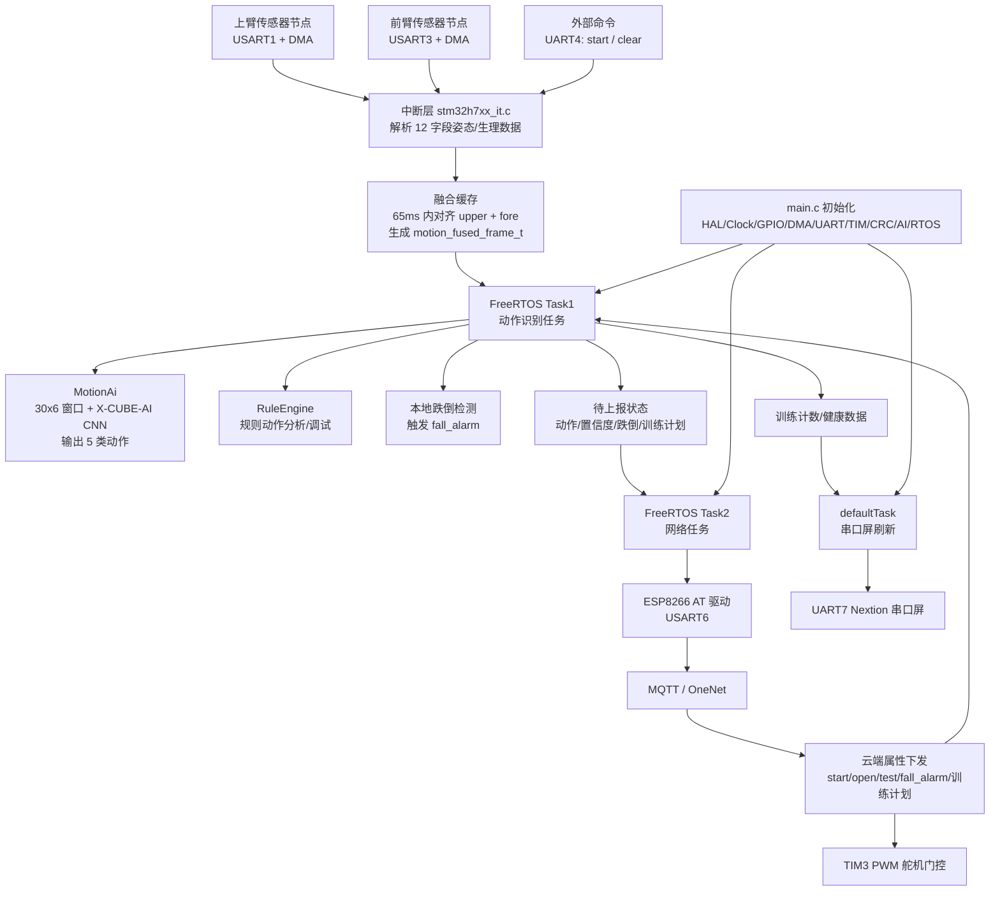
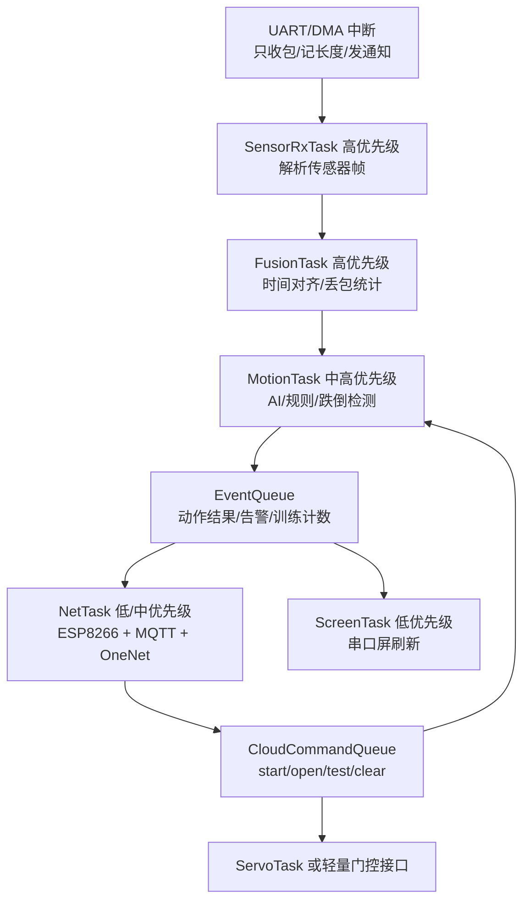
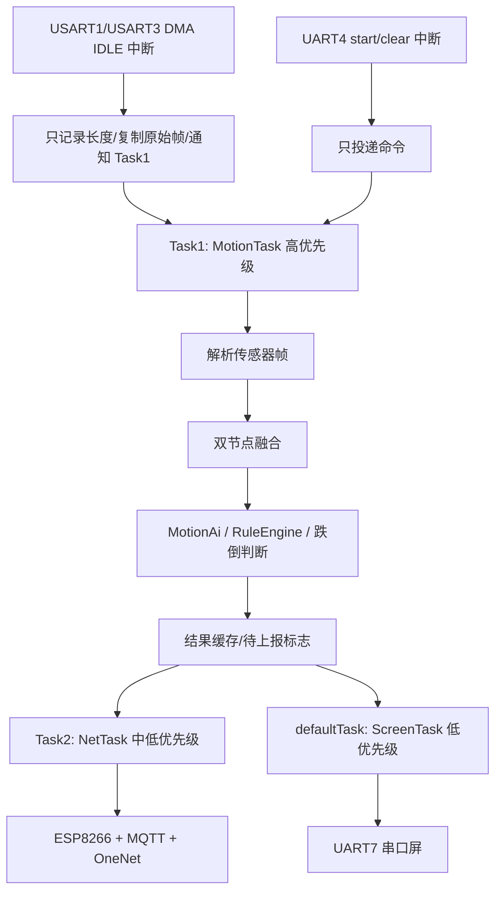

# 帮我滤清一下这整个H743项目的架构以及配置和使用，并且给我看一下架构示意图
_Exported on 06/03/2026 at 10:08:38 GMT+8 from OpenAI Codex via WayLog_


**OpenAI Codex**

<permissions instructions>
Filesystem sandboxing defines which files can be read or written. `sandbox_mode` is `workspace-write`: The sandbox permits reading files, and editing files in `cwd` and `writable_roots`. Editing files in other directories requires approval. Network access is restricted.
# Escalation Requests

Commands are run outside the sandbox if they are approved by the user, or match an existing rule that allows it to run unrestricted. The command string is split into independent command segments at shell control operators, including but not limited to:

- Pipes: |
- Logical operators: &&, ||
- Command separators: ;
- Subshell boundaries: (...), $(...)

Each resulting segment is evaluated independently for sandbox restrictions and approval requirements.

Example:

git pull | tee output.txt

This is treated as two command segments:

["git", "pull"]

["tee", "output.txt"]

Commands that use more advanced shell features like redirection (>, >>, <), substitutions ($(...), ...), environment variables (FOO=bar), or wildcard patterns (*, ?) will not be evaluated against rules, to limit the scope of what an approved rule allows.

## How to request escalation

IMPORTANT: To request approval to execute a command that will require escalated privileges:

- Provide the `sandbox_permissions` parameter with the value `"require_escalated"`
- Include a short question asking the user if they want to allow the action in `justification` parameter. e.g. "Do you want to download and install dependencies for this project?"
- Optionally suggest a `prefix_rule` - this will be shown to the user with an option to persist the rule approval for future sessions.

If you run a command that is important to solving the user's query, but it fails because of sandboxing or with a likely sandbox-related network error (for example DNS/host resolution, registry/index access, or dependency download failure), rerun the command with "require_escalated". ALWAYS proceed to use the `justification` parameter - do not message the user before requesting approval for the command.

## When to request escalation

While commands are running inside the sandbox, here are some scenarios that will require escalation outside the sandbox:

- You need to run a command that writes to a directory that requires it (e.g. running tests that write to /var)
- You need to run a GUI app (e.g., open/xdg-open/osascript) to open browsers or files.
- If you run a command that is important to solving the user's query, but it fails because of sandboxing or with a likely sandbox-related network error (for example DNS/host resolution, registry/index access, or dependency download failure), rerun the command with `require_escalated`. ALWAYS proceed to use the `sandbox_permissions` and `justification` parameters. do not message the user before requesting approval for the command.
- You are about to take a potentially destructive action such as an `rm` or `git reset` that the user did not explicitly ask for.
- Be judicious with escalating, but if completing the user's request requires it, you should do so - don't try and circumvent approvals by using other tools.

## prefix_rule guidance

When choosing a `prefix_rule`, request one that will allow you to fulfill similar requests from the user in the future without re-requesting escalation. It should be categorical and reasonably scoped to similar capabilities. You should rarely pass the entire command into `prefix_rule`.

### Banned prefix_rules 
Avoid requesting overly broad prefixes that the user would be ill-advised to approve. For example, do not request ["python3"], ["python", "-"], or other similar prefixes that would allow arbitrary scripting.
NEVER provide a prefix_rule argument for destructive commands like rm.
NEVER provide a prefix_rule if your command uses a heredoc or herestring. 

### Examples
Good examples of prefixes:
- ["npm", "run", "dev"]
- ["gh", "pr", "check"]
- ["cargo", "test"]


## Approved command prefixes
The following prefix rules have already been approved: - ["C:\\WINDOWS\\System32\\WindowsPowerShell\\v1.0\\powershell.exe", "-Command", "Get-ChildItem source/img | Select-Object Name,Length"]
- ["C:\\WINDOWS\\System32\\WindowsPowerShell\\v1.0\\powershell.exe", "-Command", "git mv source/img/background.jpg source/img/backgroud.jpg"]
- ["C:\\WINDOWS\\System32\\WindowsPowerShell\\v1.0\\powershell.exe", "-Command", "Get-Help Format-Hex -Parameter * | Select-Object -First 60"]
- ["C:\\WINDOWS\\System32\\WindowsPowerShell\\v1.0\\powershell.exe", "-Command", "Get-ChildItem -Force source/img | Select-Object Name,Length,LastWriteTime"]
- ["C:\\WINDOWS\\System32\\WindowsPowerShell\\v1.0\\powershell.exe", "-Command", "Select-String -Path _config.fluid.yml -Pattern 'emo_fish|menu' -Context 0,3"]
- ["C:\\WINDOWS\\System32\\WindowsPowerShell\\v1.0\\powershell.exe", "-Command", "if(Test-Path source/emo/index.html){Get-Content -Raw source/emo/index.html}"]
- ["C:\\WINDOWS\\System32\\WindowsPowerShell\\v1.0\\powershell.exe", "-Command", "if (Test-Path .gitignore) { Get-Content -Raw .gitignore } else { 'NO_GITIGNORE' }"]
- ["C:\\WINDOWS\\System32\\WindowsPowerShell\\v1.0\\powershell.exe", "-Command", "Move-Item -LiteralPath source/img/background.jpg -Destination source/img/backgroud.jpg"]
- ["C:\\WINDOWS\\System32\\WindowsPowerShell\\v1.0\\powershell.exe", "-Command", "Get-ChildItem -Recurse -File source/login,source/gift,source/imgs,source/css | Select-Object FullName"]
- ["C:\\WINDOWS\\System32\\WindowsPowerShell\\v1.0\\powershell.exe", "-Command", "$b = Get-Content -Encoding Byte -TotalCount 3 _config.fluid.yml; $b | ForEach-Object { '{0:X2}' -f $_ }"]
- ["C:\\WINDOWS\\System32\\WindowsPowerShell\\v1.0\\powershell.exe", "-Command", "if (Test-Path source/css/custom.css) { Get-Content -Raw source/css/custom.css } else { 'NO_CUSTOM_CSS' }"]
- ["C:\\WINDOWS\\System32\\WindowsPowerShell\\v1.0\\powershell.exe", "-Command", "$tmp=[System.IO.Path]::GetTempFileName(); Copy-Item source/gift/index.html $tmp -Force; Write-Output $tmp"]
- ["C:\\WINDOWS\\System32\\WindowsPowerShell\\v1.0\\powershell.exe", "-Command", "$tmp=[System.IO.Path]::GetTempFileName(); Copy-Item source/login/index.html $tmp -Force; Write-Output $tmp"]
- ["C:\\WINDOWS\\System32\\WindowsPowerShell\\v1.0\\powershell.exe", "-Command", "$i=0; Get-Content -Encoding UTF8 source/gift/index.html | % { $i++; if($i -le 20){ '{0,4}: {1}' -f $i, $_ } }"]
- ["C:\\WINDOWS\\System32\\WindowsPowerShell\\v1.0\\powershell.exe", "-Command", "$i=0; Get-Content -Encoding UTF8 source/gift/index.html | ForEach-Object { $i++; if($i -le 30){ '{0,4}: {1}' -f $i, $_ } }"]
- ["C:\\WINDOWS\\System32\\WindowsPowerShell\\v1.0\\powershell.exe", "-Command", "$i=0; Get-Content themes/fluid/_config.yml | ForEach-Object { $i++; if($i -ge 220 -and $i -le 260){ '{0,4}: {1}' -f $i, $_ } }"]
- ["C:\\WINDOWS\\System32\\WindowsPowerShell\\v1.0\\powershell.exe", "-Command", "Get-ChildItem -Recurse -File source | Where-Object { $_.Name -match '^favicon\\.(png|ico|jpg|jpeg)$' } | Select-Object FullName,Name"]
- ["C:\\WINDOWS\\System32\\WindowsPowerShell\\v1.0\\powershell.exe", "-Command", "rg -n \"给 XX|把想说的话|照片故事|六张小小|最后一个小彩蛋|secretText|emo🐟 生日快乐\" source/gift/index.html"]
- ["C:\\WINDOWS\\System32\\WindowsPowerShell\\v1.0\\powershell.exe", "-Command", "Select-String -Path _config.fluid.yml -Encoding utf8 -Pattern 'blog_title|emo🐟|生日快乐' -AllMatches | ForEach-Object { $_.Line }"]
- ["C:\\WINDOWS\\System32\\WindowsPowerShell\\v1.0\\powershell.exe", "-Command", "$i=0; Get-Content -Encoding UTF8 source/gift/index.html | ForEach-Object { $i++; if($i -ge 120 -and $i -le 260){ '{0,4}: {1}' -f $i, $_ } }"]
- ["C:\\WINDOWS\\System32\\WindowsPowerShell\\v1.0\\powershell.exe", "-Command", "$i=0; Get-Content -Encoding UTF8 source/gift/index.html | ForEach-Object { $i++; if($i -ge 270 -and $i -le 380){ '{0,4}: {1}' -f $i, $_ } }"]
- ["C:\\WINDOWS\\System32\\WindowsPowerShell\\v1.0\\powershell.exe", "-Command", "$i=0; Get-Content -Encoding UTF8 source/gift/index.html | ForEach-Object { $i++; if($i -ge 280 -and $i -le 390){ '{0,4}: {1}' -f $i, $_ } }"]
- ["C:\\WINDOWS\\System32\\WindowsPowerShell\\v1.0\\powershell.exe", "-Command", "$i=0; Get-Content -Encoding UTF8 source/gift/index.html | ForEach-Object { $i++; if($i -ge 318 -and $i -le 372){ '{0,4}: {1}' -f $i, $_ } }"]
- ["C:\\WINDOWS\\System32\\WindowsPowerShell\\v1.0\\powershell.exe", "-Command", "$i=0; Get-Content -Encoding UTF8 source/gift/index.html | ForEach-Object { $i++; if($i -ge 392 -and $i -le 520){ '{0,4}: {1}' -f $i, $_ } }"]
- ["C:\\WINDOWS\\System32\\WindowsPowerShell\\v1.0\\powershell.exe", "-Command", "$i=0; Get-Content -Encoding UTF8 source/login/index.html | ForEach-Object { $i++; if($i -ge 180 -and $i -le 260){ '{0,4}: {1}' -f $i, $_ } }"]
- ["C:\\WINDOWS\\System32\\WindowsPowerShell\\v1.0\\powershell.exe", "-Command", "Test-Path source/img/backgroud.jpg; if(Test-Path source/img/backgroud.jpg){ Get-Item source/img/backgroud.jpg | Select-Object FullName,Length,LastWriteTime }"]
- ["C:\\WINDOWS\\System32\...
[Some commands were truncated]

`approvals_reviewer` is `auto_review`: Sandbox escalations with require_escalated will be reviewed for compliance with the policy. If a rejection happens, you should proceed only with a materially safer alternative, or inform the user of the risk and send a final message to ask for approval.
 The writable root is `D:\Qian Start\Smart Watch\H743`.
</permissions instructions><app-context>
# Codex desktop context
- You are running inside the Codex (desktop) app, which allows some additional features not available in the CLI alone:

### Images/Visuals/Files
- In the app, the model can display images and videos using standard Markdown image syntax: 
- When sending or referencing a local image or video, always use an absolute filesystem path in the Markdown image tag (e.g., ); relative paths and plain text will not render the media.
- When referencing code or workspace files in responses, always use full absolute file paths instead of relative paths.
- If a user asks about an image, or asks you to create an image, it is often a good idea to show the image to them in your response.
- Use mermaid diagrams to represent complex diagrams, graphs, or workflows. Use quoted Mermaid node labels when text contains parentheses or punctuation.
- Return web URLs as Markdown links (e.g., [label](https://example.com)).

### Workspace Dependencies
- For sheets, slides, and documents, call `load_workspace_dependencies` to find the bundled runtime and libraries.

### Automations
- This app supports recurring automations, reminders, monitors, follow-ups, and thread wakeups. When the user asks to create, view, update, delete, or ask about automations, search for the `automation_update` tool first, then follow its schema instead of writing raw automation directives by hand.

### Inline Code Comments
- Use the ::code-comment{...} directive when you need to attach feedback directly to specific code lines.
- Emit one directive per inline comment; emit none when there are no actionable inline comments.
- Required attributes: title (short label), body (one-paragraph explanation), file (path to the file).
- Optional attributes: start, end (1-based line numbers), priority (0-3).
- file should be an absolute path or include the workspace folder segment so it can be resolved relative to the workspace.
- Keep line ranges tight; end defaults to start.
- Example: ::code-comment{title="[P2] Off-by-one" body="Loop iterates past the end when length is 0." file="/path/to/foo.ts" start=10 end=11 priority=2}

### Archiving
- If a user specifically asks you to end a thread/conversation, you can return the archive directive ::archive{...} to archive the thread/conversation.
- Example: ::archive{reason="User requested to end conversation"}
</app-context><collaboration_mode># Collaboration Mode: Default

You are now in Default mode. Any previous instructions for other modes (e.g. Plan mode) are no longer active.

Your active mode changes only when new developer instructions with a different `<collaboration_mode>...</collaboration_mode>` change it; user requests or tool descriptions do not change mode by themselves. Known mode names are Default and Plan.

## request_user_input availability

Use the `request_user_input` tool only when it is listed in the available tools for this turn.

In Default mode, strongly prefer making reasonable assumptions and executing the user's request rather than stopping to ask questions. If you absolutely must ask a question because the answer cannot be discovered from local context and a reasonable assumption would be risky, ask the user directly with a concise plain-text question. Never write a multiple choice question as a textual assistant message.
</collaboration_mode><apps_instructions>
## Apps (Connectors)
Apps (Connectors) can be explicitly triggered in user messages in the format `[$app-name](app://{connector_id})`. Apps can also be implicitly triggered as long as the context suggests usage of available apps.
An app is equivalent to a set of MCP tools within the `codex_apps` MCP.
An installed app's MCP tools are either provided to you already, or can be lazy-loaded through the `tool_search` tool. If `tool_search` is available, the apps that are searchable by `tools_search` will be listed by it.
Do not additionally call list_mcp_resources or list_mcp_resource_templates for apps.
</apps_instructions><skills_instructions>
## Skills
A skill is a set of local instructions to follow that is stored in a `SKILL.md` file. Below is the list of skills that can be used. Each entry includes a name, description, and file path so you can open the source for full instructions when using a specific skill.
### Available skills
- imagegen: Generate or edit raster images when the task benefits from AI-created bitmap visuals such as photos, illustrations, textures, sprites, mockups, or transparent-background cutouts. Use when Codex should create a brand-new image, transform an existing image, or derive visual variants from references, and the output should be a bitmap asset rather than repo-native code or vector. Do not use when the task is better handled by editing existing SVG/vector/code-native assets, extending an established icon or logo system, or building the visual directly in HTML/CSS/canvas. (file: C:/Users/33709/.codex/skills/.system/imagegen/SKILL.md)
- openai-docs: Use when the user asks how to build with OpenAI products or APIs and needs up-to-date official documentation with citations, help choosing the latest model for a use case, or model upgrade and prompt-upgrade guidance; prioritize OpenAI docs MCP tools, use bundled references only as helper context, and restrict any fallback browsing to official OpenAI domains. (file: C:/Users/33709/.codex/skills/.system/openai-docs/SKILL.md)
- plugin-creator: Create and scaffold plugin directories for Codex with a required `.codex-plugin/plugin.json`, optional plugin folders/files, valid manifest defaults, and personal-marketplace entries by default. Use when Codex needs to create a new personal plugin, add optional plugin structure, generate or update marketplace entries for plugin ordering and availability metadata, or update an existing local plugin during development with the CLI-driven cachebuster and reinstall flow. (file: C:/Users/33709/.codex/skills/.system/plugin-creator/SKILL.md)
- skill-creator: Guide for creating effective skills. This skill should be used when users want to create a new skill (or update an existing skill) that extends Codex's capabilities with specialized knowledge, workflows, or tool integrations. (file: C:/Users/33709/.codex/skills/.system/skill-creator/SKILL.md)
- skill-installer: Install Codex skills into $CODEX_HOME/skills from a curated list or a GitHub repo path. Use when a user asks to list installable skills, install a curated skill, or install a skill from another repo (including private repos). (file: C:/Users/33709/.codex/skills/.system/skill-installer/SKILL.md)
- canva:canva-branded-presentation: Create on-brand Canva presentations from a brief, outline, existing Canva doc, or design link. Use when the user wants a branded slide deck, wants to turn notes into a presentation, or needs a presentation generated in Canva with the right brand kit and a clear slide plan. (file: C:/Users/33709/.codex/plugins/cache/openai-curated/canva/6188456f/skills/canva-branded-presentation/SKILL.md)
- canva:canva-resize-for-all-social-media: Resize a Canva design into standard social media formats and prepare export-ready results. Use when the user wants one Canva design adapted across multiple social platforms such as Facebook, Instagram, and LinkedIn, especially when they want all variants produced in one pass. (file: C:/Users/33709/.codex/plugins/cache/openai-curated/canva/6188456f/skills/canva-resize-for-all-social-media/SKILL.md)
- canva:canva-translate-design: Translate the text in a Canva design into another language while preserving the original layout as much as possible. Use when the user wants a localized or translated version of an existing Canva design and expects the original file to remain unchanged. (file: C:/Users/33709/.codex/plugins/cache/openai-curated/canva/6188456f/skills/canva-translate-design/SKILL.md)
- documents:documents: Create, edit, redline, and comment on `.docx`, Word, and Google Docs-targeted document artifacts inside the container, with a strict render-and-verify workflow. Use `render_docx.py` to generate page PNGs (and optional PDF) for visual QA, then iterate until layout is flawless before delivering the final document. (file: C:/Users/33709/.codex/plugins/cache/openai-primary-runtime/documents/26.521.10419/skills/documents/SKILL.md)
- docx: Use this skill whenever the user wants to create, read, edit, or manipulate Word documents (.docx files). Triggers include: any mention of 'Word doc', 'word document', '.docx', or requests to produce professional documents with formatting like tables of contents, headings, page numbers, or letterheads. Also use when extracting or reorganizing content from .docx files, inserting or replacing images in documents, performing find-and-replace in Word files, working with tracked changes or comments, or converting content into a polished Word document. If the user asks for a 'report', 'memo', 'letter', 'template', or similar deliverable as a Word or .docx file, use this skill. Do NOT use for PDFs, spreadsheets, Google Docs, or general coding tasks unrelated to document generation. (file: C:/Users/33709/.codex/skills/docx/SKILL.md)
- drawio-skill: Use when user requests diagrams, flowcharts, architecture charts, or visualizations. Also use proactively when explaining systems with 3+ components, complex data flows, or relationships that benefit from visual representation. Generates .drawio XML files and exports to PNG/SVG/PDF locally using the native draw.io desktop CLI. (file: C:/Users/33709/.agents/skills/drawio-skill/SKILL.md)
- find-skills: Helps users discover and install agent skills when they ask questions like "how do I do X", "find a skill for X", "is there a skill that can...", or express interest in extending capabilities. This skill should be used when the user is looking for functionality that might exist as an installable skill. (file: C:/Users/33709/.agents/skills/find-skills/SKILL.md)
- frontend-design: Frontend design skill for Claude Code, Codex, and Gemini CLI. Eight aesthetic anchors, each locking palette, typography, and texture to specific CSS tokens. Pick one per brief. (file: C:/Users/33709/.codex/skills/frontend-design/SKILL.md)
- frontend-slides: Create stunning, animation-rich HTML presentations from scratch or by converting PowerPoint files. Use when the user wants to build a presentation, convert a PPT/PPTX to web, or create slides for a talk/pitch. Helps non-designers discover their aesthetic through visual exploration rather than abstract choices. (file: C:/Users/33709/.agents/skills/frontend-slides/SKILL.md)
- github:gh-address-comments: Address actionable GitHub pull request review feedback. Use when the user wants to inspect unresolved review threads, requested changes, or inline review comments on a PR, then implement selected fixes. Use the GitHub app for PR metadata and flat comment reads, and use the bundled GraphQL script via `gh` whenever thread-level state, resolution status, or inline review context matters. (file: C:/Users/33709/.codex/plugins/cache/openai-curated/github/6188456f/skills/gh-address-comments/SKILL.md)
- github:gh-fix-ci: Use when a user asks to debug or fix failing GitHub PR checks that run in GitHub Actions. Use the GitHub app from this plugin for PR metadata and patch context, and use `gh` for Actions check and log inspection before implementing any approved fix. (file: C:/Users/33709/.codex/plugins/cache/openai-curated/github/6188456f/skills/gh-fix-ci/SKILL.md)
- github:github: Triage and orient GitHub repository, pull request, and issue work through the connected GitHub app. Use when the user asks for general GitHub help, wants PR or issue summaries, or needs repository context before choosing a more specific GitHub workflow. (file: C:/Users/33709/.codex/plugins/cache/openai-curated/github/6188456f/skills/github/SKILL.md)
- github:yeet: Publish local changes to GitHub by confirming scope, committing intentionally, pushing the branch, and opening a draft PR through the GitHub app from this plugin, with `gh` used only as a fallback where connector coverage is insufficient. (file: C:/Users/33709/.codex/plugins/cache/openai-curated/github/6188456f/skills/yeet/SKILL.md)
- karpathy-guidelines: Behavioral guidelines to reduce common LLM coding mistakes. Use when writing, reviewing, or refactoring code to avoid overcomplication, make surgical changes, surface assumptions, and define verifiable success criteria. (file: C:/Users/33709/.codex/skills/karpathy-guidelines/SKILL.md)
- planning-with-files:planning-with-files: Implements Manus-style file-based planning to organize and track progress on complex tasks. Creates task_plan.md, findings.md, and progress.md. Use when asked to plan out, break down, or organize a multi-step project, research task, or any work requiring 5+ tool calls. Supports automatic session recovery after /clear. (file: C:/Users/33709/.codex/skills/planning-with-files/skills/planning-with-files/SKILL.md)
- planning-with-files:planning-with-files-zh: 基于 Manus 风格的文件规划系统，用于组织和跟踪复杂任务的进度。创建 task_plan.md、findings.md 和 progress.md 三个文件。当用户要求规划、拆解或组织多步骤项目、研究任务或需要超过5次工具调用的工作时使用。支持 /clear 后的自动会话恢复。触发词：任务规划、项目计划、制定计划、分解任务、多步骤规划、进度跟踪、文件规划、帮我规划、拆解项目 (file: C:/Users/33709/.codex/skills/planning-with-files/skills/planning-with-files-zh/SKILL.md)
- pptx: Use this skill any time a .pptx file is involved in any way — as input, output, or both. This includes: creating slide decks, pitch decks, or presentations; reading, parsing, or extracting text from any .pptx file (even if the extracted content will be used elsewhere, like in an email or summary); editing, modifying, or updating existing presentations; combining or splitting slide files; working with templates, layouts, speaker notes, or comments. Trigger whenever the user mentions "deck," "slides," "presentation," or references a .pptx filename, regardless of what they plan to do with the content afterward. If a .pptx file needs to be opened, created, or touched, use this skill. (file: C:/Users/33709/.codex/skills/pptx/SKILL.md)
- presentations:Presentations: Build PowerPoint PPTX decks with artifact-tool presentation JSX (file: C:/Users/33709/.codex/plugins/cache/openai-primary-runtime/presentations/26.521.10419/skills/presentations/SKILL.md)
- spreadsheets:Spreadsheets: Use this skill when a user requests to create, modify, analyze, visualize, or work with spreadsheet files (`.xlsx`, `.xls`, `.csv`, `.tsv`) or Google Sheets-targeted spreadsheet artifacts with formulas, formatting, charts, tables, and recalculation. (file: C:/Users/33709/.codex/plugins/cache/openai-primary-runtime/spreadsheets/26.521.10419/skills/spreadsheets/SKILL.md)
- wechat-miniprogram-skill: Expert guidelines for Native WeChat Mini Program development focusing on performance, code size, and native compatibility. Use when developing WeChat Mini Programs in native JavaScript. (file: C:/Users/33709/.agents/skills/wechat-miniprogram-skill/SKILL.md)
### How to use skills
- Discovery: The list above is the skills available in this session (name + description + file path). Skill bodies live on disk at the listed paths.
- Trigger rules: If the user names a skill (with `$SkillName` or plain text) OR the task clearly matches a skill's description shown above, you must use that skill for that turn. Multiple mentions mean use them all. Do not carry skills across turns unless re-mentioned.
- Missing/blocked: If a named skill isn't in the list or the path can't be read, say so briefly and continue with the best fallback.
- How to use a skill (progressive disclosure):
  1) After deciding to use a skill, open its `SKILL.md`. Read only enough to follow the workflow.
  2) When `SKILL.md` references relative paths (e.g., `scripts/foo.py`), resolve them relative to the skill directory listed above first, and only consider other paths if needed.
  3) If `SKILL.md` points to extra folders such as `references/`, load only the specific files needed for the request; don't bulk-load everything.
  4) If `scripts/` exist, prefer running or patching them instead of retyping large code blocks.
  5) If `assets/` or templates exist, reuse them instead of recreating from scratch.
- Coordination and sequencing:
  - If multiple skills apply, choose the minimal set that covers the request and state the order you'll use them.
  - Announce which skill(s) you're using and why (one short line). If you skip an obvious skill, say why.
- Context hygiene:
  - Keep context small: summarize long sections instead of pasting them; only load extra files when needed.
  - Avoid deep reference-chasing: prefer opening only files directly linked from `SKILL.md` unless you're blocked.
  - When variants exist (frameworks, providers, domains), pick only the relevant reference file(s) and note that choice.
- Safety and fallback: If a skill can't be applied cleanly (missing files, unclear instructions), state the issue, pick the next-best approach, and continue.
</skills_instructions><plugins_instructions>
## Plugins
A plugin is a local bundle of skills, MCP servers, and apps. Below is the list of plugins that are enabled and available in this session.
### Available plugins
- `Canva`: Search, create, edit designs
- `Documents`: Create and edit document artifacts in Codex, including Word files and Google Docs.
- `GitHub`: Inspect repositories, triage pull requests and issues, debug CI, and publish changes through a hybrid GitHub connector and CLI workflow.
- `Presentations`: Create, edit, render, verify, and export presentation slide decks. Use when Codex needs to build or modify a deck, slidedeck, presentation deck, slide deck, slides, PowerPoint, Google Slides, PPT, PPTX, .ppt, or .pptx file.
- `Spreadsheets`: Create, edit, analyze, visualize, render, and export spreadsheets or Google Sheets-ready workbooks in Codex.
### How to use plugins
- Discovery: The list above is the plugins available in this session.
- Skill naming: If a plugin contributes skills, those skill entries are prefixed with `plugin_name:` in the Skills list.
- Trigger rules: If the user explicitly names a plugin, prefer capabilities associated with that plugin for that turn.
- Relationship to capabilities: Plugins are not invoked directly. Use their underlying skills, MCP tools, and app tools to help solve the task.
- Preference: When a relevant plugin is available, prefer using capabilities associated with that plugin over standalone capabilities that provide similar functionality.
- Missing/blocked: If the user requests a plugin that is not listed above, or the plugin does not have relevant callable capabilities for the task, say so briefly and continue with the best fallback.
</plugins_instructions>

---


**User**

帮我滤清一下这整个H743项目的架构以及配置和使用，并且给我看一下架构示意图

---


**OpenAI Codex**

我会只读取当前 `H743` 项目内容，不做任何修改。先从目录结构、构建配置、入口文件和 README/脚本入手，再把模块关系和使用方式整理成一张示意图。

---


**OpenAI Codex**

`rg` 在这个环境里被拒绝执行，我改用 PowerShell 原生命令递归列文件。现在重点看工程元数据、启动入口、BSP、AI 中间件和 MDK 工程配置。

---


**OpenAI Codex**

目前看这是 STM32CubeMX 生成的 STM32H743 工程，外加用户层 BSP、FreeRTOS 和 X-CUBE-AI。接下来我会缩小到业务代码，确认各串口、任务、AI 推理和云/屏幕模块的实际调用链。

---


**OpenAI Codex**

业务主线已经比较清楚：两个传感器串口输入在中断里对齐融合，Task1 做动作识别/规则/跌倒逻辑，Task2 负责 ESP8266 + MQTT + OneNet，defaultTask 刷串口屏。我再核对 MDK 工程、外设引脚和最终编译入口，避免只按源码猜测。

---


**OpenAI Codex**

我只读了当前 `D:\Qian Start\Smart Watch\H743` 项目，没有改文件。

**整体定位**
这是一个基于 `STM32H743ZIT6` 的主控工程：接收两个传感器节点数据，做姿态融合、动作识别、规则分析、跌倒告警，并通过 `ESP8266 + MQTT` 接入 OneNet，同时驱动串口屏和舵机门控。项目说明也这么描述：[说明文档.txt](<D:/Qian Start/Smart Watch/H743/说明文档.txt:1>)。

**架构示意图**


**目录分层**
`Core` 是 CubeMX 生成加用户业务逻辑的核心层，入口在 [Core/Src/main.c](<D:/Qian Start/Smart Watch/H743/Core/Src/main.c:83>)，FreeRTOS 任务在 [Core/Src/freertos.c](<D:/Qian Start/Smart Watch/H743/Core/Src/freertos.c:229>)，串口中断和传感器融合在 [Core/Src/stm32h7xx_it.c](<D:/Qian Start/Smart Watch/H743/Core/Src/stm32h7xx_it.c:377>)。

`BSP` 是板级业务驱动：`ESP8266`、`MqttKit`、`onenet`、`uart_screen`、`health_monitor`、`debug_uart7`。云平台配置在 [BSP/onenet.h](<D:/Qian Start/Smart Watch/H743/BSP/onenet.h:6>)，Wi-Fi/OneNet 主机配置在 [BSP/ESP8266.h](<D:/Qian Start/Smart Watch/H743/BSP/ESP8266.h:6>)。

`X-CUBE-AI` 是 STM32Cube.AI 生成的神经网络代码，封装入口是 `AppXCubeAI_Run()`：[X-CUBE-AI/App/app_x-cube-ai.c](<D:/Qian Start/Smart Watch/H743/X-CUBE-AI/App/app_x-cube-ai.c:145>)。

`Middlewares` 放 FreeRTOS 和 ST AI runtime，`Drivers` 放 CMSIS/HAL，`SYSTEM` 是正点原子的 delay/sys/usart 基础库，`MDK-ARM` 是 Keil 工程。

**关键配置**
MCU 是 `STM32H743ZIT6 / STM32H743ZITx`，CubeMX 版本 `6.17.0`，固件包 `STM32Cube FW_H7 V1.12.1`，工具链 `MDK-ARM V5.32`：[Master.ioc](<D:/Qian Start/Smart Watch/H743/Master.ioc:187>)。

主频配置为 CPU `480MHz`，HCLK `240MHz`：[Master.ioc](<D:/Qian Start/Smart Watch/H743/Master.ioc:333>)。FreeRTOS 使用 CMSIS-RTOS v2，创建 `defaultTask`、`Task1`、`Task2` 三个线程：[Core/Src/freertos.c](<D:/Qian Start/Smart Watch/H743/Core/Src/freertos.c:229>)。

串口配置基本都是 `115200`。当前角色大致是：
`USART1` 接上臂传感器，`USART3` 接前臂传感器，`UART4` 接收 `start/clear` 控制命令，`USART6` 接 ESP8266，`UART7` 当前配置为串口屏，`USART2` 主要用于 printf/调试链路。UART7 当前角色在 [BSP/uart7_role.h](<D:/Qian Start/Smart Watch/H743/BSP/uart7_role.h:13>)。

AI 模型输入是 `30 x 6` 浮点窗口，输出 `5` 类动作：[X-CUBE-AI/App/app_x-cube-ai.h](<D:/Qian Start/Smart Watch/H743/X-CUBE-AI/App/app_x-cube-ai.h:14>)。模型报告显示是 Keras `action_cnn`，`134,192 MACC`，总占用约 `57,868B Flash`、`8,068B RAM`：[X-CUBE-AI/App/network_generate_report.txt](<D:/Qian Start/Smart Watch/H743/X-CUBE-AI/App/network_generate_report.txt:1>)。

**运行流程**
上电后 `main()` 依次初始化 MPU、HAL、时钟、GPIO、DMA、多个 UART、TIM2/TIM3、CRC、X-CUBE-AI，然后初始化舵机门控并启动 FreeRTOS：[Core/Src/main.c](<D:/Qian Start/Smart Watch/H743/Core/Src/main.c:102>)。

传感器数据通过 `USART1_IRQHandler` 和 `USART3_IRQHandler` 接收，解析后按 `65ms` 阈值对齐融合：[Core/Src/stm32h7xx_it.c](<D:/Qian Start/Smart Watch/H743/Core/Src/stm32h7xx_it.c:65>)。

`Task1` 初始化 `MotionAi`、`MotionWindowTest`、`RuleEngine`，循环消费融合帧，执行动作识别、规则分析和本地跌倒判断：[Core/Src/freertos.c](<D:/Qian Start/Smart Watch/H743/Core/Src/freertos.c:339>)。

`Task2` 初始化 ESP8266，连接 OneNet MQTT，周期上报属性，同时解析云端下发的属性控制：[Core/Src/freertos.c](<D:/Qian Start/Smart Watch/H743/Core/Src/freertos.c:438>)。

`defaultTask` 负责串口屏初始化和健康/训练页面刷新：[Core/Src/freertos.c](<D:/Qian Start/Smart Watch/H743/Core/Src/freertos.c:260>)。

**使用方式**
用 Keil MDK 打开 [MDK-ARM/Master.uvprojx](<D:/Qian Start/Smart Watch/H743/MDK-ARM/Master.uvprojx:10>)，选择 `Master` 目标，确认已安装 STM32H7 设备包和 ARM 编译链后编译下载。若要重新生成外设配置，用 STM32CubeMX 打开 [Master.ioc](<D:/Qian Start/Smart Watch/H743/Master.ioc:1>)；若要重新生成 AI 模型，需要原始 `action_cnn.h5`，当前工程内已经包含生成后的 C 代码和 runtime 库。

注意：Wi-Fi、OneNet 产品信息和 token 是硬编码在头文件里的，实际部署前应确认是否过期、是否需要替换，以及避免把真实密钥公开。

---


**OpenAI Codex**

<permissions instructions>
Filesystem sandboxing defines which files can be read or written. `sandbox_mode` is `workspace-write`: The sandbox permits reading files, and editing files in `cwd` and `writable_roots`. Editing files in other directories requires approval. Network access is restricted.
# Escalation Requests

Commands are run outside the sandbox if they are approved by the user, or match an existing rule that allows it to run unrestricted. The command string is split into independent command segments at shell control operators, including but not limited to:

- Pipes: |
- Logical operators: &&, ||
- Command separators: ;
- Subshell boundaries: (...), $(...)

Each resulting segment is evaluated independently for sandbox restrictions and approval requirements.

Example:

git pull | tee output.txt

This is treated as two command segments:

["git", "pull"]

["tee", "output.txt"]

Commands that use more advanced shell features like redirection (>, >>, <), substitutions ($(...), ...), environment variables (FOO=bar), or wildcard patterns (*, ?) will not be evaluated against rules, to limit the scope of what an approved rule allows.

## How to request escalation

IMPORTANT: To request approval to execute a command that will require escalated privileges:

- Provide the `sandbox_permissions` parameter with the value `"require_escalated"`
- Include a short question asking the user if they want to allow the action in `justification` parameter. e.g. "Do you want to download and install dependencies for this project?"
- Optionally suggest a `prefix_rule` - this will be shown to the user with an option to persist the rule approval for future sessions.

If you run a command that is important to solving the user's query, but it fails because of sandboxing or with a likely sandbox-related network error (for example DNS/host resolution, registry/index access, or dependency download failure), rerun the command with "require_escalated". ALWAYS proceed to use the `justification` parameter - do not message the user before requesting approval for the command.

## When to request escalation

While commands are running inside the sandbox, here are some scenarios that will require escalation outside the sandbox:

- You need to run a command that writes to a directory that requires it (e.g. running tests that write to /var)
- You need to run a GUI app (e.g., open/xdg-open/osascript) to open browsers or files.
- If you run a command that is important to solving the user's query, but it fails because of sandboxing or with a likely sandbox-related network error (for example DNS/host resolution, registry/index access, or dependency download failure), rerun the command with `require_escalated`. ALWAYS proceed to use the `sandbox_permissions` and `justification` parameters. do not message the user before requesting approval for the command.
- You are about to take a potentially destructive action such as an `rm` or `git reset` that the user did not explicitly ask for.
- Be judicious with escalating, but if completing the user's request requires it, you should do so - don't try and circumvent approvals by using other tools.

## prefix_rule guidance

When choosing a `prefix_rule`, request one that will allow you to fulfill similar requests from the user in the future without re-requesting escalation. It should be categorical and reasonably scoped to similar capabilities. You should rarely pass the entire command into `prefix_rule`.

### Banned prefix_rules 
Avoid requesting overly broad prefixes that the user would be ill-advised to approve. For example, do not request ["python3"], ["python", "-"], or other similar prefixes that would allow arbitrary scripting.
NEVER provide a prefix_rule argument for destructive commands like rm.
NEVER provide a prefix_rule if your command uses a heredoc or herestring. 

### Examples
Good examples of prefixes:
- ["npm", "run", "dev"]
- ["gh", "pr", "check"]
- ["cargo", "test"]


## Approved command prefixes
The following prefix rules have already been approved: - ["C:\\WINDOWS\\System32\\WindowsPowerShell\\v1.0\\powershell.exe", "-Command", "Get-ChildItem source/img | Select-Object Name,Length"]
- ["C:\\WINDOWS\\System32\\WindowsPowerShell\\v1.0\\powershell.exe", "-Command", "git mv source/img/background.jpg source/img/backgroud.jpg"]
- ["C:\\WINDOWS\\System32\\WindowsPowerShell\\v1.0\\powershell.exe", "-Command", "Get-Help Format-Hex -Parameter * | Select-Object -First 60"]
- ["C:\\WINDOWS\\System32\\WindowsPowerShell\\v1.0\\powershell.exe", "-Command", "Get-ChildItem -Force source/img | Select-Object Name,Length,LastWriteTime"]
- ["C:\\WINDOWS\\System32\\WindowsPowerShell\\v1.0\\powershell.exe", "-Command", "Select-String -Path _config.fluid.yml -Pattern 'emo_fish|menu' -Context 0,3"]
- ["C:\\WINDOWS\\System32\\WindowsPowerShell\\v1.0\\powershell.exe", "-Command", "if(Test-Path source/emo/index.html){Get-Content -Raw source/emo/index.html}"]
- ["C:\\WINDOWS\\System32\\WindowsPowerShell\\v1.0\\powershell.exe", "-Command", "if (Test-Path .gitignore) { Get-Content -Raw .gitignore } else { 'NO_GITIGNORE' }"]
- ["C:\\WINDOWS\\System32\\WindowsPowerShell\\v1.0\\powershell.exe", "-Command", "Move-Item -LiteralPath source/img/background.jpg -Destination source/img/backgroud.jpg"]
- ["C:\\WINDOWS\\System32\\WindowsPowerShell\\v1.0\\powershell.exe", "-Command", "Get-ChildItem -Recurse -File source/login,source/gift,source/imgs,source/css | Select-Object FullName"]
- ["C:\\WINDOWS\\System32\\WindowsPowerShell\\v1.0\\powershell.exe", "-Command", "$b = Get-Content -Encoding Byte -TotalCount 3 _config.fluid.yml; $b | ForEach-Object { '{0:X2}' -f $_ }"]
- ["C:\\WINDOWS\\System32\\WindowsPowerShell\\v1.0\\powershell.exe", "-Command", "if (Test-Path source/css/custom.css) { Get-Content -Raw source/css/custom.css } else { 'NO_CUSTOM_CSS' }"]
- ["C:\\WINDOWS\\System32\\WindowsPowerShell\\v1.0\\powershell.exe", "-Command", "$tmp=[System.IO.Path]::GetTempFileName(); Copy-Item source/gift/index.html $tmp -Force; Write-Output $tmp"]
- ["C:\\WINDOWS\\System32\\WindowsPowerShell\\v1.0\\powershell.exe", "-Command", "$tmp=[System.IO.Path]::GetTempFileName(); Copy-Item source/login/index.html $tmp -Force; Write-Output $tmp"]
- ["C:\\WINDOWS\\System32\\WindowsPowerShell\\v1.0\\powershell.exe", "-Command", "$i=0; Get-Content -Encoding UTF8 source/gift/index.html | % { $i++; if($i -le 20){ '{0,4}: {1}' -f $i, $_ } }"]
- ["C:\\WINDOWS\\System32\\WindowsPowerShell\\v1.0\\powershell.exe", "-Command", "$i=0; Get-Content -Encoding UTF8 source/gift/index.html | ForEach-Object { $i++; if($i -le 30){ '{0,4}: {1}' -f $i, $_ } }"]
- ["C:\\WINDOWS\\System32\\WindowsPowerShell\\v1.0\\powershell.exe", "-Command", "$i=0; Get-Content themes/fluid/_config.yml | ForEach-Object { $i++; if($i -ge 220 -and $i -le 260){ '{0,4}: {1}' -f $i, $_ } }"]
- ["C:\\WINDOWS\\System32\\WindowsPowerShell\\v1.0\\powershell.exe", "-Command", "Get-ChildItem -Recurse -File source | Where-Object { $_.Name -match '^favicon\\.(png|ico|jpg|jpeg)$' } | Select-Object FullName,Name"]
- ["C:\\WINDOWS\\System32\\WindowsPowerShell\\v1.0\\powershell.exe", "-Command", "rg -n \"给 XX|把想说的话|照片故事|六张小小|最后一个小彩蛋|secretText|emo🐟 生日快乐\" source/gift/index.html"]
- ["C:\\WINDOWS\\System32\\WindowsPowerShell\\v1.0\\powershell.exe", "-Command", "Select-String -Path _config.fluid.yml -Encoding utf8 -Pattern 'blog_title|emo🐟|生日快乐' -AllMatches | ForEach-Object { $_.Line }"]
- ["C:\\WINDOWS\\System32\\WindowsPowerShell\\v1.0\\powershell.exe", "-Command", "$i=0; Get-Content -Encoding UTF8 source/gift/index.html | ForEach-Object { $i++; if($i -ge 120 -and $i -le 260){ '{0,4}: {1}' -f $i, $_ } }"]
- ["C:\\WINDOWS\\System32\\WindowsPowerShell\\v1.0\\powershell.exe", "-Command", "$i=0; Get-Content -Encoding UTF8 source/gift/index.html | ForEach-Object { $i++; if($i -ge 270 -and $i -le 380){ '{0,4}: {1}' -f $i, $_ } }"]
- ["C:\\WINDOWS\\System32\\WindowsPowerShell\\v1.0\\powershell.exe", "-Command", "$i=0; Get-Content -Encoding UTF8 source/gift/index.html | ForEach-Object { $i++; if($i -ge 280 -and $i -le 390){ '{0,4}: {1}' -f $i, $_ } }"]
- ["C:\\WINDOWS\\System32\\WindowsPowerShell\\v1.0\\powershell.exe", "-Command", "$i=0; Get-Content -Encoding UTF8 source/gift/index.html | ForEach-Object { $i++; if($i -ge 318 -and $i -le 372){ '{0,4}: {1}' -f $i, $_ } }"]
- ["C:\\WINDOWS\\System32\\WindowsPowerShell\\v1.0\\powershell.exe", "-Command", "$i=0; Get-Content -Encoding UTF8 source/gift/index.html | ForEach-Object { $i++; if($i -ge 392 -and $i -le 520){ '{0,4}: {1}' -f $i, $_ } }"]
- ["C:\\WINDOWS\\System32\\WindowsPowerShell\\v1.0\\powershell.exe", "-Command", "$i=0; Get-Content -Encoding UTF8 source/login/index.html | ForEach-Object { $i++; if($i -ge 180 -and $i -le 260){ '{0,4}: {1}' -f $i, $_ } }"]
- ["C:\\WINDOWS\\System32\\WindowsPowerShell\\v1.0\\powershell.exe", "-Command", "Test-Path source/img/backgroud.jpg; if(Test-Path source/img/backgroud.jpg){ Get-Item source/img/backgroud.jpg | Select-Object FullName,Length,LastWriteTime }"]
- ["C:\\WINDOWS\\System32\...
[Some commands were truncated]

`approvals_reviewer` is `auto_review`: Sandbox escalations with require_escalated will be reviewed for compliance with the policy. If a rejection happens, you should proceed only with a materially safer alternative, or inform the user of the risk and send a final message to ask for approval.
 The writable root is `D:\Qian Start\Smart Watch\H743`.
</permissions instructions>

---


**User**

我想优化一下这个系统架构，希望提高FreeRTOS实时性，以及各种中断优先级设置问题，整体架构优化，我应该再给你提供哪些信息，先简单回答我

---


**OpenAI Codex**

要做 FreeRTOS 实时性和中断优先级优化，最好再提供这些信息：

1. **硬件连接表**
   各 UART、DMA、TIM、传感器、ESP8266、屏幕、舵机分别接什么外设，数据频率是多少。

2. **实时性目标**
   比如传感器数据最大允许延迟、动作识别响应时间、云端控制响应时间、屏幕刷新周期、舵机动作时限。

3. **当前问题现象**
   是否有丢包、卡顿、识别延迟、MQTT 断连、屏幕阻塞、任务饿死、中断过密等。

4. **数据流协议**
   两个传感器节点每帧格式、发送频率、帧长；ESP8266 接收包大小和频率；UART4 命令来源。

5. **当前 FreeRTOS 任务设计意图**
   哪些任务必须实时，哪些可以低优先级；是否允许拆分任务，比如把网络、屏幕、AI、数据融合分开。

6. **Keil/CubeMX 当前配置截图或导出**
   NVIC 优先级、FreeRTOSConfig、DMA 配置、时钟树、串口 DMA/中断设置。

7. **运行时监测数据**
   任务栈余量、CPU 占用、各任务执行周期、串口丢包计数、DMA 溢出次数、HardFault/卡死位置。

8. **优化边界**
   是否允许我改架构和代码，还是只给建议；是否能接受更换 UART 接收方式、队列/消息缓冲、事件组、DMA 双缓冲等方案。

最关键的是：**实时性目标 + 当前异常现象 + 外设数据频率 + 是否允许改代码**。这四个信息足够先做一版架构优化方案。

---


**User**

前五个问题你来根据我现在的整个项配置情况来得出，关于第六七点你也可以根据我目前的项目配置来得出，可以接收优化边界，现在还是在探讨优化的详细方法，后续如果没有问题就可以进行重构

---


**OpenAI Codex**

我先按现有工程静态配置来推导，不会改代码。重点补齐 FreeRTOS 优先级、NVIC 优先级、任务阻塞点和可能的实时性瓶颈。

---


**OpenAI Codex**

可以。按当前项目静态配置，我能先推导出一版优化方向，不需要你额外补很多信息。

**我从现有项目推导出的现状**
你的系统目前大致是：

- `USART1 + DMA`：上臂传感器数据。
- `USART3 + DMA`：前臂传感器数据。
- `UART4 + DMA`：外部命令，主要是 `start / clear`。
- `USART6 + DMA`：ESP8266 / OneNet 网络。
- `UART7`：当前配置为串口屏。
- `TIM3 PWM`：舵机门控。
- `Task1`：动作识别、融合帧消费、AI、规则分析、跌倒判断。
- `Task2`：ESP8266、MQTT、OneNet 上报/下发。
- `defaultTask`：串口屏刷新。

目前 FreeRTOS 配置是抢占式调度，`1ms tick`，`configMAX_SYSCALL_INTERRUPT_PRIORITY = 5`，而 UART、DMA、TIM2 基本全部设成了 NVIC 抢占优先级 `5`。这说明：它们都处在“刚好允许调用 FreeRTOS FromISR API 的最高中断优先级”这一档，但彼此没有分层。

**当前最值得优化的点**
第一，当前中断里做了偏重的事情。比如 `USART1/USART3` 空闲中断里不仅停 DMA、算长度，还解析字符串、`strtof`、做序号统计、做双传感器对齐融合。这个会拉长 ISR 时间，影响整体实时性。

第二，`USART6` 的 ESP8266 接收路径里，每收到数据会喂给 `ESP8266_RxFeedByte()`，里面还会检查字符串状态。这类网络解析也不适合放在中断上下文里做。

第三，任务优先级现在不够合理：`Task2` 网络任务是 `osPriorityNormal`，`Task1` 动作识别是 `osPriorityLow`，这意味着网络任务优先级高于动作识别。对你的项目来说，动作识别/传感器融合通常应该比 MQTT 和屏幕更实时。

第四，屏幕和 ESP8266 发送都用了 `HAL_UART_Transmit(..., HAL_MAX_DELAY)` 这种阻塞式发送。它们在任务里执行还可以接受，但如果任务优先级不合理，会拖慢其他业务。

第五，当前架构里“采集、融合、AI、网络、屏幕”边界还不够清晰。后续重构最好把它们拆成明确的数据流，不要让中断直接承担业务逻辑。

**建议的优化架构**
我建议后续按这个方向重构：



**优先级初步建议**
可以先定成这样：

- 最高：传感器 UART/DMA 接收相关 ISR，但 ISR 内只做轻活。
- 高优先级任务：`SensorRxTask / FusionTask`。
- 中高优先级任务：`MotionTask`，跑 AI、规则、跌倒判断。
- 中优先级任务：`CommandTask`，处理本地/云端控制命令。
- 低优先级任务：`NetTask`，MQTT、ESP8266。
- 最低优先级任务：`ScreenTask`，串口屏刷新。

NVIC 方面，后续可以分层，不要全部放 `5`。但如果某个中断将来要调用 `xQueueSendFromISR` / `osMessageQueuePut`，它的数值优先级必须保持 `>= 5`，也就是不能设成 `0~4`。这个边界很关键。

**重构优先顺序**
我建议后续按这 4 步来，不要一次大改：

1. 先把 `USART1/USART3` 中断里的解析和融合移出 ISR，只在中断里投递原始帧。
2. 调整任务优先级，让动作识别高于网络和屏幕。
3. 把 ESP8266 接收解析从字节级中断处理改成 DMA/缓冲区 + 网络任务解析。
4. 再统一整理事件队列：动作结果、跌倒告警、门控、训练计数、屏幕刷新都走明确队列或事件组。

这样改的风险最低，也最能直接改善实时性。

---


**OpenAI Codex**

<collaboration_mode># Collaboration Mode: Default

You are now in Default mode. Any previous instructions for other modes (e.g. Plan mode) are no longer active.

Your active mode changes only when new developer instructions with a different `<collaboration_mode>...</collaboration_mode>` change it; user requests or tool descriptions do not change mode by themselves. Known mode names are Default and Plan.

## request_user_input availability

Use the `request_user_input` tool only when it is listed in the available tools for this turn.

In Default mode, strongly prefer making reasonable assumptions and executing the user's request rather than stopping to ask questions. If you absolutely must ask a question because the answer cannot be discovered from local context and a reasonable assumption would be risky, ask the user directly with a concise plain-text question. Never write a multiple choice question as a textual assistant message.
</collaboration_mode>

---


**User**

[$karpathy-guidelines](C:\\Users\\33709\\.codex\\skills\\karpathy-guidelines\\SKILL.md) 你现在在和Claude来探讨怎么来合理又不复杂地来优化这个架构，你再详细思考先给我一个简化版方案

---


**OpenAI Codex**

我会使用 `karpathy-guidelines`，重点按“少改、可验证、避免过度设计”的原则，把方案收敛成能和 Claude 讨论的简化版。先读取这份 skill 的具体约束。

---


**OpenAI Codex**

英文内容先说明：`Claude` 指另一个 AI 助手；`karpathy-guidelines` 是要求我们按“少改、明确假设、避免过度设计、每步可验证”的工程准则来讨论方案。

**简化版结论**
不要一上来把系统拆成很多任务。最合理的简化优化方案是：**保留现有 3 个主任务框架，只先解决两个核心问题：中断过重、任务优先级反了。**

**方案目标**
当前系统最实时的是：

1. 两路传感器接收。
2. 双传感器时间对齐。
3. 动作识别 / 跌倒判断。

不太实时的是：

1. OneNet / MQTT。
2. 串口屏刷新。
3. 调试打印。
4. 舵机门控，除非云端开门要求很快。

所以第一阶段不要大重构，先把实时链路拉直。

**建议架构**


**最小改动点**
第一步只改这几个地方：

1. `USART1_IRQHandler` / `USART3_IRQHandler` 不再解析字符串、不再 `strtof`、不再做融合。
2. 中断里只做：算 DMA 接收长度、保存原始数据、重启 DMA、通知 `Task1`。
3. `Task1` 从“10ms 轮询融合结果”改成“收到传感器帧通知后处理”。
4. `Task1` 优先级提高到 `osPriorityAboveNormal`。
5. `Task2` 网络任务降到 `osPriorityBelowNormal` 或保持 `Normal`，但必须低于 `Task1`。
6. `defaultTask` 屏幕任务保持低优先级。

**中断优先级简化建议**
你现在 UART、DMA、TIM2 基本都是优先级 `5`，不分层。建议先这样分：

| 中断 | 建议优先级 | 原因 |
|---|---:|---|
| `USART1_IRQn` / `USART3_IRQn` | 5 | 两路传感器最关键 |
| `DMA1_Stream0/1` | 5 | 对应传感器 DMA |
| `UART4_IRQn` / `DMA1_Stream2` | 6 | start/clear 命令重要，但低于传感器 |
| `USART6_IRQn` / `DMA1_Stream3` | 7 | ESP8266 网络不应抢传感器 |
| `UART7_IRQn` | 8 或更低 | 屏幕最低 |
| `TIM2_IRQn` | 8~10 | 当前校准逻辑基本停用，不应抢实时链路 |

注意：FreeRTOS 当前 `configLIBRARY_MAX_SYSCALL_INTERRUPT_PRIORITY = 5`，所以如果中断里要调用 `FromISR` API，优先级数值必须是 `5` 或更大，不能设成 `0~4`。

**暂时不要做的事**
第一阶段不建议做这些：

1. 不要马上拆成 `SensorTask/FusionTask/AITask/NetTask/ScreenTask` 五六个任务。
2. 不要重写 OneNet/MQTT。
3. 不要立刻把所有 UART TX 都改 DMA。
4. 不要动 AI 模型结构。
5. 不要大范围改 BSP 接口。

这些会扩大风险，而且不一定是当前瓶颈。

**第一阶段成功标准**
重构后只看几个指标：

1. 中断里不再出现 `strtof`、业务融合、长字符串解析。
2. 传感器帧丢包计数 `g_lost_u/g_lost_f` 不上升或明显下降。
3. `g_align_fail_count` 不上升或下降。
4. `Task1` 不再靠 `osDelay(10)` 轮询等数据。
5. MQTT 断连、屏幕刷新不会影响动作识别。
6. 动作识别响应比现在更稳定。

一句话：**先把“中断采集”和“任务处理”切开，再把 Task1 提到网络和屏幕前面。** 这是当前最合理、最不复杂、收益最大的第一版架构优化。

---


**OpenAI Codex**

<collaboration_mode># Collaboration Mode: Default

You are now in Default mode. Any previous instructions for other modes (e.g. Plan mode) are no longer active.

Your active mode changes only when new developer instructions with a different `<collaboration_mode>...</collaboration_mode>` change it; user requests or tool descriptions do not change mode by themselves. Known mode names are Default and Plan.

## request_user_input availability

Use the `request_user_input` tool only when it is listed in the available tools for this turn.

In Default mode, strongly prefer making reasonable assumptions and executing the user's request rather than stopping to ask questions. If you absolutely must ask a question because the answer cannot be discovered from local context and a reasonable assumption would be risky, ask the user directly with a concise plain-text question. Never write a multiple choice question as a textual assistant message.
</collaboration_mode>

---


**User**

把现在我此时的项目各种外设接线引脚制作成一个表格方便我来查看

---


**OpenAI Codex**

我先只读取当前工程里的 `main.h/usart.c/tim.c/Master.ioc`，把 CubeMX 配置和手工新增的 UART7、TIM3 舵机引脚一起整理成表格。

---


**OpenAI Codex**

下面是按当前工程配置和代码推导出的外设接线表，实际硬件还需要你对照原理图确认一次。

| 外设/模块 | 引脚 | STM32 功能 | 代码中用途 | 关键配置 |
|---|---|---|---|---|
| 上臂传感器节点 | `PB14` | `USART1_TX` | 上臂节点串口发送方向 | 115200 |
| 上臂传感器节点 | `PB15` | `USART1_RX` | 接收上臂姿态/生理数据 | DMA RX: `DMA1_Stream0` |
| 前臂传感器节点 | `PB10` | `USART3_TX` | 前臂节点串口发送方向 | 115200 |
| 前臂传感器节点 | `PB11` | `USART3_RX` | 接收前臂姿态/生理数据 | DMA RX: `DMA1_Stream1` |
| 调试/printf 串口 | `PA2` | `USART2_TX` | 调试输出，正点原子 printf 常用 | 115200 |
| 调试/printf 串口 | `PA3` | `USART2_RX` | 调试输入，当前业务使用较少 | 115200 |
| 外部控制命令 | `PC10` | `UART4_TX` | 命令串口发送方向 | 115200 |
| 外部控制命令 | `PC11` | `UART4_RX` | 接收 `start` / `clear` 命令 | DMA RX: `DMA1_Stream2` |
| ESP8266 Wi-Fi | `PC6` | `USART6_TX` | 向 ESP8266 发送 AT/MQTT 数据 | 115200 |
| ESP8266 Wi-Fi | `PC7` | `USART6_RX` | 接收 ESP8266 返回和 `+IPD` 数据 | DMA RX: `DMA1_Stream3` |
| 串口屏 Nextion | `PF6` | `UART7_TX` | 向屏幕发送指令 | 115200，代码手动配置 |
| 串口屏 Nextion | `PF7` | `UART7_RX` | 屏幕回传，当前使用较少 | 115200，代码手动配置 |
| 左舵机 | `PA6` | `TIM3_CH1 PWM` | 左侧门控舵机 | 20ms 周期，500~2500us 脉宽 |
| 右舵机 | `PB1` | `TIM3_CH4 PWM` | 右侧门控舵机 | 20ms 周期，500~2500us 脉宽 |
| 定时器 | 无外部引脚 | `TIM2` | 原校准/周期中断相关，当前校准逻辑基本注释 | Prescaler `4800-1`，Period `10000-1` |
| 系统时钟 HSE | `PH0` | `RCC_OSC_IN` | 外部高速时钟输入 | HSE bypass，8MHz |
| 低速晶振 LSE | `PC14` | `OSC32_IN` | 32.768k 低速晶振输入 | LSE external oscillator |
| 低速晶振 LSE | `PC15` | `OSC32_OUT` | 32.768k 低速晶振输出 | LSE external oscillator |
| CRC | 无外部引脚 | `CRC` | X-CUBE-AI/系统计算支持 | 内部外设 |
| X-CUBE-AI | 无外部引脚 | AI runtime | 动作识别模型推理 | 输入 `30x6`，输出 `5` 类动作 |

补充一点：`Master.ioc` 里主要记录了 `USART1/2/3/6/UART4/TIM2/CRC/FreeRTOS/X-CUBE-AI`，而 `UART7` 和 `TIM3` 舵机相关配置是从源码里看出来的，不完全依赖 `.ioc`。

---


**User**

我想要再买一个指纹传感器来控制舵机，指纹开锁，控制舵机来开门，指纹传感器推荐什么，

---


**OpenAI Codex**

推荐优先级：

| 推荐 | 型号 | 为什么适合你这个 H743 项目 |
|---|---|---|
| 首选 | **DFRobot SEN0348 / ID809 电容式指纹模块** | `3.3V`、`UART` 通信、带 IRQ 触摸检测、资料完整，适合接 STM32；容量 80 枚，识别约 300-400ms |
| 次选 | **R503 电容式指纹模块** | `3.3V TTL UART`，容量 200 枚，面板安装更方便，识别速度快，适合做“门锁外观” |
| 便宜方案 | **AS608 / ZFM-20 类光学指纹模块** | 便宜、资料多，但体积大、外观和耐用性一般，更像实验模块 |

我的建议：**买 DFRobot SEN0348**。  
原因是你现在系统已经有 STM32、FreeRTOS、UART、舵机门控，SEN0348 的 `UART + IRQ` 很好接入，协议资料清楚，电压也是 `3.3V`，不容易踩电平坑。

接线建议可以先这样规划：

| 指纹模块 | STM32 建议 |
|---|---|
| `VCC / 3.3V` | `3.3V` |
| `GND` | `GND` |
| `TX` | STM32 某个空闲 UART_RX |
| `RX` | STM32 某个空闲 UART_TX |
| `IRQ` | 任意 GPIO 外部中断输入，可选 |

你现在串口资源已经比较满：`USART1/3` 传感器，`USART6` ESP8266，`UART7` 屏幕，`UART4` 命令，`USART2` 调试。  
如果要加指纹，比较合理的是：

1. **复用/替换 UART4 命令口**，如果 `start/clear` 命令不再重要。
2. 或者保留 `USART2` 调试，只在开发时用；正式版把 `USART2` 给指纹。
3. 如果板子还能引出其它 UART，比如 `UART5/USART10` 等，再单独开一个最好。

不建议一开始买 USB 指纹头，也不建议买只给 Linux/Windows 上位机用的模块。你这个项目最适合的是：**自带算法、自带指纹库、UART 指令控制的独立指纹模块**。

参考资料：DFRobot SEN0348 官方规格说明、Adafruit R503 产品资料。

---


**User**

我发现此时我板子上接线情况很乱，我觉得主要原因是外设模块比如串口需要共地接一个GND，要么ESP8266需要VCC，GND；舵机也需要VCC，这个供电的排针在板子上比较少，我该怎么来优化这个接线呢

---


**OpenAI Codex**

先解释一下英文缩写：`VCC` 是电源正极，`GND` 是公共地，`ESP8266` 是 Wi-Fi 模块。你的问题本质不是代码问题，而是**供电分配和接插件规划问题**。

我建议你按“电源总线 + 信号排线”来整理，不要每个模块都直接往开发板有限的 `VCC/GND` 排针上挤。

**最推荐方案**
做一个小的“外设供电转接板”，哪怕先用洞洞板也行：

| 总线 | 用途 |
|---|---|
| `5V` 总线 | 舵机、串口屏、部分带稳压模块 |
| `3.3V` 总线 | ESP8266 裸模块、指纹模块、低压传感器 |
| `GND` 总线 | 所有外设共地 |
| 信号排针 | UART、PWM、GPIO 单独引出 |

也就是说：**开发板只负责信号，外设供电从转接板统一分配。**

**接线结构建议**
```text
外部电源 5V/3A 或 5V/5A
        |
        +---- 5V 总线 ---- 舵机 VCC
        |              ---- 串口屏 VCC
        |
        +---- 3.3V 稳压 ---- ESP8266 VCC
        |                ---- 指纹模块 VCC
        |
        +---- GND 总线 ---- 所有模块 GND
                         ---- STM32 GND

STM32 只接：
USART TX/RX
PWM 信号
GPIO 信号
GND 共地
```

**非常重要**
舵机不要直接从 STM32 板子的 `5V/3.3V` 排针取电。舵机启动电流和堵转电流很大，容易导致开发板复位、串口异常、ESP8266 掉线。

ESP8266 也要注意：如果是裸 ESP8266，通常需要稳定 `3.3V`，峰值电流可能到几百 mA；不要直接接 `5V`。如果是带底板/带稳压的 ESP8266 模块，才可能接 `5V`，这个要看你的具体模块。

**GND 怎么接**
所有模块必须共地，但不要把大电流舵机的地线绕来绕去经过传感器地线。建议：

- 舵机 GND 直接回到电源分配板 GND。
- ESP8266 GND 直接回到电源分配板 GND。
- STM32 GND 也接到同一个 GND 总点。
- 传感器 GND 尽量走细分支，不和舵机电流共用很长一段线。

简单说：**共地，但尽量星形接地。**

**实际整理方法**
你可以买或做这些东西：

1. **电源分配板 / 端子排 / WAGO 接线端子**
   用来扩展 `5V` 和 `GND`。

2. **洞洞板自制转接板**
   焊三排总线：`5V`、`3.3V`、`GND`，旁边放 UART/PWM 接口。

3. **统一接口规范**
   比如以后 UART 模块都用 4Pin：
   `GND - VCC - TX - RX`

   舵机都用 3Pin：
   `GND - VCC - PWM`

4. **线材颜色固定**
   - 红色：`VCC`
   - 黑色：`GND`
   - 黄色：`TX/PWM`
   - 绿色：`RX`
   - 蓝色：普通 GPIO

5. **每根线贴标签**
   尤其是 `USART1/3/4/6/7`，否则后期一定乱。

**电容也建议加**
- ESP8266 供电旁边加 `470uF` 或 `1000uF` 电解电容，再并一个 `0.1uF`。
- 舵机电源旁边加 `1000uF` 以上电容。
- 如果舵机动作时屏幕闪、ESP 掉线，基本就是供电瞬态不稳。

我的建议是：先不要急着改代码，先做一个**供电分配小板**，把 `5V / 3.3V / GND` 分清楚，再把每个外设做成独立插头。这样后面加指纹模块、换屏幕、换 ESP8266 都不会再乱。

---


**User**

有没有这方面的图像或者视频资料给我看看

---


**OpenAI Codex**

有，建议你看这几类资料，和你现在的问题最贴近。

**图文资料**
| 资料 | 适合看什么 |
|---|---|
| [5V/3.3V Breadboard Power Supply 图文教程](https://www.instructables.com/5V33V-Breadboard-Power-Supply/) | 看“面包板电源模块怎么把 5V/3.3V/GND 分配到电源轨” |
| [SparkFun Breadboard Power Supply Kit Guide](https://learn.sparkfun.com/tutorials/breadboard-power-supply-kit-5v33v-quickstart-guide) | 看标准面包板电源模块接法 |
| [ESP8266 官方社区入门 Wiki](https://www.esp8266.com/wiki/doku.php?id=getting-started-with-the-esp8266) | 看 ESP8266 为什么需要稳定 3.3V，以及外部供电时必须共地 |
| [STM32 舵机接线教程](https://www.kpower.com/insight_bldc/7162.html/) | 看舵机三根线：VCC、GND、PWM 怎么接 |
| [串行舵机/多舵机供电接线图](https://www.kpower.com/insight_driver/7460.html) | 看多个舵机为什么要外部电源、公共地 |

**B站视频方向**
这几个可以直接看：

- [面包板结构和 5V/3.3V 电源模块](https://www.bilibili.com/video/BV1g841127bx/)  
  适合先理解面包板电源轨、红蓝电源线、GND 分配。

- [ESP8266 和 STM32 串口连接示例](https://www.bilibili.com/video/BV1x2mSYrEwc/)  
  适合看 ESP8266、STM32、串口、供电的实际接线。

- [STM32 + ESP8266 接 OneNet 指南](https://www.bilibili.com/video/BV1P94y1C7x5/)  
  和你项目里的 OneNet/ESP8266 更接近。

**你应该重点搜这些关键词**
```text
面包板 电源模块 5V 3.3V 接线
STM32 舵机 外部电源 共地
ESP8266 STM32 接线 3.3V 供电
单片机 外设供电 分配板
洞洞板 电源分配 5V 3.3V GND
```

你看资料时重点盯三件事：**5V/3.3V 分轨、所有 GND 共地、舵机/ESP8266 不从 STM32 小电流排针硬取电**。这三点解决了，接线会清爽很多。

---


**User**

我有一个面包板，然后是不是可以从H743这个板子上引出5V电源到面包板上，再把GND也连接在这个面包板上，然后剩下所有外设VCC，GND都接在面包板的正负极这样有没有问题

---


**OpenAI Codex**

可以这么做，但要分情况。**面包板可以当“信号和小电流供电分配板”，不建议当“舵机/ESP8266 大电流主供电板”。**

你的想法：

```text
H743 5V  ---> 面包板 + 电源轨
H743 GND ---> 面包板 - 电源轨

外设 VCC ---> 面包板 +
外设 GND ---> 面包板 -
```

**小电流外设可以这样接**，比如：

| 外设 | 是否适合从面包板取电 |
|---|---|
| 指纹模块 | 一般可以，注意 3.3V/5V 型号 |
| 普通传感器模块 | 可以 |
| 串口电平模块 | 可以 |
| 小 OLED/普通低功耗模块 | 可以 |

但这些不建议直接这样接：

| 外设 | 原因 |
|---|---|
| 舵机 | 启动电流大，容易让 H743 掉压/复位 |
| ESP8266 | 瞬时电流大，供电不稳会掉线 |
| 串口屏 | 如果屏幕电流较大，也不建议从板子 5V 排针硬带 |

**更稳的接法**
建议改成这样：

```text
外部 5V 大电流电源
        |
        +---- 面包板 5V 正极轨
        +---- 舵机 VCC
        +---- 串口屏 VCC

外部电源 GND
        |
        +---- 面包板 GND 负极轨
        +---- H743 GND
        +---- 舵机 GND
        +---- ESP8266 GND
        +---- 屏幕 GND
```

然后 H743 只负责信号：

```text
H743 PWM  ---> 舵机信号线
H743 UART ---> ESP8266 / 屏幕 / 指纹模块
H743 GND  ---> 面包板 GND，共地
```

**关键判断**
如果你的 H743 板子 5V 是 USB 或板载稳压出来的，通常不适合带舵机和 ESP8266。舵机一动，ESP8266 一发包，电压可能瞬间掉下来。

**推荐你这样分**
| 电源轨 | 接什么 |
|---|---|
| 面包板 `5V` | 串口屏、舵机电源、5V 模块，但最好来自外部 5V/3A 以上电源 |
| 面包板 `3.3V` | ESP8266 裸模块、3.3V 指纹模块、3.3V 传感器 |
| 面包板 `GND` | 所有模块、H743 都接这里 |

**一句话**
面包板作为 `VCC/GND` 汇流排是可以的；但**不要用 H743 板子的 5V 去养所有外设**。更好的做法是：外部 5V 大电流电源进面包板，H743 和所有外设共地，H743 只出控制信号。

---


**User**

但是用外部电源来给面板板来供电，面包板电源不就只有两个选项，要么是3.3V要么是5V吗

---


**OpenAI Codex**

对，常见面包板电源模块通常每一路电源轨只能选 **3.3V 或 5V**，但这不代表整个面包板只能有一种电压。

常见模块一般是这样：

```text
左侧电源轨：可选 3.3V 或 5V
右侧电源轨：可选 3.3V 或 5V
```

所以你可以这样设：

| 面包板电源轨 | 设置 | 接什么 |
|---|---|---|
| 左侧 `+` 电源轨 | `5V` | 舵机、串口屏、5V 模块 |
| 右侧 `+` 电源轨 | `3.3V` | ESP8266 裸模块、3.3V 指纹模块、3.3V 传感器 |
| 两侧 `-` 电源轨 | `GND` | 全部共地 |

结构大概是：

```text
外部电源输入
   |
面包板电源模块
   |
   +---- 左侧 + 轨：5V
   +---- 右侧 + 轨：3.3V
   +---- 左右 - 轨：GND 共地
```

但是要注意两点：

**第一，面包板电源模块电流通常不大。**  
很多普通 MB102 面包板电源模块的 `3.3V/5V` 输出能力有限，不适合直接带舵机，也不太适合稳定带 ESP8266。舵机建议直接接外部 `5V` 大电流电源，不要经过面包板电源模块的小稳压芯片。

**第二，GND 必须共地。**  
无论你有 `5V` 轨还是 `3.3V` 轨，所有模块的 `GND`、H743 的 `GND`、外部电源的 `GND` 都要连在一起。

更推荐的接法是：

```text
外部 5V/3A 电源
   |
   +---- 舵机 VCC
   +---- 面包板 5V 轨
   +---- 降压/稳压到 3.3V ---- 面包板 3.3V 轨

外部电源 GND
   |
   +---- 面包板 GND
   +---- H743 GND
   +---- 舵机 GND
   +---- ESP8266 GND
```

如果只是实验阶段，简单做法：

| 模块 | 供电建议 |
|---|---|
| H743 | USB 或原本开发板供电 |
| 舵机 | 外部 5V，别从 H743 取 |
| ESP8266 | 稳定 3.3V，最好独立稳压 |
| 串口屏 | 如果是 5V 屏，可接外部 5V |
| 指纹模块 | 看型号，支持 3.3V 就接 3.3V，支持 5V 就接 5V |

所以答案是：**面包板可以同时有 5V 和 3.3V，只要左右电源轨分别设置；但大电流模块不要完全依赖普通面包板电源模块。**

---
