# 帮我滤清一下这整个H743项目的架构以及配置和使用，并且给我看一下架构示意图
_Exported on 06/03/2026 at 10:08:38 GMT+8 from OpenAI Codex via WayLog_


**OpenAI Codex**

<permissions instructions>
Filesystem sandboxing defines which files can be read or written. `sandbox_mode` is `workspace-write`: The sandbox permits reading files, and editing files in `cwd` and `writable_roots`. Editing files in other directories requires approval. Network access is restricted.
# Escalation Requests

Commands are run outside the sandbox if they are approved by the user, or match an existing rule that allows it to run unrestricted. The command string is split into independent command segments at shell control operators, including but not limited to:

- Pipes: |
- Logical operators: &&, ||
- Command separators: ;
- Subshell boundaries: (...), $(...)

Each resulting segment is evaluated independently for sandbox restrictions and approval requirements.

Example:

git pull | tee output.txt

This is treated as two command segments:

["git", "pull"]

["tee", "output.txt"]

Commands that use more advanced shell features like redirection (>, >>, <), substitutions ($(...), ...), environment variables (FOO=bar), or wildcard patterns (*, ?) will not be evaluated against rules, to limit the scope of what an approved rule allows.

## How to request escalation

IMPORTANT: To request approval to execute a command that will require escalated privileges:

- Provide the `sandbox_permissions` parameter with the value `"require_escalated"`
- Include a short question asking the user if they want to allow the action in `justification` parameter. e.g. "Do you want to download and install dependencies for this project?"
- Optionally suggest a `prefix_rule` - this will be shown to the user with an option to persist the rule approval for future sessions.

If you run a command that is important to solving the user's query, but it fails because of sandboxing or with a likely sandbox-related network error (for example DNS/host resolution, registry/index access, or dependency download failure), rerun the command with "require_escalated". ALWAYS proceed to use the `justification` parameter - do not message the user before requesting approval for the command.

## When to request escalation

While commands are running inside the sandbox, here are some scenarios that will require escalation outside the sandbox:

- You need to run a command that writes to a directory that requires it (e.g. running tests that write to /var)
- You need to run a GUI app (e.g., open/xdg-open/osascript) to open browsers or files.
- If you run a command that is important to solving the user's query, but it fails because of sandboxing or with a likely sandbox-related network error (for example DNS/host resolution, registry/index access, or dependency download failure), rerun the command with `require_escalated`. ALWAYS proceed to use the `sandbox_permissions` and `justification` parameters. do not message the user before requesting approval for the command.
- You are about to take a potentially destructive action such as an `rm` or `git reset` that the user did not explicitly ask for.
- Be judicious with escalating, but if completing the user's request requires it, you should do so - don't try and circumvent approvals by using other tools.

## prefix_rule guidance

When choosing a `prefix_rule`, request one that will allow you to fulfill similar requests from the user in the future without re-requesting escalation. It should be categorical and reasonably scoped to similar capabilities. You should rarely pass the entire command into `prefix_rule`.

### Banned prefix_rules 
Avoid requesting overly broad prefixes that the user would be ill-advised to approve. For example, do not request ["python3"], ["python", "-"], or other similar prefixes that would allow arbitrary scripting.
NEVER provide a prefix_rule argument for destructive commands like rm.
NEVER provide a prefix_rule if your command uses a heredoc or herestring. 

### Examples
Good examples of prefixes:
- ["npm", "run", "dev"]
- ["gh", "pr", "check"]
- ["cargo", "test"]


## Approved command prefixes
The following prefix rules have already been approved: - ["C:\\WINDOWS\\System32\\WindowsPowerShell\\v1.0\\powershell.exe", "-Command", "Get-ChildItem source/img | Select-Object Name,Length"]
- ["C:\\WINDOWS\\System32\\WindowsPowerShell\\v1.0\\powershell.exe", "-Command", "git mv source/img/background.jpg source/img/backgroud.jpg"]
- ["C:\\WINDOWS\\System32\\WindowsPowerShell\\v1.0\\powershell.exe", "-Command", "Get-Help Format-Hex -Parameter * | Select-Object -First 60"]
- ["C:\\WINDOWS\\System32\\WindowsPowerShell\\v1.0\\powershell.exe", "-Command", "Get-ChildItem -Force source/img | Select-Object Name,Length,LastWriteTime"]
- ["C:\\WINDOWS\\System32\\WindowsPowerShell\\v1.0\\powershell.exe", "-Command", "Select-String -Path _config.fluid.yml -Pattern 'emo_fish|menu' -Context 0,3"]
- ["C:\\WINDOWS\\System32\\WindowsPowerShell\\v1.0\\powershell.exe", "-Command", "if(Test-Path source/emo/index.html){Get-Content -Raw source/emo/index.html}"]
- ["C:\\WINDOWS\\System32\\WindowsPowerShell\\v1.0\\powershell.exe", "-Command", "if (Test-Path .gitignore) { Get-Content -Raw .gitignore } else { 'NO_GITIGNORE' }"]
- ["C:\\WINDOWS\\System32\\WindowsPowerShell\\v1.0\\powershell.exe", "-Command", "Move-Item -LiteralPath source/img/background.jpg -Destination source/img/backgroud.jpg"]
- ["C:\\WINDOWS\\System32\\WindowsPowerShell\\v1.0\\powershell.exe", "-Command", "Get-ChildItem -Recurse -File source/login,source/gift,source/imgs,source/css | Select-Object FullName"]
- ["C:\\WINDOWS\\System32\\WindowsPowerShell\\v1.0\\powershell.exe", "-Command", "$b = Get-Content -Encoding Byte -TotalCount 3 _config.fluid.yml; $b | ForEach-Object { '{0:X2}' -f $_ }"]
- ["C:\\WINDOWS\\System32\\WindowsPowerShell\\v1.0\\powershell.exe", "-Command", "if (Test-Path source/css/custom.css) { Get-Content -Raw source/css/custom.css } else { 'NO_CUSTOM_CSS' }"]
- ["C:\\WINDOWS\\System32\\WindowsPowerShell\\v1.0\\powershell.exe", "-Command", "$tmp=[System.IO.Path]::GetTempFileName(); Copy-Item source/gift/index.html $tmp -Force; Write-Output $tmp"]
- ["C:\\WINDOWS\\System32\\WindowsPowerShell\\v1.0\\powershell.exe", "-Command", "$tmp=[System.IO.Path]::GetTempFileName(); Copy-Item source/login/index.html $tmp -Force; Write-Output $tmp"]
- ["C:\\WINDOWS\\System32\\WindowsPowerShell\\v1.0\\powershell.exe", "-Command", "$i=0; Get-Content -Encoding UTF8 source/gift/index.html | % { $i++; if($i -le 20){ '{0,4}: {1}' -f $i, $_ } }"]
- ["C:\\WINDOWS\\System32\\WindowsPowerShell\\v1.0\\powershell.exe", "-Command", "$i=0; Get-Content -Encoding UTF8 source/gift/index.html | ForEach-Object { $i++; if($i -le 30){ '{0,4}: {1}' -f $i, $_ } }"]
- ["C:\\WINDOWS\\System32\\WindowsPowerShell\\v1.0\\powershell.exe", "-Command", "$i=0; Get-Content themes/fluid/_config.yml | ForEach-Object { $i++; if($i -ge 220 -and $i -le 260){ '{0,4}: {1}' -f $i, $_ } }"]
- ["C:\\WINDOWS\\System32\\WindowsPowerShell\\v1.0\\powershell.exe", "-Command", "Get-ChildItem -Recurse -File source | Where-Object { $_.Name -match '^favicon\\.(png|ico|jpg|jpeg)$' } | Select-Object FullName,Name"]
- ["C:\\WINDOWS\\System32\\WindowsPowerShell\\v1.0\\powershell.exe", "-Command", "rg -n \"给 XX|把想说的话|照片故事|六张小小|最后一个小彩蛋|secretText|emo🐟 生日快乐\" source/gift/index.html"]
- ["C:\\WINDOWS\\System32\\WindowsPowerShell\\v1.0\\powershell.exe", "-Command", "Select-String -Path _config.fluid.yml -Encoding utf8 -Pattern 'blog_title|emo🐟|生日快乐' -AllMatches | ForEach-Object { $_.Line }"]
- ["C:\\WINDOWS\\System32\\WindowsPowerShell\\v1.0\\powershell.exe", "-Command", "$i=0; Get-Content -Encoding UTF8 source/gift/index.html | ForEach-Object { $i++; if($i -ge 120 -and $i -le 260){ '{0,4}: {1}' -f $i, $_ } }"]
- ["C:\\WINDOWS\\System32\\WindowsPowerShell\\v1.0\\powershell.exe", "-Command", "$i=0; Get-Content -Encoding UTF8 source/gift/index.html | ForEach-Object { $i++; if($i -ge 270 -and $i -le 380){ '{0,4}: {1}' -f $i, $_ } }"]
- ["C:\\WINDOWS\\System32\\WindowsPowerShell\\v1.0\\powershell.exe", "-Command", "$i=0; Get-Content -Encoding UTF8 source/gift/index.html | ForEach-Object { $i++; if($i -ge 280 -and $i -le 390){ '{0,4}: {1}' -f $i, $_ } }"]
- ["C:\\WINDOWS\\System32\\WindowsPowerShell\\v1.0\\powershell.exe", "-Command", "$i=0; Get-Content -Encoding UTF8 source/gift/index.html | ForEach-Object { $i++; if($i -ge 318 -and $i -le 372){ '{0,4}: {1}' -f $i, $_ } }"]
- ["C:\\WINDOWS\\System32\\WindowsPowerShell\\v1.0\\powershell.exe", "-Command", "$i=0; Get-Content -Encoding UTF8 source/gift/index.html | ForEach-Object { $i++; if($i -ge 392 -and $i -le 520){ '{0,4}: {1}' -f $i, $_ } }"]
- ["C:\\WINDOWS\\System32\\WindowsPowerShell\\v1.0\\powershell.exe", "-Command", "$i=0; Get-Content -Encoding UTF8 source/login/index.html | ForEach-Object { $i++; if($i -ge 180 -and $i -le 260){ '{0,4}: {1}' -f $i, $_ } }"]
- ["C:\\WINDOWS\\System32\\WindowsPowerShell\\v1.0\\powershell.exe", "-Command", "Test-Path source/img/backgroud.jpg; if(Test-Path source/img/backgroud.jpg){ Get-Item source/img/backgroud.jpg | Select-Object FullName,Length,LastWriteTime }"]
- ["C:\\WINDOWS\\System32\...
[Some commands were truncated]

`approvals_reviewer` is `auto_review`: Sandbox escalations with require_escalated will be reviewed for compliance with the policy. If a rejection happens, you should proceed only with a materially safer alternative, or inform the user of the risk and send a final message to ask for approval.
 The writable root is `D:\Qian Start\Smart Watch\H743`.
</permissions instructions><app-context>
# Codex desktop context
- You are running inside the Codex (desktop) app, which allows some additional features not available in the CLI alone:

### Images/Visuals/Files
- In the app, the model can display images and videos using standard Markdown image syntax: 
- When sending or referencing a local image or video, always use an absolute filesystem path in the Markdown image tag (e.g., ); relative paths and plain text will not render the media.
- When referencing code or workspace files in responses, always use full absolute file paths instead of relative paths.
- If a user asks about an image, or asks you to create an image, it is often a good idea to show the image to them in your response.
- Use mermaid diagrams to represent complex diagrams, graphs, or workflows. Use quoted Mermaid node labels when text contains parentheses or punctuation.
- Return web URLs as Markdown links (e.g., [label](https://example.com)).

### Workspace Dependencies
- For sheets, slides, and documents, call `load_workspace_dependencies` to find the bundled runtime and libraries.

### Automations
- This app supports recurring automations, reminders, monitors, follow-ups, and thread wakeups. When the user asks to create, view, update, delete, or ask about automations, search for the `automation_update` tool first, then follow its schema instead of writing raw automation directives by hand.

### Inline Code Comments
- Use the ::code-comment{...} directive when you need to attach feedback directly to specific code lines.
- Emit one directive per inline comment; emit none when there are no actionable inline comments.
- Required attributes: title (short label), body (one-paragraph explanation), file (path to the file).
- Optional attributes: start, end (1-based line numbers), priority (0-3).
- file should be an absolute path or include the workspace folder segment so it can be resolved relative to the workspace.
- Keep line ranges tight; end defaults to start.
- Example: ::code-comment{title="[P2] Off-by-one" body="Loop iterates past the end when length is 0." file="/path/to/foo.ts" start=10 end=11 priority=2}

### Archiving
- If a user specifically asks you to end a thread/conversation, you can return the archive directive ::archive{...} to archive the thread/conversation.
- Example: ::archive{reason="User requested to end conversation"}
</app-context><collaboration_mode># Collaboration Mode: Default

You are now in Default mode. Any previous instructions for other modes (e.g. Plan mode) are no longer active.

Your active mode changes only when new developer instructions with a different `<collaboration_mode>...</collaboration_mode>` change it; user requests or tool descriptions do not change mode by themselves. Known mode names are Default and Plan.

## request_user_input availability

Use the `request_user_input` tool only when it is listed in the available tools for this turn.

In Default mode, strongly prefer making reasonable assumptions and executing the user's request rather than stopping to ask questions. If you absolutely must ask a question because the answer cannot be discovered from local context and a reasonable assumption would be risky, ask the user directly with a concise plain-text question. Never write a multiple choice question as a textual assistant message.
</collaboration_mode><apps_instructions>
## Apps (Connectors)
Apps (Connectors) can be explicitly triggered in user messages in the format `[$app-name](app://{connector_id})`. Apps can also be implicitly triggered as long as the context suggests usage of available apps.
An app is equivalent to a set of MCP tools within the `codex_apps` MCP.
An installed app's MCP tools are either provided to you already, or can be lazy-loaded through the `tool_search` tool. If `tool_search` is available, the apps that are searchable by `tools_search` will be listed by it.
Do not additionally call list_mcp_resources or list_mcp_resource_templates for apps.
</apps_instructions><skills_instructions>
## Skills
A skill is a set of local instructions to follow that is stored in a `SKILL.md` file. Below is the list of skills that can be used. Each entry includes a name, description, and file path so you can open the source for full instructions when using a specific skill.
### Available skills
- imagegen: Generate or edit raster images when the task benefits from AI-created bitmap visuals such as photos, illustrations, textures, sprites, mockups, or transparent-background cutouts. Use when Codex should create a brand-new image, transform an existing image, or derive visual variants from references, and the output should be a bitmap asset rather than repo-native code or vector. Do not use when the task is better handled by editing existing SVG/vector/code-native assets, extending an established icon or logo system, or building the visual directly in HTML/CSS/canvas. (file: C:/Users/33709/.codex/skills/.system/imagegen/SKILL.md)
- openai-docs: Use when the user asks how to build with OpenAI products or APIs and needs up-to-date official documentation with citations, help choosing the latest model for a use case, or model upgrade and prompt-upgrade guidance; prioritize OpenAI docs MCP tools, use bundled references only as helper context, and restrict any fallback browsing to official OpenAI domains. (file: C:/Users/33709/.codex/skills/.system/openai-docs/SKILL.md)
- plugin-creator: Create and scaffold plugin directories for Codex with a required `.codex-plugin/plugin.json`, optional plugin folders/files, valid manifest defaults, and personal-marketplace entries by default. Use when Codex needs to create a new personal plugin, add optional plugin structure, generate or update marketplace entries for plugin ordering and availability metadata, or update an existing local plugin during development with the CLI-driven cachebuster and reinstall flow. (file: C:/Users/33709/.codex/skills/.system/plugin-creator/SKILL.md)
- skill-creator: Guide for creating effective skills. This skill should be used when users want to create a new skill (or update an existing skill) that extends Codex's capabilities with specialized knowledge, workflows, or tool integrations. (file: C:/Users/33709/.codex/skills/.system/skill-creator/SKILL.md)
- skill-installer: Install Codex skills into $CODEX_HOME/skills from a curated list or a GitHub repo path. Use when a user asks to list installable skills, install a curated skill, or install a skill from another repo (including private repos). (file: C:/Users/33709/.codex/skills/.system/skill-installer/SKILL.md)
- canva:canva-branded-presentation: Create on-brand Canva presentations from a brief, outline, existing Canva doc, or design link. Use when the user wants a branded slide deck, wants to turn notes into a presentation, or needs a presentation generated in Canva with the right brand kit and a clear slide plan. (file: C:/Users/33709/.codex/plugins/cache/openai-curated/canva/6188456f/skills/canva-branded-presentation/SKILL.md)
- canva:canva-resize-for-all-social-media: Resize a Canva design into standard social media formats and prepare export-ready results. Use when the user wants one Canva design adapted across multiple social platforms such as Facebook, Instagram, and LinkedIn, especially when they want all variants produced in one pass. (file: C:/Users/33709/.codex/plugins/cache/openai-curated/canva/6188456f/skills/canva-resize-for-all-social-media/SKILL.md)
- canva:canva-translate-design: Translate the text in a Canva design into another language while preserving the original layout as much as possible. Use when the user wants a localized or translated version of an existing Canva design and expects the original file to remain unchanged. (file: C:/Users/33709/.codex/plugins/cache/openai-curated/canva/6188456f/skills/canva-translate-design/SKILL.md)
- documents:documents: Create, edit, redline, and comment on `.docx`, Word, and Google Docs-targeted document artifacts inside the container, with a strict render-and-verify workflow. Use `render_docx.py` to generate page PNGs (and optional PDF) for visual QA, then iterate until layout is flawless before delivering the final document. (file: C:/Users/33709/.codex/plugins/cache/openai-primary-runtime/documents/26.521.10419/skills/documents/SKILL.md)
- docx: Use this skill whenever the user wants to create, read, edit, or manipulate Word documents (.docx files). Triggers include: any mention of 'Word doc', 'word document', '.docx', or requests to produce professional documents with formatting like tables of contents, headings, page numbers, or letterheads. Also use when extracting or reorganizing content from .docx files, inserting or replacing images in documents, performing find-and-replace in Word files, working with tracked changes or comments, or converting content into a polished Word document. If the user asks for a 'report', 'memo', 'letter', 'template', or similar deliverable as a Word or .docx file, use this skill. Do NOT use for PDFs, spreadsheets, Google Docs, or general coding tasks unrelated to document generation. (file: C:/Users/33709/.codex/skills/docx/SKILL.md)
- drawio-skill: Use when user requests diagrams, flowcharts, architecture charts, or visualizations. Also use proactively when explaining systems with 3+ components, complex data flows, or relationships that benefit from visual representation. Generates .drawio XML files and exports to PNG/SVG/PDF locally using the native draw.io desktop CLI. (file: C:/Users/33709/.agents/skills/drawio-skill/SKILL.md)
- find-skills: Helps users discover and install agent skills when they ask questions like "how do I do X", "find a skill for X", "is there a skill that can...", or express interest in extending capabilities. This skill should be used when the user is looking for functionality that might exist as an installable skill. (file: C:/Users/33709/.agents/skills/find-skills/SKILL.md)
- frontend-design: Frontend design skill for Claude Code, Codex, and Gemini CLI. Eight aesthetic anchors, each locking palette, typography, and texture to specific CSS tokens. Pick one per brief. (file: C:/Users/33709/.codex/skills/frontend-design/SKILL.md)
- frontend-slides: Create stunning, animation-rich HTML presentations from scratch or by converting PowerPoint files. Use when the user wants to build a presentation, convert a PPT/PPTX to web, or create slides for a talk/pitch. Helps non-designers discover their aesthetic through visual exploration rather than abstract choices. (file: C:/Users/33709/.agents/skills/frontend-slides/SKILL.md)
- github:gh-address-comments: Address actionable GitHub pull request review feedback. Use when the user wants to inspect unresolved review threads, requested changes, or inline review comments on a PR, then implement selected fixes. Use the GitHub app for PR metadata and flat comment reads, and use the bundled GraphQL script via `gh` whenever thread-level state, resolution status, or inline review context matters. (file: C:/Users/33709/.codex/plugins/cache/openai-curated/github/6188456f/skills/gh-address-comments/SKILL.md)
- github:gh-fix-ci: Use when a user asks to debug or fix failing GitHub PR checks that run in GitHub Actions. Use the GitHub app from this plugin for PR metadata and patch context, and use `gh` for Actions check and log inspection before implementing any approved fix. (file: C:/Users/33709/.codex/plugins/cache/openai-curated/github/6188456f/skills/gh-fix-ci/SKILL.md)
- github:github: Triage and orient GitHub repository, pull request, and issue work through the connected GitHub app. Use when the user asks for general GitHub help, wants PR or issue summaries, or needs repository context before choosing a more specific GitHub workflow. (file: C:/Users/33709/.codex/plugins/cache/openai-curated/github/6188456f/skills/github/SKILL.md)
- github:yeet: Publish local changes to GitHub by confirming scope, committing intentionally, pushing the branch, and opening a draft PR through the GitHub app from this plugin, with `gh` used only as a fallback where connector coverage is insufficient. (file: C:/Users/33709/.codex/plugins/cache/openai-curated/github/6188456f/skills/yeet/SKILL.md)
- karpathy-guidelines: Behavioral guidelines to reduce common LLM coding mistakes. Use when writing, reviewing, or refactoring code to avoid overcomplication, make surgical changes, surface assumptions, and define verifiable success criteria. (file: C:/Users/33709/.codex/skills/karpathy-guidelines/SKILL.md)
- planning-with-files:planning-with-files: Implements Manus-style file-based planning to organize and track progress on complex tasks. Creates task_plan.md, findings.md, and progress.md. Use when asked to plan out, break down, or organize a multi-step project, research task, or any work requiring 5+ tool calls. Supports automatic session recovery after /clear. (file: C:/Users/33709/.codex/skills/planning-with-files/skills/planning-with-files/SKILL.md)
- planning-with-files:planning-with-files-zh: 基于 Manus 风格的文件规划系统，用于组织和跟踪复杂任务的进度。创建 task_plan.md、findings.md 和 progress.md 三个文件。当用户要求规划、拆解或组织多步骤项目、研究任务或需要超过5次工具调用的工作时使用。支持 /clear 后的自动会话恢复。触发词：任务规划、项目计划、制定计划、分解任务、多步骤规划、进度跟踪、文件规划、帮我规划、拆解项目 (file: C:/Users/33709/.codex/skills/planning-with-files/skills/planning-with-files-zh/SKILL.md)
- pptx: Use this skill any time a .pptx file is involved in any way — as input, output, or both. This includes: creating slide decks, pitch decks, or presentations; reading, parsing, or extracting text from any .pptx file (even if the extracted content will be used elsewhere, like in an email or summary); editing, modifying, or updating existing presentations; combining or splitting slide files; working with templates, layouts, speaker notes, or comments. Trigger whenever the user mentions "deck," "slides," "presentation," or references a .pptx filename, regardless of what they plan to do with the content afterward. If a .pptx file needs to be opened, created, or touched, use this skill. (file: C:/Users/33709/.codex/skills/pptx/SKILL.md)
- presentations:Presentations: Build PowerPoint PPTX decks with artifact-tool presentation JSX (file: C:/Users/33709/.codex/plugins/cache/openai-primary-runtime/presentations/26.521.10419/skills/presentations/SKILL.md)
- spreadsheets:Spreadsheets: Use this skill when a user requests to create, modify, analyze, visualize, or work with spreadsheet files (`.xlsx`, `.xls`, `.csv`, `.tsv`) or Google Sheets-targeted spreadsheet artifacts with formulas, formatting, charts, tables, and recalculation. (file: C:/Users/33709/.codex/plugins/cache/openai-primary-runtime/spreadsheets/26.521.10419/skills/spreadsheets/SKILL.md)
- wechat-miniprogram-skill: Expert guidelines for Native WeChat Mini Program development focusing on performance, code size, and native compatibility. Use when developing WeChat Mini Programs in native JavaScript. (file: C:/Users/33709/.agents/skills/wechat-miniprogram-skill/SKILL.md)
### How to use skills
- Discovery: The list above is the skills available in this session (name + description + file path). Skill bodies live on disk at the listed paths.
- Trigger rules: If the user names a skill (with `$SkillName` or plain text) OR the task clearly matches a skill's description shown above, you must use that skill for that turn. Multiple mentions mean use them all. Do not carry skills across turns unless re-mentioned.
- Missing/blocked: If a named skill isn't in the list or the path can't be read, say so briefly and continue with the best fallback.
- How to use a skill (progressive disclosure):
  1) After deciding to use a skill, open its `SKILL.md`. Read only enough to follow the workflow.
  2) When `SKILL.md` references relative paths (e.g., `scripts/foo.py`), resolve them relative to the skill directory listed above first, and only consider other paths if needed.
  3) If `SKILL.md` points to extra folders such as `references/`, load only the specific files needed for the request; don't bulk-load everything.
  4) If `scripts/` exist, prefer running or patching them instead of retyping large code blocks.
  5) If `assets/` or templates exist, reuse them instead of recreating from scratch.
- Coordination and sequencing:
  - If multiple skills apply, choose the minimal set that covers the request and state the order you'll use them.
  - Announce which skill(s) you're using and why (one short line). If you skip an obvious skill, say why.
- Context hygiene:
  - Keep context small: summarize long sections instead of pasting them; only load extra files when needed.
  - Avoid deep reference-chasing: prefer opening only files directly linked from `SKILL.md` unless you're blocked.
  - When variants exist (frameworks, providers, domains), pick only the relevant reference file(s) and note that choice.
- Safety and fallback: If a skill can't be applied cleanly (missing files, unclear instructions), state the issue, pick the next-best approach, and continue.
</skills_instructions><plugins_instructions>
## Plugins
A plugin is a local bundle of skills, MCP servers, and apps. Below is the list of plugins that are enabled and available in this session.
### Available plugins
- `Canva`: Search, create, edit designs
- `Documents`: Create and edit document artifacts in Codex, including Word files and Google Docs.
- `GitHub`: Inspect repositories, triage pull requests and issues, debug CI, and publish changes through a hybrid GitHub connector and CLI workflow.
- `Presentations`: Create, edit, render, verify, and export presentation slide decks. Use when Codex needs to build or modify a deck, slidedeck, presentation deck, slide deck, slides, PowerPoint, Google Slides, PPT, PPTX, .ppt, or .pptx file.
- `Spreadsheets`: Create, edit, analyze, visualize, render, and export spreadsheets or Google Sheets-ready workbooks in Codex.
### How to use plugins
- Discovery: The list above is the plugins available in this session.
- Skill naming: If a plugin contributes skills, those skill entries are prefixed with `plugin_name:` in the Skills list.
- Trigger rules: If the user explicitly names a plugin, prefer capabilities associated with that plugin for that turn.
- Relationship to capabilities: Plugins are not invoked directly. Use their underlying skills, MCP tools, and app tools to help solve the task.
- Preference: When a relevant plugin is available, prefer using capabilities associated with that plugin over standalone capabilities that provide similar functionality.
- Missing/blocked: If the user requests a plugin that is not listed above, or the plugin does not have relevant callable capabilities for the task, say so briefly and continue with the best fallback.
</plugins_instructions>

---


**User**

帮我滤清一下这整个H743项目的架构以及配置和使用，并且给我看一下架构示意图

---


**OpenAI Codex**

我会只读取当前 `H743` 项目内容，不做任何修改。先从目录结构、构建配置、入口文件和 README/脚本入手，再把模块关系和使用方式整理成一张示意图。

---


**OpenAI Codex**

`rg` 在这个环境里被拒绝执行，我改用 PowerShell 原生命令递归列文件。现在重点看工程元数据、启动入口、BSP、AI 中间件和 MDK 工程配置。

---


**OpenAI Codex**

目前看这是 STM32CubeMX 生成的 STM32H743 工程，外加用户层 BSP、FreeRTOS 和 X-CUBE-AI。接下来我会缩小到业务代码，确认各串口、任务、AI 推理和云/屏幕模块的实际调用链。

---


**OpenAI Codex**

业务主线已经比较清楚：两个传感器串口输入在中断里对齐融合，Task1 做动作识别/规则/跌倒逻辑，Task2 负责 ESP8266 + MQTT + OneNet，defaultTask 刷串口屏。我再核对 MDK 工程、外设引脚和最终编译入口，避免只按源码猜测。

---


**OpenAI Codex**

我只读了当前 `D:\Qian Start\Smart Watch\H743` 项目，没有改文件。

**整体定位**
这是一个基于 `STM32H743ZIT6` 的主控工程：接收两个传感器节点数据，做姿态融合、动作识别、规则分析、跌倒告警，并通过 `ESP8266 + MQTT` 接入 OneNet，同时驱动串口屏和舵机门控。项目说明也这么描述：[说明文档.txt](<D:/Qian Start/Smart Watch/H743/说明文档.txt:1>)。

**架构示意图**
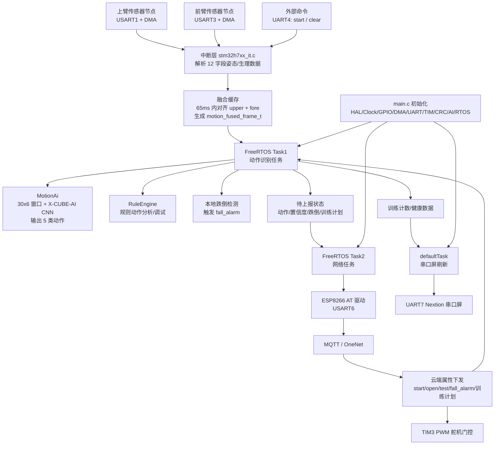

**目录分层**
`Core` 是 CubeMX 生成加用户业务逻辑的核心层，入口在 [Core/Src/main.c](<D:/Qian Start/Smart Watch/H743/Core/Src/main.c:83>)，FreeRTOS 任务在 [Core/Src/freertos.c](<D:/Qian Start/Smart Watch/H743/Core/Src/freertos.c:229>)，串口中断和传感器融合在 [Core/Src/stm32h7xx_it.c](<D:/Qian Start/Smart Watch/H743/Core/Src/stm32h7xx_it.c:377>)。

`BSP` 是板级业务驱动：`ESP8266`、`MqttKit`、`onenet`、`uart_screen`、`health_monitor`、`debug_uart7`。云平台配置在 [BSP/onenet.h](<D:/Qian Start/Smart Watch/H743/BSP/onenet.h:6>)，Wi-Fi/OneNet 主机配置在 [BSP/ESP8266.h](<D:/Qian Start/Smart Watch/H743/BSP/ESP8266.h:6>)。

`X-CUBE-AI` 是 STM32Cube.AI 生成的神经网络代码，封装入口是 `AppXCubeAI_Run()`：[X-CUBE-AI/App/app_x-cube-ai.c](<D:/Qian Start/Smart Watch/H743/X-CUBE-AI/App/app_x-cube-ai.c:145>)。

`Middlewares` 放 FreeRTOS 和 ST AI runtime，`Drivers` 放 CMSIS/HAL，`SYSTEM` 是正点原子的 delay/sys/usart 基础库，`MDK-ARM` 是 Keil 工程。

**关键配置**
MCU 是 `STM32H743ZIT6 / STM32H743ZITx`，CubeMX 版本 `6.17.0`，固件包 `STM32Cube FW_H7 V1.12.1`，工具链 `MDK-ARM V5.32`：[Master.ioc](<D:/Qian Start/Smart Watch/H743/Master.ioc:187>)。

主频配置为 CPU `480MHz`，HCLK `240MHz`：[Master.ioc](<D:/Qian Start/Smart Watch/H743/Master.ioc:333>)。FreeRTOS 使用 CMSIS-RTOS v2，创建 `defaultTask`、`Task1`、`Task2` 三个线程：[Core/Src/freertos.c](<D:/Qian Start/Smart Watch/H743/Core/Src/freertos.c:229>)。

串口配置基本都是 `115200`。当前角色大致是：
`USART1` 接上臂传感器，`USART3` 接前臂传感器，`UART4` 接收 `start/clear` 控制命令，`USART6` 接 ESP8266，`UART7` 当前配置为串口屏，`USART2` 主要用于 printf/调试链路。UART7 当前角色在 [BSP/uart7_role.h](<D:/Qian Start/Smart Watch/H743/BSP/uart7_role.h:13>)。

AI 模型输入是 `30 x 6` 浮点窗口，输出 `5` 类动作：[X-CUBE-AI/App/app_x-cube-ai.h](<D:/Qian Start/Smart Watch/H743/X-CUBE-AI/App/app_x-cube-ai.h:14>)。模型报告显示是 Keras `action_cnn`，`134,192 MACC`，总占用约 `57,868B Flash`、`8,068B RAM`：[X-CUBE-AI/App/network_generate_report.txt](<D:/Qian Start/Smart Watch/H743/X-CUBE-AI/App/network_generate_report.txt:1>)。

**运行流程**
上电后 `main()` 依次初始化 MPU、HAL、时钟、GPIO、DMA、多个 UART、TIM2/TIM3、CRC、X-CUBE-AI，然后初始化舵机门控并启动 FreeRTOS：[Core/Src/main.c](<D:/Qian Start/Smart Watch/H743/Core/Src/main.c:102>)。

传感器数据通过 `USART1_IRQHandler` 和 `USART3_IRQHandler` 接收，解析后按 `65ms` 阈值对齐融合：[Core/Src/stm32h7xx_it.c](<D:/Qian Start/Smart Watch/H743/Core/Src/stm32h7xx_it.c:65>)。

`Task1` 初始化 `MotionAi`、`MotionWindowTest`、`RuleEngine`，循环消费融合帧，执行动作识别、规则分析和本地跌倒判断：[Core/Src/freertos.c](<D:/Qian Start/Smart Watch/H743/Core/Src/freertos.c:339>)。

`Task2` 初始化 ESP8266，连接 OneNet MQTT，周期上报属性，同时解析云端下发的属性控制：[Core/Src/freertos.c](<D:/Qian Start/Smart Watch/H743/Core/Src/freertos.c:438>)。

`defaultTask` 负责串口屏初始化和健康/训练页面刷新：[Core/Src/freertos.c](<D:/Qian Start/Smart Watch/H743/Core/Src/freertos.c:260>)。

**使用方式**
用 Keil MDK 打开 [MDK-ARM/Master.uvprojx](<D:/Qian Start/Smart Watch/H743/MDK-ARM/Master.uvprojx:10>)，选择 `Master` 目标，确认已安装 STM32H7 设备包和 ARM 编译链后编译下载。若要重新生成外设配置，用 STM32CubeMX 打开 [Master.ioc](<D:/Qian Start/Smart Watch/H743/Master.ioc:1>)；若要重新生成 AI 模型，需要原始 `action_cnn.h5`，当前工程内已经包含生成后的 C 代码和 runtime 库。

注意：Wi-Fi、OneNet 产品信息和 token 是硬编码在头文件里的，实际部署前应确认是否过期、是否需要替换，以及避免把真实密钥公开。

---


**OpenAI Codex**

<permissions instructions>
Filesystem sandboxing defines which files can be read or written. `sandbox_mode` is `workspace-write`: The sandbox permits reading files, and editing files in `cwd` and `writable_roots`. Editing files in other directories requires approval. Network access is restricted.
# Escalation Requests

Commands are run outside the sandbox if they are approved by the user, or match an existing rule that allows it to run unrestricted. The command string is split into independent command segments at shell control operators, including but not limited to:

- Pipes: |
- Logical operators: &&, ||
- Command separators: ;
- Subshell boundaries: (...), $(...)

Each resulting segment is evaluated independently for sandbox restrictions and approval requirements.

Example:

git pull | tee output.txt

This is treated as two command segments:

["git", "pull"]

["tee", "output.txt"]

Commands that use more advanced shell features like redirection (>, >>, <), substitutions ($(...), ...), environment variables (FOO=bar), or wildcard patterns (*, ?) will not be evaluated against rules, to limit the scope of what an approved rule allows.

## How to request escalation

IMPORTANT: To request approval to execute a command that will require escalated privileges:

- Provide the `sandbox_permissions` parameter with the value `"require_escalated"`
- Include a short question asking the user if they want to allow the action in `justification` parameter. e.g. "Do you want to download and install dependencies for this project?"
- Optionally suggest a `prefix_rule` - this will be shown to the user with an option to persist the rule approval for future sessions.

If you run a command that is important to solving the user's query, but it fails because of sandboxing or with a likely sandbox-related network error (for example DNS/host resolution, registry/index access, or dependency download failure), rerun the command with "require_escalated". ALWAYS proceed to use the `justification` parameter - do not message the user before requesting approval for the command.

## When to request escalation

While commands are running inside the sandbox, here are some scenarios that will require escalation outside the sandbox:

- You need to run a command that writes to a directory that requires it (e.g. running tests that write to /var)
- You need to run a GUI app (e.g., open/xdg-open/osascript) to open browsers or files.
- If you run a command that is important to solving the user's query, but it fails because of sandboxing or with a likely sandbox-related network error (for example DNS/host resolution, registry/index access, or dependency download failure), rerun the command with `require_escalated`. ALWAYS proceed to use the `sandbox_permissions` and `justification` parameters. do not message the user before requesting approval for the command.
- You are about to take a potentially destructive action such as an `rm` or `git reset` that the user did not explicitly ask for.
- Be judicious with escalating, but if completing the user's request requires it, you should do so - don't try and circumvent approvals by using other tools.

## prefix_rule guidance

When choosing a `prefix_rule`, request one that will allow you to fulfill similar requests from the user in the future without re-requesting escalation. It should be categorical and reasonably scoped to similar capabilities. You should rarely pass the entire command into `prefix_rule`.

### Banned prefix_rules 
Avoid requesting overly broad prefixes that the user would be ill-advised to approve. For example, do not request ["python3"], ["python", "-"], or other similar prefixes that would allow arbitrary scripting.
NEVER provide a prefix_rule argument for destructive commands like rm.
NEVER provide a prefix_rule if your command uses a heredoc or herestring. 

### Examples
Good examples of prefixes:
- ["npm", "run", "dev"]
- ["gh", "pr", "check"]
- ["cargo", "test"]


## Approved command prefixes
The following prefix rules have already been approved: - ["C:\\WINDOWS\\System32\\WindowsPowerShell\\v1.0\\powershell.exe", "-Command", "Get-ChildItem source/img | Select-Object Name,Length"]
- ["C:\\WINDOWS\\System32\\WindowsPowerShell\\v1.0\\powershell.exe", "-Command", "git mv source/img/background.jpg source/img/backgroud.jpg"]
- ["C:\\WINDOWS\\System32\\WindowsPowerShell\\v1.0\\powershell.exe", "-Command", "Get-Help Format-Hex -Parameter * | Select-Object -First 60"]
- ["C:\\WINDOWS\\System32\\WindowsPowerShell\\v1.0\\powershell.exe", "-Command", "Get-ChildItem -Force source/img | Select-Object Name,Length,LastWriteTime"]
- ["C:\\WINDOWS\\System32\\WindowsPowerShell\\v1.0\\powershell.exe", "-Command", "Select-String -Path _config.fluid.yml -Pattern 'emo_fish|menu' -Context 0,3"]
- ["C:\\WINDOWS\\System32\\WindowsPowerShell\\v1.0\\powershell.exe", "-Command", "if(Test-Path source/emo/index.html){Get-Content -Raw source/emo/index.html}"]
- ["C:\\WINDOWS\\System32\\WindowsPowerShell\\v1.0\\powershell.exe", "-Command", "if (Test-Path .gitignore) { Get-Content -Raw .gitignore } else { 'NO_GITIGNORE' }"]
- ["C:\\WINDOWS\\System32\\WindowsPowerShell\\v1.0\\powershell.exe", "-Command", "Move-Item -LiteralPath source/img/background.jpg -Destination source/img/backgroud.jpg"]
- ["C:\\WINDOWS\\System32\\WindowsPowerShell\\v1.0\\powershell.exe", "-Command", "Get-ChildItem -Recurse -File source/login,source/gift,source/imgs,source/css | Select-Object FullName"]
- ["C:\\WINDOWS\\System32\\WindowsPowerShell\\v1.0\\powershell.exe", "-Command", "$b = Get-Content -Encoding Byte -TotalCount 3 _config.fluid.yml; $b | ForEach-Object { '{0:X2}' -f $_ }"]
- ["C:\\WINDOWS\\System32\\WindowsPowerShell\\v1.0\\powershell.exe", "-Command", "if (Test-Path source/css/custom.css) { Get-Content -Raw source/css/custom.css } else { 'NO_CUSTOM_CSS' }"]
- ["C:\\WINDOWS\\System32\\WindowsPowerShell\\v1.0\\powershell.exe", "-Command", "$tmp=[System.IO.Path]::GetTempFileName(); Copy-Item source/gift/index.html $tmp -Force; Write-Output $tmp"]
- ["C:\\WINDOWS\\System32\\WindowsPowerShell\\v1.0\\powershell.exe", "-Command", "$tmp=[System.IO.Path]::GetTempFileName(); Copy-Item source/login/index.html $tmp -Force; Write-Output $tmp"]
- ["C:\\WINDOWS\\System32\\WindowsPowerShell\\v1.0\\powershell.exe", "-Command", "$i=0; Get-Content -Encoding UTF8 source/gift/index.html | % { $i++; if($i -le 20){ '{0,4}: {1}' -f $i, $_ } }"]
- ["C:\\WINDOWS\\System32\\WindowsPowerShell\\v1.0\\powershell.exe", "-Command", "$i=0; Get-Content -Encoding UTF8 source/gift/index.html | ForEach-Object { $i++; if($i -le 30){ '{0,4}: {1}' -f $i, $_ } }"]
- ["C:\\WINDOWS\\System32\\WindowsPowerShell\\v1.0\\powershell.exe", "-Command", "$i=0; Get-Content themes/fluid/_config.yml | ForEach-Object { $i++; if($i -ge 220 -and $i -le 260){ '{0,4}: {1}' -f $i, $_ } }"]
- ["C:\\WINDOWS\\System32\\WindowsPowerShell\\v1.0\\powershell.exe", "-Command", "Get-ChildItem -Recurse -File source | Where-Object { $_.Name -match '^favicon\\.(png|ico|jpg|jpeg)$' } | Select-Object FullName,Name"]
- ["C:\\WINDOWS\\System32\\WindowsPowerShell\\v1.0\\powershell.exe", "-Command", "rg -n \"给 XX|把想说的话|照片故事|六张小小|最后一个小彩蛋|secretText|emo🐟 生日快乐\" source/gift/index.html"]
- ["C:\\WINDOWS\\System32\\WindowsPowerShell\\v1.0\\powershell.exe", "-Command", "Select-String -Path _config.fluid.yml -Encoding utf8 -Pattern 'blog_title|emo🐟|生日快乐' -AllMatches | ForEach-Object { $_.Line }"]
- ["C:\\WINDOWS\\System32\\WindowsPowerShell\\v1.0\\powershell.exe", "-Command", "$i=0; Get-Content -Encoding UTF8 source/gift/index.html | ForEach-Object { $i++; if($i -ge 120 -and $i -le 260){ '{0,4}: {1}' -f $i, $_ } }"]
- ["C:\\WINDOWS\\System32\\WindowsPowerShell\\v1.0\\powershell.exe", "-Command", "$i=0; Get-Content -Encoding UTF8 source/gift/index.html | ForEach-Object { $i++; if($i -ge 270 -and $i -le 380){ '{0,4}: {1}' -f $i, $_ } }"]
- ["C:\\WINDOWS\\System32\\WindowsPowerShell\\v1.0\\powershell.exe", "-Command", "$i=0; Get-Content -Encoding UTF8 source/gift/index.html | ForEach-Object { $i++; if($i -ge 280 -and $i -le 390){ '{0,4}: {1}' -f $i, $_ } }"]
- ["C:\\WINDOWS\\System32\\WindowsPowerShell\\v1.0\\powershell.exe", "-Command", "$i=0; Get-Content -Encoding UTF8 source/gift/index.html | ForEach-Object { $i++; if($i -ge 318 -and $i -le 372){ '{0,4}: {1}' -f $i, $_ } }"]
- ["C:\\WINDOWS\\System32\\WindowsPowerShell\\v1.0\\powershell.exe", "-Command", "$i=0; Get-Content -Encoding UTF8 source/gift/index.html | ForEach-Object { $i++; if($i -ge 392 -and $i -le 520){ '{0,4}: {1}' -f $i, $_ } }"]
- ["C:\\WINDOWS\\System32\\WindowsPowerShell\\v1.0\\powershell.exe", "-Command", "$i=0; Get-Content -Encoding UTF8 source/login/index.html | ForEach-Object { $i++; if($i -ge 180 -and $i -le 260){ '{0,4}: {1}' -f $i, $_ } }"]
- ["C:\\WINDOWS\\System32\\WindowsPowerShell\\v1.0\\powershell.exe", "-Command", "Test-Path source/img/backgroud.jpg; if(Test-Path source/img/backgroud.jpg){ Get-Item source/img/backgroud.jpg | Select-Object FullName,Length,LastWriteTime }"]
- ["C:\\WINDOWS\\System32\...
[Some commands were truncated]

`approvals_reviewer` is `auto_review`: Sandbox escalations with require_escalated will be reviewed for compliance with the policy. If a rejection happens, you should proceed only with a materially safer alternative, or inform the user of the risk and send a final message to ask for approval.
 The writable root is `D:\Qian Start\Smart Watch\H743`.
</permissions instructions>

---


**User**

我想优化一下这个系统架构，希望提高FreeRTOS实时性，以及各种中断优先级设置问题，整体架构优化，我应该再给你提供哪些信息，先简单回答我

---


**OpenAI Codex**

要做 FreeRTOS 实时性和中断优先级优化，最好再提供这些信息：

1. **硬件连接表**
   各 UART、DMA、TIM、传感器、ESP8266、屏幕、舵机分别接什么外设，数据频率是多少。

2. **实时性目标**
   比如传感器数据最大允许延迟、动作识别响应时间、云端控制响应时间、屏幕刷新周期、舵机动作时限。

3. **当前问题现象**
   是否有丢包、卡顿、识别延迟、MQTT 断连、屏幕阻塞、任务饿死、中断过密等。

4. **数据流协议**
   两个传感器节点每帧格式、发送频率、帧长；ESP8266 接收包大小和频率；UART4 命令来源。

5. **当前 FreeRTOS 任务设计意图**
   哪些任务必须实时，哪些可以低优先级；是否允许拆分任务，比如把网络、屏幕、AI、数据融合分开。

6. **Keil/CubeMX 当前配置截图或导出**
   NVIC 优先级、FreeRTOSConfig、DMA 配置、时钟树、串口 DMA/中断设置。

7. **运行时监测数据**
   任务栈余量、CPU 占用、各任务执行周期、串口丢包计数、DMA 溢出次数、HardFault/卡死位置。

8. **优化边界**
   是否允许我改架构和代码，还是只给建议；是否能接受更换 UART 接收方式、队列/消息缓冲、事件组、DMA 双缓冲等方案。

最关键的是：**实时性目标 + 当前异常现象 + 外设数据频率 + 是否允许改代码**。这四个信息足够先做一版架构优化方案。

---


**User**

前五个问题你来根据我现在的整个项配置情况来得出，关于第六七点你也可以根据我目前的项目配置来得出，可以接收优化边界，现在还是在探讨优化的详细方法，后续如果没有问题就可以进行重构

---


**OpenAI Codex**

我先按现有工程静态配置来推导，不会改代码。重点补齐 FreeRTOS 优先级、NVIC 优先级、任务阻塞点和可能的实时性瓶颈。

---


**OpenAI Codex**

可以。按当前项目静态配置，我能先推导出一版优化方向，不需要你额外补很多信息。

**我从现有项目推导出的现状**
你的系统目前大致是：

- `USART1 + DMA`：上臂传感器数据。
- `USART3 + DMA`：前臂传感器数据。
- `UART4 + DMA`：外部命令，主要是 `start / clear`。
- `USART6 + DMA`：ESP8266 / OneNet 网络。
- `UART7`：当前配置为串口屏。
- `TIM3 PWM`：舵机门控。
- `Task1`：动作识别、融合帧消费、AI、规则分析、跌倒判断。
- `Task2`：ESP8266、MQTT、OneNet 上报/下发。
- `defaultTask`：串口屏刷新。

目前 FreeRTOS 配置是抢占式调度，`1ms tick`，`configMAX_SYSCALL_INTERRUPT_PRIORITY = 5`，而 UART、DMA、TIM2 基本全部设成了 NVIC 抢占优先级 `5`。这说明：它们都处在“刚好允许调用 FreeRTOS FromISR API 的最高中断优先级”这一档，但彼此没有分层。

**当前最值得优化的点**
第一，当前中断里做了偏重的事情。比如 `USART1/USART3` 空闲中断里不仅停 DMA、算长度，还解析字符串、`strtof`、做序号统计、做双传感器对齐融合。这个会拉长 ISR 时间，影响整体实时性。

第二，`USART6` 的 ESP8266 接收路径里，每收到数据会喂给 `ESP8266_RxFeedByte()`，里面还会检查字符串状态。这类网络解析也不适合放在中断上下文里做。

第三，任务优先级现在不够合理：`Task2` 网络任务是 `osPriorityNormal`，`Task1` 动作识别是 `osPriorityLow`，这意味着网络任务优先级高于动作识别。对你的项目来说，动作识别/传感器融合通常应该比 MQTT 和屏幕更实时。

第四，屏幕和 ESP8266 发送都用了 `HAL_UART_Transmit(..., HAL_MAX_DELAY)` 这种阻塞式发送。它们在任务里执行还可以接受，但如果任务优先级不合理，会拖慢其他业务。

第五，当前架构里“采集、融合、AI、网络、屏幕”边界还不够清晰。后续重构最好把它们拆成明确的数据流，不要让中断直接承担业务逻辑。

**建议的优化架构**
我建议后续按这个方向重构：

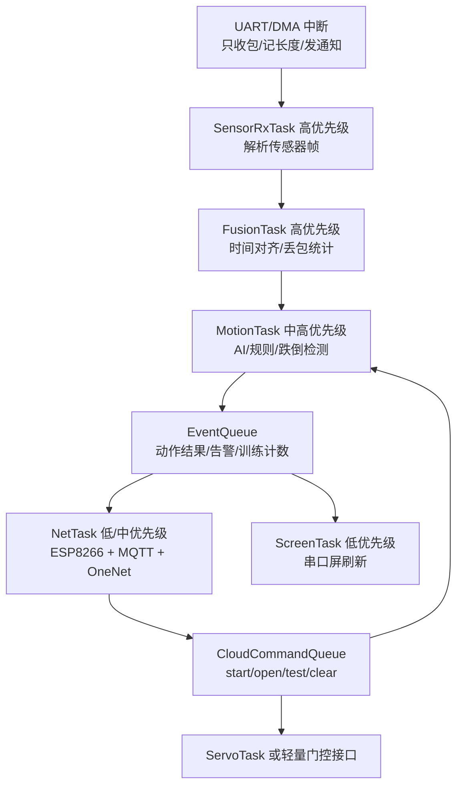

**优先级初步建议**
可以先定成这样：

- 最高：传感器 UART/DMA 接收相关 ISR，但 ISR 内只做轻活。
- 高优先级任务：`SensorRxTask / FusionTask`。
- 中高优先级任务：`MotionTask`，跑 AI、规则、跌倒判断。
- 中优先级任务：`CommandTask`，处理本地/云端控制命令。
- 低优先级任务：`NetTask`，MQTT、ESP8266。
- 最低优先级任务：`ScreenTask`，串口屏刷新。

NVIC 方面，后续可以分层，不要全部放 `5`。但如果某个中断将来要调用 `xQueueSendFromISR` / `osMessageQueuePut`，它的数值优先级必须保持 `>= 5`，也就是不能设成 `0~4`。这个边界很关键。

**重构优先顺序**
我建议后续按这 4 步来，不要一次大改：

1. 先把 `USART1/USART3` 中断里的解析和融合移出 ISR，只在中断里投递原始帧。
2. 调整任务优先级，让动作识别高于网络和屏幕。
3. 把 ESP8266 接收解析从字节级中断处理改成 DMA/缓冲区 + 网络任务解析。
4. 再统一整理事件队列：动作结果、跌倒告警、门控、训练计数、屏幕刷新都走明确队列或事件组。

这样改的风险最低，也最能直接改善实时性。

---


**OpenAI Codex**

<collaboration_mode># Collaboration Mode: Default

You are now in Default mode. Any previous instructions for other modes (e.g. Plan mode) are no longer active.

Your active mode changes only when new developer instructions with a different `<collaboration_mode>...</collaboration_mode>` change it; user requests or tool descriptions do not change mode by themselves. Known mode names are Default and Plan.

## request_user_input availability

Use the `request_user_input` tool only when it is listed in the available tools for this turn.

In Default mode, strongly prefer making reasonable assumptions and executing the user's request rather than stopping to ask questions. If you absolutely must ask a question because the answer cannot be discovered from local context and a reasonable assumption would be risky, ask the user directly with a concise plain-text question. Never write a multiple choice question as a textual assistant message.
</collaboration_mode>

---


**User**

[$karpathy-guidelines](C:\\Users\\33709\\.codex\\skills\\karpathy-guidelines\\SKILL.md) 你现在在和Claude来探讨怎么来合理又不复杂地来优化这个架构，你再详细思考先给我一个简化版方案

---


**OpenAI Codex**

我会使用 `karpathy-guidelines`，重点按“少改、可验证、避免过度设计”的原则，把方案收敛成能和 Claude 讨论的简化版。先读取这份 skill 的具体约束。

---


**OpenAI Codex**

英文内容先说明：`Claude` 指另一个 AI 助手；`karpathy-guidelines` 是要求我们按“少改、明确假设、避免过度设计、每步可验证”的工程准则来讨论方案。

**简化版结论**
不要一上来把系统拆成很多任务。最合理的简化优化方案是：**保留现有 3 个主任务框架，只先解决两个核心问题：中断过重、任务优先级反了。**

**方案目标**
当前系统最实时的是：

1. 两路传感器接收。
2. 双传感器时间对齐。
3. 动作识别 / 跌倒判断。

不太实时的是：

1. OneNet / MQTT。
2. 串口屏刷新。
3. 调试打印。
4. 舵机门控，除非云端开门要求很快。

所以第一阶段不要大重构，先把实时链路拉直。

**建议架构**
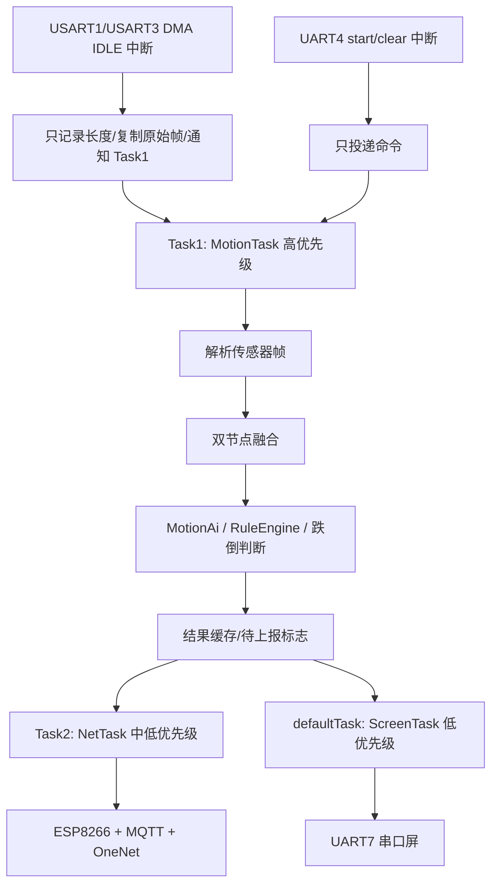

**最小改动点**
第一步只改这几个地方：

1. `USART1_IRQHandler` / `USART3_IRQHandler` 不再解析字符串、不再 `strtof`、不再做融合。
2. 中断里只做：算 DMA 接收长度、保存原始数据、重启 DMA、通知 `Task1`。
3. `Task1` 从“10ms 轮询融合结果”改成“收到传感器帧通知后处理”。
4. `Task1` 优先级提高到 `osPriorityAboveNormal`。
5. `Task2` 网络任务降到 `osPriorityBelowNormal` 或保持 `Normal`，但必须低于 `Task1`。
6. `defaultTask` 屏幕任务保持低优先级。

**中断优先级简化建议**
你现在 UART、DMA、TIM2 基本都是优先级 `5`，不分层。建议先这样分：

| 中断 | 建议优先级 | 原因 |
|---|---:|---|
| `USART1_IRQn` / `USART3_IRQn` | 5 | 两路传感器最关键 |
| `DMA1_Stream0/1` | 5 | 对应传感器 DMA |
| `UART4_IRQn` / `DMA1_Stream2` | 6 | start/clear 命令重要，但低于传感器 |
| `USART6_IRQn` / `DMA1_Stream3` | 7 | ESP8266 网络不应抢传感器 |
| `UART7_IRQn` | 8 或更低 | 屏幕最低 |
| `TIM2_IRQn` | 8~10 | 当前校准逻辑基本停用，不应抢实时链路 |

注意：FreeRTOS 当前 `configLIBRARY_MAX_SYSCALL_INTERRUPT_PRIORITY = 5`，所以如果中断里要调用 `FromISR` API，优先级数值必须是 `5` 或更大，不能设成 `0~4`。

**暂时不要做的事**
第一阶段不建议做这些：

1. 不要马上拆成 `SensorTask/FusionTask/AITask/NetTask/ScreenTask` 五六个任务。
2. 不要重写 OneNet/MQTT。
3. 不要立刻把所有 UART TX 都改 DMA。
4. 不要动 AI 模型结构。
5. 不要大范围改 BSP 接口。

这些会扩大风险，而且不一定是当前瓶颈。

**第一阶段成功标准**
重构后只看几个指标：

1. 中断里不再出现 `strtof`、业务融合、长字符串解析。
2. 传感器帧丢包计数 `g_lost_u/g_lost_f` 不上升或明显下降。
3. `g_align_fail_count` 不上升或下降。
4. `Task1` 不再靠 `osDelay(10)` 轮询等数据。
5. MQTT 断连、屏幕刷新不会影响动作识别。
6. 动作识别响应比现在更稳定。

一句话：**先把“中断采集”和“任务处理”切开，再把 Task1 提到网络和屏幕前面。** 这是当前最合理、最不复杂、收益最大的第一版架构优化。

---


**OpenAI Codex**

<collaboration_mode># Collaboration Mode: Default

You are now in Default mode. Any previous instructions for other modes (e.g. Plan mode) are no longer active.

Your active mode changes only when new developer instructions with a different `<collaboration_mode>...</collaboration_mode>` change it; user requests or tool descriptions do not change mode by themselves. Known mode names are Default and Plan.

## request_user_input availability

Use the `request_user_input` tool only when it is listed in the available tools for this turn.

In Default mode, strongly prefer making reasonable assumptions and executing the user's request rather than stopping to ask questions. If you absolutely must ask a question because the answer cannot be discovered from local context and a reasonable assumption would be risky, ask the user directly with a concise plain-text question. Never write a multiple choice question as a textual assistant message.
</collaboration_mode>

---


**User**

[$karpathy-guidelines](C:\\Users\\33709\\.codex\\skills\\karpathy-guidelines\\SKILL.md) 根据这个skill来优化一下我的代码逻辑，现在我的代码虽然能跑的但是代码有点过度设计，并且没有高内聚低耦合，请你帮我一步一步来修改各个模块

---


**OpenAI Codex**

我会按 `karpathy-guidelines` 做：先收敛范围、只动能直接降低耦合的模块、每一步都给出可验证结果。先重新读取 skill，然后我会给出第一阶段改动边界；涉及删除/迁移旧代码时会先按你的规则确认。

---


**OpenAI Codex**

当前工作区已经有一个修改过的文件：`Core/Src/stm32h7xx_it.c`。我需要先看差异，避免覆盖你已有改动；然后只选一个最小模块作为第一步。

---


**OpenAI Codex**

现有改动已经把 `USART1/USART3` 的解析从中断里挪出了一半：中断现在存原始包并通知 `Task1`，但 `Task1` 还没有消费 `Motion_ProcessPendingPosePackets()`。第一步我会只做“接线”和优先级调整，不移动大段代码、不删除旧逻辑。

---


**OpenAI Codex**

`freertos.c` 现在也已经有对应改动：Task1 优先级提高、Task2 降低，并且开始调用 `Motion_ProcessPendingPosePackets()`。这一步的主逻辑已经形成了；我接下来做一个更小的收口：把跨模块函数声明从散落的 `.c` 文件里收进一个头文件，先把接口边界固定下来。

---


**OpenAI Codex**

第一处收口会很小：新增一个 `motion_input.h`，把“动作输入/命令入口”的跨模块 API 放进去；`freertos.c` 和 `onenet.c` 不再直接依赖中断头文件。这样先减少耦合，不碰核心算法。

---


**User**

暂时不要你修改

---


**OpenAI Codex**

收到，暂停修改。我刚刚已经做了一个很小的接口收口改动；我现在只撤回我刚做的这部分，保留你/Claude 已有的改动不动。

---


**User**

你先把修改方案给我看看

---


**OpenAI Codex**

我不会继续改文件。先核对一下当前差异，确保下面方案只基于现有状态来讲，不把我的临时收口改动混进去。

---


**OpenAI Codex**

英文内容先说明：`skill` 这里指你指定的 `karpathy-guidelines` 约束，我会按“先想清楚、少改、每步可验证、不做大而全重构”的原则给方案。

我建议先按 **5 个小阶段** 来改，不要一次性重构全项目。

**阶段 0：确认当前基线**
当前工作区已经有这些文件处于修改状态：

- `Core/Src/stm32h7xx_it.c`
- `Core/Src/freertos.c`
- `Core/Src/dma.c`
- `Core/Src/tim.c`
- `Core/Src/usart.c`

其中 `stm32h7xx_it.c` 和 `freertos.c` 已经有一版“中断轻量化 + Task1 消费待处理包”的改动。这部分需要先确认是你或 Claude 的最新方案，后续我只在这个基础上收口，不覆盖。

**阶段 1：先闭环实时链路，不拆大架构**
目标：让传感器数据链路更实时，但保持现有 3 个任务结构。

改动范围：

- `USART1_IRQHandler`
- `USART3_IRQHandler`
- `StartTask1`
- FreeRTOS 任务优先级

方案：

- 中断只做：算 DMA 长度、保存原始包、通知 `Task1`。
- `Task1` 做：解析字符串、时间对齐、融合、AI、规则判断。
- `Task1` 优先级高于网络任务。
- `Task2` 网络任务低于 `Task1`。
- 屏幕任务继续最低优先级。

验证标准：

- 中断里不再执行 `strtof`。
- 中断里不再做融合。
- `Task1` 不再纯 `osDelay(10)` 轮询。
- `g_lost_u/g_lost_f/g_align_fail_count` 不变差。

**阶段 2：建立一个轻量 motion_input 模块**
目标：降低耦合，不再让 `onenet.c`、`freertos.c` 直接依赖 `stm32h7xx_it.c` 的内部函数。

建议新增：

- `Core/Inc/motion_input.h`
- 后续可选 `Core/Src/motion_input.c`

先只暴露 3 个接口：

```c
uint8_t Motion_ProcessPendingPosePackets(void);
void Motion_RequestStart(void);
void Motion_RequestClear(void);
```

然后：

- `freertos.c` include `motion_input.h`
- `onenet.c` include `motion_input.h`
- 不再让业务模块 include `stm32h7xx_it.h` 来拿运动控制接口

验证标准：

- `onenet.c` 不直接依赖中断头文件。
- 跨模块函数声明不再散落在 `.c` 文件里。
- 编译无隐式声明。

**阶段 3：把传感器解析/融合从中断文件迁出去**
目标：提高内聚。`stm32h7xx_it.c` 只保留真正的 ISR；传感器协议解析和融合放到独立模块。

建议模块：

- `motion_sensor_pipeline.h`
- `motion_sensor_pipeline.c`

迁移内容：

- `pose_frame_t`
- `parse_pose_frame`
- `update_seq_stats`
- `try_emit_fused`
- `process_pose_packet`
- 融合帧状态管理

`stm32h7xx_it.c` 最终只负责：

- UART IDLE 判断
- DMA stop/restart
- 把原始数据交给 pipeline
- 通知任务

验证标准：

- `stm32h7xx_it.c` 明显变薄。
- 传感器协议修改只影响 `motion_sensor_pipeline.c`。
- AI 模块不关心 UART/DMA 细节。

**阶段 4：网络模块降耦合**
当前 `onenet.c` 同时做了：

- MQTT 包处理
- JSON 解析
- 云端属性处理
- 舵机控制
- 动作开始/清除
- 训练计划状态管理

这块先不大拆，建议只做一个小收口：

新增内部函数或小模块处理云端命令：

```c
static void OneNet_HandleStartCommand(...);
static void OneNet_HandleFallCommand(...);
static void OneNet_HandleDoorCommand(...);
static void OneNet_HandleTrainPlanCommand(...);
```

先不改协议、不改 MQTT，只把 `OneNet_RevPro()` 里的大块逻辑拆薄。

验证标准：

- `OneNet_RevPro()` 变短。
- 每个云端属性有独立处理函数。
- 不改变 MQTT topic 和 payload 格式。

**阶段 5：最后再优化 ESP8266 接收**
这是后做，不要第一步碰。

原因：ESP8266 当前链路能跑，改它风险比传感器链路更高。

后续方向：

- `USART6` 接收尽量用 DMA buffer。
- 中断或 callback 只收数据。
- `ESP8266_GetIPD()` / MQTT 解析放在 `Task2`。
- 避免在接收回调里频繁字符串扫描。

验证标准：

- MQTT 功能不退化。
- 断线重连仍可用。
- 网络卡顿不影响 `Task1`。

**我建议第一刀怎么下**
第一刀只做：

1. 确认当前 `stm32h7xx_it.c + freertos.c` 的已有改动是否保留。
2. 如果保留，就只做接口收口：新增 `motion_input.h`。
3. 不马上搬大段代码。
4. 编译通过后，再进入阶段 3，把传感器解析/融合迁出 `stm32h7xx_it.c`。

这样最稳，也符合 `karpathy-guidelines`：每一步都小、目标明确、可回退、可验证。

---


**User**

把你要修改的模块逻辑分别修改前修改后逻辑都跟我说下，并且也给我修改前后示意图

---


**OpenAI Codex**

下面只是**修改方案说明**，不改代码。

**整体原则**
按 `karpathy-guidelines`，我建议分阶段小改，不一次性大重构。核心目标是：

- 中断只负责“收数据 + 通知”
- 业务逻辑放回任务或业务模块
- 每个模块只管自己的事
- 先优化实时主链路，再动网络和屏幕

**修改前整体图**
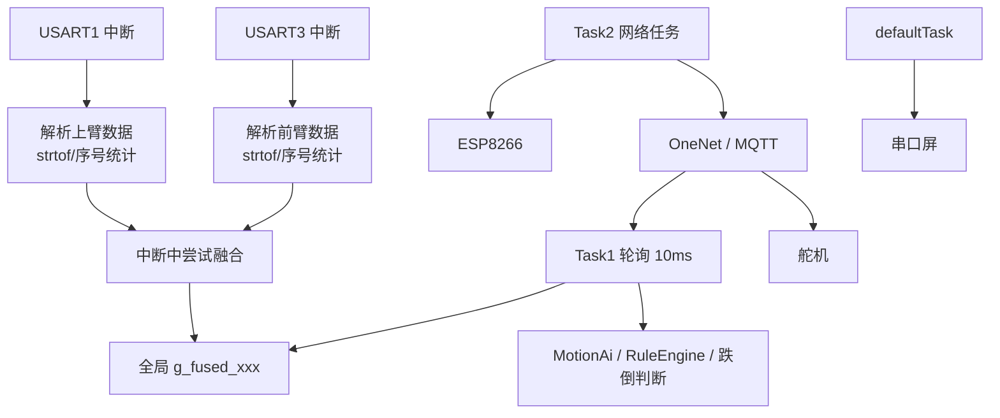

**修改后整体图**
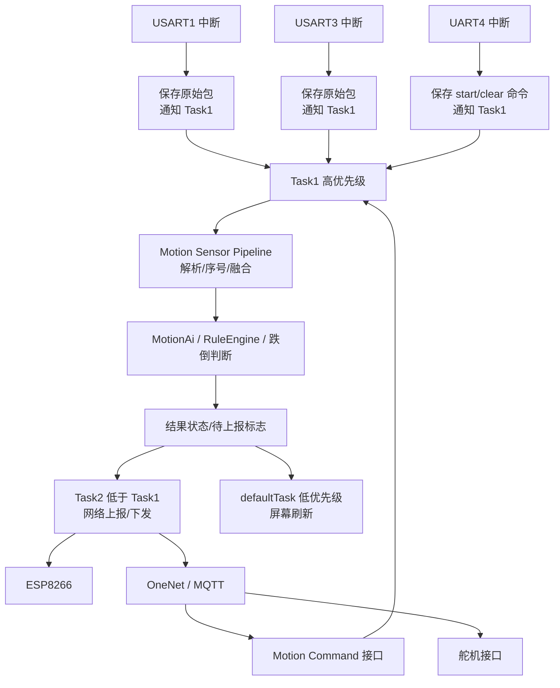

**模块 1：中断模块 `stm32h7xx_it.c`**
修改前逻辑：

- `USART1_IRQHandler` 直接解析上臂数据。
- `USART3_IRQHandler` 直接解析前臂数据。
- 中断里执行 `strtof`、字符串拆分、序号统计。
- 中断里尝试做双传感器时间对齐融合。
- 中断文件里混有“采集、解析、融合、运动控制命令”等业务逻辑。

修改后逻辑：

- 中断只做最小动作：
  - 判断 IDLE
  - 计算 DMA 接收长度
  - 复制原始数据到 pending buffer
  - 记录时间戳
  - 通知 `Task1`
  - 重启 DMA
- 不在中断里解析浮点数。
- 不在中断里做融合。
- `stm32h7xx_it.c` 逐步回归“中断处理文件”。

模块示意图：

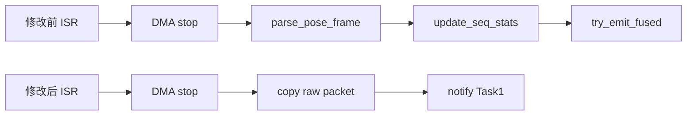

**模块 2：运动输入接口 `motion_input`**
修改前逻辑：

- `Motion_RequestStart`
- `Motion_RequestClear`
- `Motion_ProcessPendingPosePackets`

这些接口实际属于“运动输入控制”，但声明散落在 `.c` 文件或通过 `stm32h7xx_it.h` 被其他模块间接使用。

问题是：`onenet.c` 为了调用运动控制接口，可能需要依赖中断头文件，耦合不合理。

修改后逻辑：

新增轻量接口头：

```c
motion_input.h
```

只暴露：

```c
uint8_t Motion_ProcessPendingPosePackets(void);
void Motion_RequestStart(void);
void Motion_RequestClear(void);
```

这样：

- `freertos.c` 调 `Motion_ProcessPendingPosePackets`
- `onenet.c` 调 `Motion_RequestStart / Motion_RequestClear`
- 它们不再关心这些函数最初是否来自中断文件

示意图：

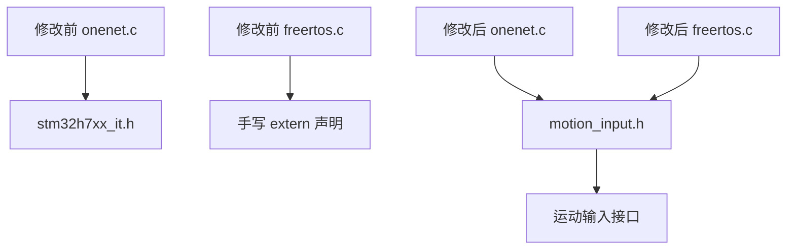

**模块 3：传感器解析与融合模块**
修改前逻辑：

- `pose_frame_t`
- `parse_pose_frame`
- `update_seq_stats`
- `try_emit_fused`
- `g_fused_xxx`
- `g_lost_xxx`
- `g_align_fail_count`

这些都在 `stm32h7xx_it.c` 里。

问题是：中断文件太胖，业务逻辑不内聚。

修改后逻辑：

后续拆出：

```c
motion_sensor_pipeline.h
motion_sensor_pipeline.c
```

它专门负责：

- 解析传感器帧
- 维护上臂/前臂最新帧
- 序号丢包统计
- 时间戳对齐
- 生成融合帧

`Task1` 调它，ISR 不直接调解析逻辑。

示意图：

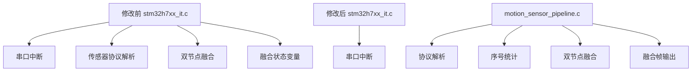

**模块 4：FreeRTOS 任务逻辑 `freertos.c`**
修改前逻辑：

- `Task1` 优先级低。
- `Task2` 网络任务优先级高于 `Task1`。
- `Task1` 主要靠 `osDelay(10)` 轮询 `g_fused_row_ready`。
- 网络任务、屏幕任务可能影响动作识别及时性。

修改后逻辑：

- `Task1` 提高优先级。
- `Task2` 降低到低于 `Task1`。
- `Task1` 被传感器中断通知后及时处理 pending packet。
- 没有数据时再阻塞等待通知或超时。
- 保留现有 3 任务结构，不新增一堆任务。

示意图：

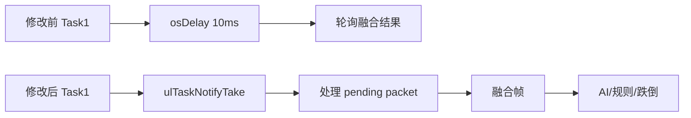

建议优先级：

| 任务 | 修改前 | 修改后 |
|---|---|---|
| `Task1` 动作识别 | `Low` | `AboveNormal` |
| `Task2` 网络 | `Normal` | `BelowNormal` |
| `defaultTask` 屏幕 | `Low` | 暂时保持 `Low` |

**模块 5：OneNet 云端控制 `onenet.c`**
修改前逻辑：

`OneNet_RevPro()` 里混合了很多事情：

- MQTT 包解析
- topic 判断
- JSON 字段解析
- 开门控制
- 跌倒告警控制
- start 命令
- test/demo override
- 训练计划
- reply 回复

修改后逻辑：

第一阶段不重写 OneNet，只把大函数拆薄：

```c
OneNet_HandleDoorCommand()
OneNet_HandleFallAlarmCommand()
OneNet_HandleStartCommand()
OneNet_HandleTestCommand()
OneNet_HandleTrainPlanCommand()
```

`OneNet_RevPro()` 只负责：

- 收到 MQTT publish
- 解析 topic/payload
- 分发到对应 handler

示意图：

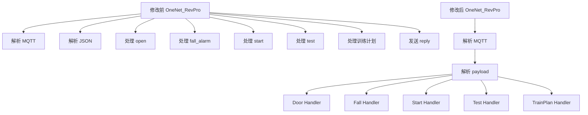

**建议实际修改顺序**
我建议你和 Claude 讨论时按这个顺序：

1. 先确认 `stm32h7xx_it.c + freertos.c` 这版“中断轻量化”是否保留。
2. 新增 `motion_input.h`，先解决跨模块接口散乱。
3. 把传感器解析/融合迁到 `motion_sensor_pipeline.c`。
4. 再拆薄 `OneNet_RevPro()`。
5. 最后再考虑 ESP8266 接收和串口发送 DMA 化。

**第一阶段我建议只改这些**
如果你同意进入第一阶段，我只会动：

- `Core/Src/stm32h7xx_it.c`
- `Core/Src/freertos.c`
- 新增 `Core/Inc/motion_input.h`

暂时不碰：

- AI 算法
- OneNet 协议格式
- ESP8266 驱动
- 屏幕驱动
- 舵机逻辑

这样风险最低，收益也最明确。

---


**OpenAI Codex**

<collaboration_mode># Plan Mode (Conversational)

You work in 3 phases, and you should *chat your way* to a great plan before finalizing it. A great plan is very detailed—intent- and implementation-wise—so that it can be handed to another engineer or agent to be implemented right away. It must be **decision complete**, where the implementer does not need to make any decisions.

## Mode rules (strict)

You are in **Plan Mode** until a developer message explicitly ends it.

Plan Mode is not changed by user intent, tone, or imperative language. If a user asks for execution while still in Plan Mode, treat it as a request to **plan the execution**, not perform it.

## Plan Mode vs update_plan tool

Plan Mode is a collaboration mode that can involve requesting user input and eventually issuing a `<proposed_plan>` block.

Separately, `update_plan` is a checklist/progress/TODOs tool; it does not enter or exit Plan Mode. Do not confuse it with Plan mode or try to use it while in Plan mode. If you try to use `update_plan` in Plan mode, it will return an error.

## Execution vs. mutation in Plan Mode

You may explore and execute **non-mutating** actions that improve the plan. You must not perform **mutating** actions.

### Allowed (non-mutating, plan-improving)

Actions that gather truth, reduce ambiguity, or validate feasibility without changing repo-tracked state. Examples:

* Reading or searching files, configs, schemas, types, manifests, and docs
* Static analysis, inspection, and repo exploration
* Dry-run style commands when they do not edit repo-tracked files
* Tests, builds, or checks that may write to caches or build artifacts (for example, `target/`, `.cache/`, or snapshots) so long as they do not edit repo-tracked files

### Not allowed (mutating, plan-executing)

Actions that implement the plan or change repo-tracked state. Examples:

* Editing or writing files
* Running formatters or linters that rewrite files
* Applying patches, migrations, or codegen that updates repo-tracked files
* Side-effectful commands whose purpose is to carry out the plan rather than refine it

When in doubt: if the action would reasonably be described as "doing the work" rather than "planning the work," do not do it.

## PHASE 1 — Ground in the environment (explore first, ask second)

Begin by grounding yourself in the actual environment. Eliminate unknowns in the prompt by discovering facts, not by asking the user. Resolve all questions that can be answered through exploration or inspection. Identify missing or ambiguous details only if they cannot be derived from the environment. Silent exploration between turns is allowed and encouraged.

Before asking the user any question, perform at least one targeted non-mutating exploration pass (for example: search relevant files, inspect likely entrypoints/configs, confirm current implementation shape), unless no local environment/repo is available.

Exception: you may ask clarifying questions about the user's prompt before exploring, ONLY if there are obvious ambiguities or contradictions in the prompt itself. However, if ambiguity might be resolved by exploring, always prefer exploring first.

Do not ask questions that can be answered from the repo or system (for example, "where is this struct?" or "which UI component should we use?" when exploration can make it clear). Only ask once you have exhausted reasonable non-mutating exploration.

## PHASE 2 — Intent chat (what they actually want)

* Keep asking until you can clearly state: goal + success criteria, audience, in/out of scope, constraints, current state, and the key preferences/tradeoffs.
* Bias toward questions over guessing: if any high-impact ambiguity remains, do NOT plan yet—ask.

## PHASE 3 — Implementation chat (what/how we’ll build)

* Once intent is stable, keep asking until the spec is decision complete: approach, interfaces (APIs/schemas/I/O), data flow, edge cases/failure modes, testing + acceptance criteria, rollout/monitoring, and any migrations/compat constraints.

## Asking questions

Critical rules:

* Strongly prefer using the `request_user_input` tool to ask any questions.
* Offer only meaningful multiple‑choice options; don’t include filler choices that are obviously wrong or irrelevant.
* In rare cases where an unavoidable, important question can’t be expressed with reasonable multiple‑choice options (due to extreme ambiguity), you may ask it directly without the tool.

You SHOULD ask many questions, but each question must:

* materially change the spec/plan, OR
* confirm/lock an assumption, OR
* choose between meaningful tradeoffs.
* not be answerable by non-mutating commands.

Use the `request_user_input` tool only for decisions that materially change the plan, for confirming important assumptions, or for information that cannot be discovered via non-mutating exploration.

## Two kinds of unknowns (treat differently)

1. **Discoverable facts** (repo/system truth): explore first.

   * Before asking, run targeted searches and check likely sources of truth (configs/manifests/entrypoints/schemas/types/constants).
   * Ask only if: multiple plausible candidates; nothing found but you need a missing identifier/context; or ambiguity is actually product intent.
   * If asking, present concrete candidates (paths/service names) + recommend one.
   * Never ask questions you can answer from your environment (e.g., “where is this struct”).

2. **Preferences/tradeoffs** (not discoverable): ask early.

   * These are intent or implementation preferences that cannot be derived from exploration.
   * Provide 2–4 mutually exclusive options + a recommended default.
   * If unanswered, proceed with the recommended option and record it as an assumption in the final plan.

## Finalization rule

Only output the final plan when it is decision complete and leaves no decisions to the implementer.

When you present the official plan, wrap it in a `<proposed_plan>` block so the client can render it specially:

1) The opening tag must be on its own line.
2) Start the plan content on the next line (no text on the same line as the tag).
3) The closing tag must be on its own line.
4) Use Markdown inside the block.
5) Keep the tags exactly as `<proposed_plan>` and `</proposed_plan>` (do not translate or rename them), even if the plan content is in another language.

Example:

<proposed_plan>
plan content
</proposed_plan>

plan content should be human and agent digestible. The final plan must be plan-only, concise by default, and include:

* A clear title
* A brief summary section
* Important changes or additions to public APIs/interfaces/types
* Test cases and scenarios
* Explicit assumptions and defaults chosen where needed

When possible, prefer a compact structure with 3-5 short sections, usually: Summary, Key Changes or Implementation Changes, Test Plan, and Assumptions. Do not include a separate Scope section unless scope boundaries are genuinely important to avoid mistakes.

Prefer grouped implementation bullets by subsystem or behavior over file-by-file inventories. Mention files only when needed to disambiguate a non-obvious change, and avoid naming more than 3 paths unless extra specificity is necessary to prevent mistakes. Prefer behavior-level descriptions over symbol-by-symbol removal lists. For v1 feature-addition plans, do not invent detailed schema, validation, precedence, fallback, or wire-shape policy unless the request establishes it or it is needed to prevent a concrete implementation mistake; prefer the intended capability and minimum interface/behavior changes.

Keep bullets short and avoid explanatory sub-bullets unless they are needed to prevent ambiguity. Prefer the minimum detail needed for implementation safety, not exhaustive coverage. Within each section, compress related changes into a few high-signal bullets and omit branch-by-branch logic, repeated invariants, and long lists of unaffected behavior unless they are necessary to prevent a likely implementation mistake. Avoid repeated repo facts and irrelevant edge-case or rollout detail. For straightforward refactors, keep the plan to a compact summary, key edits, tests, and assumptions. If the user asks for more detail, then expand.

Do not ask "should I proceed?" in the final output. The user can easily switch out of Plan mode and request implementation if you have included a `<proposed_plan>` block in your response. Alternatively, they can decide to stay in Plan mode and continue refining the plan.

Only produce at most one `<proposed_plan>` block per turn, and only when you are presenting a complete spec.

If the user stays in Plan mode and asks for revisions after a prior `<proposed_plan>`, any new `<proposed_plan>` must be a complete replacement.
</collaboration_mode>

---


**User**

[$karpathy-guidelines](C:\\Users\\33709\\.codex\\skills\\karpathy-guidelines\\SKILL.md) 根据这个规则以及计划模式来一个一个修改

---


**OpenAI Codex**

英文内容先解释：`karpathy-guidelines` 是你指定的“少改、明确假设、避免过度设计、每步可验证”的代码修改规则；`Plan Mode` 是当前“先规划、不直接改代码”的工作模式。  
我先只做非修改性的检查，把当前工作区状态和已有改动摸清楚，再把“一个一个改”的执行顺序定成可交给实现者直接照做的计划。

---


**OpenAI Codex**

我看到当前已经存在一组未提交改动：中断优先级已分层、Task1/Task2 优先级已调、`USART1/USART3` 中断已开始改成“存包 + 通知 Task1”。这会影响计划基线，所以我需要先锁定是沿着这版继续收口，还是先把它当作草稿重新规划。

---


**OpenAI Codex**

这三个“基线”选项的意思是：

1. **沿用现有改动**
   你现在项目里已经有一些未提交修改，比如：
   - 中断优先级已经改了一部分
   - `Task1` 优先级已经提高
   - `USART1/USART3` 中断已经开始改成“只存原始包，不直接解析”
   
   选择这个就是：**把这些现有改动当成已经做了一半的第一步，我继续在它基础上帮你整理方案和后续步骤。**
   
   我推荐这个，因为这些改动方向基本符合我们刚才讨论的实时性优化。

2. **按原始代码规划**
   意思是：**先不承认当前这些未提交改动，把它们当草稿参考，正式方案从 git 原始版本开始重新设计。**
   
   这个更干净，但会浪费你或 Claude 已经做过的一些工作。

3. **仅继续讨论**
   意思是：**暂时不形成可执行改动计划，只继续聊架构方案。**
   
   适合你还没决定是否真的重构时用。

你已经选了“一个模块一步”，这个我同意。  
现在只需要你确认基线：我建议选 **沿用现有改动**。

---


**User**

好的确实我刚刚修改了一点点，内容，请沿用现有改动继续来修改

---


**OpenAI Codex**

<proposed_plan>
# H743 架构优化分步计划

## Summary
沿用当前已有改动作为基线：中断优先级已开始分层，`Task1` 已高于网络任务，`USART1/USART3` 已开始从“中断内解析融合”改为“中断存包 + 通知 Task1”。后续按“一个模块一步”推进，不做大爆炸重构。

核心目标：先把实时链路闭环，再做低耦合收口。每步都保持可编译、可回退、可验证。

## Step 1：收口当前实时链路改动
修改模块：`stm32h7xx_it.c`、`freertos.c`、`dma.c`、`usart.c`、`tim.c`

修改前逻辑：
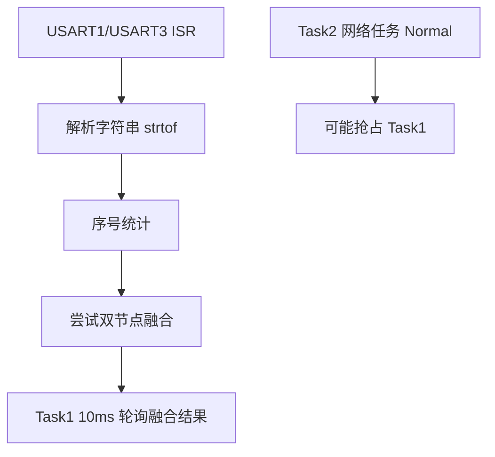

修改后逻辑：
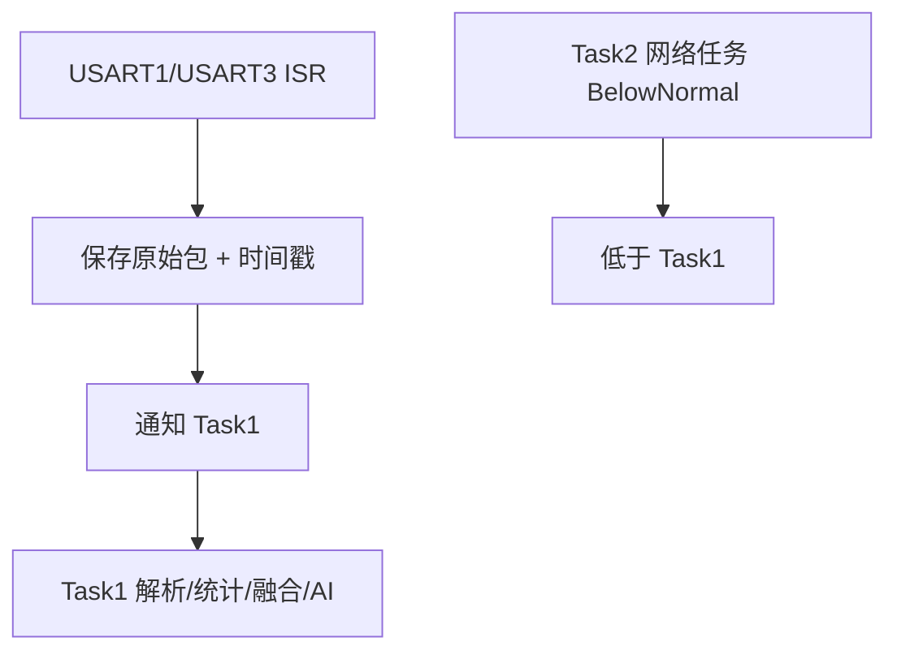

实施要点：
- 保留当前 ISR 轻量化方向。
- 检查 `Task1Handle` 在调度器启动前后是否安全使用。
- 保留 `USART1/USART3` 和对应 DMA 优先级为 `5`。
- 保留 `UART4=6`、`USART6=7`、`UART7/TIM2=8` 的分层思路。
- 不继续扩大改动范围。

验证：
- 搜索确认 `USART1_IRQHandler/USART3_IRQHandler` 内不再调用 `parse_pose_frame`。
- 确认 `Task1` 调用 `Motion_ProcessPendingPosePackets()`。
- 确认所有调用 FreeRTOS FromISR API 的中断优先级数值 `>= 5`。
- Keil 编译通过。

## Step 2：新增运动输入接口，降低跨模块耦合
修改模块：新增 `motion_input.h`，小改 `freertos.c`、`onenet.c`、`stm32h7xx_it.c`

修改前逻辑：
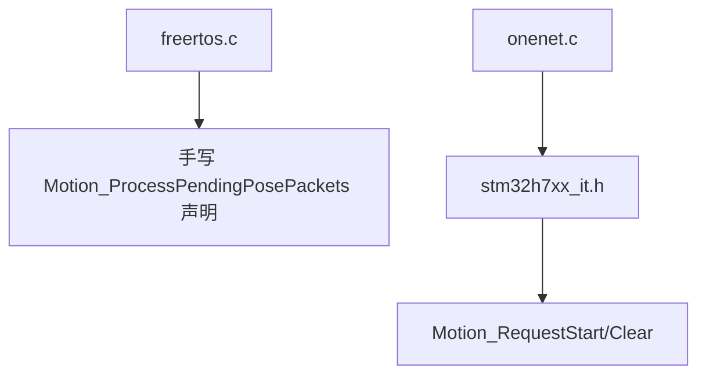

修改后逻辑：
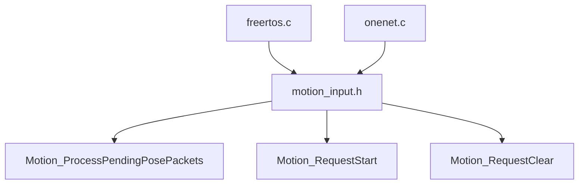

实施要点：
- 新增 `Core/Inc/motion_input.h`，只声明 3 个接口：
  - `Motion_ProcessPendingPosePackets`
  - `Motion_RequestStart`
  - `Motion_RequestClear`
- `freertos.c` include `motion_input.h`，移除本地手写声明。
- `onenet.c` include `motion_input.h`，不再为运动控制依赖 `stm32h7xx_it.h`。
- `stm32h7xx_it.c` include `motion_input.h`，保留函数实现位置不动。

验证：
- 无隐式函数声明。
- `onenet.c` 不再 include `stm32h7xx_it.h`。
- Keil 编译通过。

## Step 3：抽出传感器解析/融合模块
修改模块：新增 `motion_sensor_pipeline.h/.c`，小改 `stm32h7xx_it.c`、`freertos.c`

修改前逻辑：
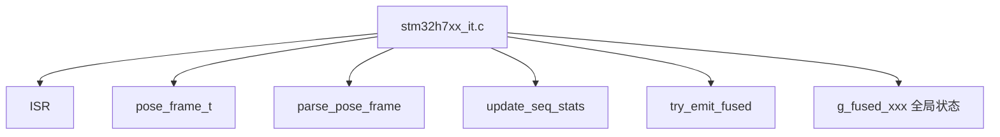

修改后逻辑：
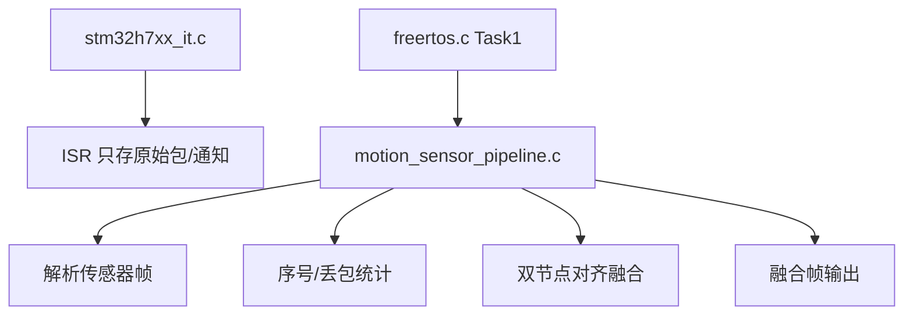

实施要点：
- 新模块只负责传感器协议、序号统计、时间对齐、融合帧状态。
- ISR 不直接解析浮点、不做融合。
- `Task1` 通过 pipeline 接口消费 pending packet 或融合帧。
- 这一步涉及从 `stm32h7xx_it.c` 移走旧代码；实施前需要按你的规则确认“删除/迁移旧代码”的权限。

验证：
- `stm32h7xx_it.c` 中只保留 ISR 和少量中断辅助逻辑。
- 传感器协议相关函数集中在 `motion_sensor_pipeline.c`。
- `Task1` 行为不变：仍能得到 `motion_fused_frame_t`。
- Keil 编译通过，运行后 `g_lost_u/g_lost_f/g_align_fail_count` 不变差。

## Step 4：拆薄 OneNet 下发处理
修改模块：`onenet.c`

修改前逻辑：
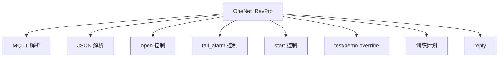

修改后逻辑：
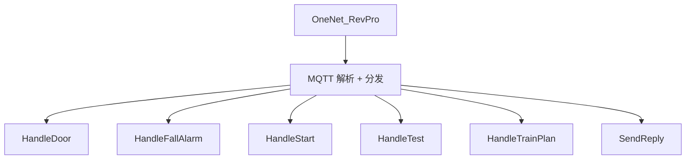

实施要点：
- 不改 MQTT topic。
- 不改 JSON 格式。
- 不改 OneNet 物模型字段。
- 只把 `OneNet_RevPro()` 里的属性处理拆成静态 helper。
- 保持 `Motion_RequestStart/Clear`、`Servo_SetDoorByCloudValue`、`MotionAi_SetDemoOverride` 行为不变。

验证：
- 云端 `open`、`fall_alarm`、`start`、`test`、训练计划仍按原逻辑处理。
- `OneNet_RevPro()` 明显变短。
- Keil 编译通过。

## Step 5：最后再评估 ESP8266 接收优化
修改模块：暂不默认修改，先观察 Step 1-4 后效果。

原因：
- 当前最大实时性问题在传感器 ISR 和任务优先级。
- ESP8266 链路能跑，重写接收风险更高。
- 等传感器链路稳定后，再决定是否把 `USART6` 接收进一步改成更清晰的 DMA buffer + Task2 解析模型。

验证触发条件：
- 如果网络卡顿仍影响动作识别，再进入 ESP8266 接收重构。
- 如果动作识别已稳定，则暂不动 ESP8266。

## Assumptions
- 沿用当前未提交改动作为阶段 1 基线，不回退你刚才和 Claude 已做的修改。
- 每次只推进一个模块，先编译验证，再进入下一模块。
- 删除、迁移旧代码前会单独请求确认；新增头文件和小范围 include 调整不需要额外确认。
- 第一轮优化不改 AI 模型、不改 OneNet 协议、不改屏幕协议、不改舵机行为。
</proposed_plan>

---


**OpenAI Codex**

<collaboration_mode># Collaboration Mode: Default

You are now in Default mode. Any previous instructions for other modes (e.g. Plan mode) are no longer active.

Your active mode changes only when new developer instructions with a different `<collaboration_mode>...</collaboration_mode>` change it; user requests or tool descriptions do not change mode by themselves. Known mode names are Default and Plan.

## request_user_input availability

Use the `request_user_input` tool only when it is listed in the available tools for this turn.

In Default mode, strongly prefer making reasonable assumptions and executing the user's request rather than stopping to ask questions. If you absolutely must ask a question because the answer cannot be discovered from local context and a reasonable assumption would be risky, ask the user directly with a concise plain-text question. Never write a multiple choice question as a textual assistant message.
</collaboration_mode>

---


**User**

PLEASE IMPLEMENT THIS PLAN:
# H743 架构优化分步计划

## Summary
沿用当前已有改动作为基线：中断优先级已开始分层，`Task1` 已高于网络任务，`USART1/USART3` 已开始从“中断内解析融合”改为“中断存包 + 通知 Task1”。后续按“一个模块一步”推进，不做大爆炸重构。

核心目标：先把实时链路闭环，再做低耦合收口。每步都保持可编译、可回退、可验证。

## Step 1：收口当前实时链路改动
修改模块：`stm32h7xx_it.c`、`freertos.c`、`dma.c`、`usart.c`、`tim.c`

修改前逻辑：


修改后逻辑：


实施要点：
- 保留当前 ISR 轻量化方向。
- 检查 `Task1Handle` 在调度器启动前后是否安全使用。
- 保留 `USART1/USART3` 和对应 DMA 优先级为 `5`。
- 保留 `UART4=6`、`USART6=7`、`UART7/TIM2=8` 的分层思路。
- 不继续扩大改动范围。

验证：
- 搜索确认 `USART1_IRQHandler/USART3_IRQHandler` 内不再调用 `parse_pose_frame`。
- 确认 `Task1` 调用 `Motion_ProcessPendingPosePackets()`。
- 确认所有调用 FreeRTOS FromISR API 的中断优先级数值 `>= 5`。
- Keil 编译通过。

## Step 2：新增运动输入接口，降低跨模块耦合
修改模块：新增 `motion_input.h`，小改 `freertos.c`、`onenet.c`、`stm32h7xx_it.c`

修改前逻辑：
```mermaid
flowchart TD
  A["freertos.c"] --> B["手写 Motion_ProcessPendingPosePackets 声明"]
  C["onenet.c"] --> D["stm32h7xx_it.h"]
  D --> E["Motion_RequestStart/Clear"]
```

修改后逻辑：
```mermaid
flowchart TD
  A["freertos.c"] --> H["motion_input.h"]
  C["onenet.c"] --> H
  H --> E["Motion_ProcessPendingPosePackets"]
  H --> F["Motion_RequestStart"]
  H --> G["Motion_RequestClear"]
```

实施要点：
- 新增 `Core/Inc/motion_input.h`，只声明 3 个接口：
  - `Motion_ProcessPendingPosePackets`
  - `Motion_RequestStart`
  - `Motion_RequestClear`
- `freertos.c` include `motion_input.h`，移除本地手写声明。
- `onenet.c` include `motion_input.h`，不再为运动控制依赖 `stm32h7xx_it.h`。
- `stm32h7xx_it.c` include `motion_input.h`，保留函数实现位置不动。

验证：
- 无隐式函数声明。
- `onenet.c` 不再 include `stm32h7xx_it.h`。
- Keil 编译通过。

## Step 3：抽出传感器解析/融合模块
修改模块：新增 `motion_sensor_pipeline.h/.c`，小改 `stm32h7xx_it.c`、`freertos.c`

修改前逻辑：
```mermaid
flowchart TD
  A["stm32h7xx_it.c"] --> B["ISR"]
  A --> C["pose_frame_t"]
  A --> D["parse_pose_frame"]
  A --> E["update_seq_stats"]
  A --> F["try_emit_fused"]
  A --> G["g_fused_xxx 全局状态"]
```

修改后逻辑：
```mermaid
flowchart TD
  A["stm32h7xx_it.c"] --> B["ISR 只存原始包/通知"]
  C["motion_sensor_pipeline.c"] --> D["解析传感器帧"]
  C --> E["序号/丢包统计"]
  C --> F["双节点对齐融合"]
  C --> G["融合帧输出"]
  H["freertos.c Task1"] --> C
```

实施要点：
- 新模块只负责传感器协议、序号统计、时间对齐、融合帧状态。
- ISR 不直接解析浮点、不做融合。
- `Task1` 通过 pipeline 接口消费 pending packet 或融合帧。
- 这一步涉及从 `stm32h7xx_it.c` 移走旧代码；实施前需要按你的规则确认“删除/迁移旧代码”的权限。

验证：
- `stm32h7xx_it.c` 中只保留 ISR 和少量中断辅助逻辑。
- 传感器协议相关函数集中在 `motion_sensor_pipeline.c`。
- `Task1` 行为不变：仍能得到 `motion_fused_frame_t`。
- Keil 编译通过，运行后 `g_lost_u/g_lost_f/g_align_fail_count` 不变差。

## Step 4：拆薄 OneNet 下发处理
修改模块：`onenet.c`

修改前逻辑：
```mermaid
flowchart TD
  A["OneNet_RevPro"] --> B["MQTT 解析"]
  A --> C["JSON 解析"]
  A --> D["open 控制"]
  A --> E["fall_alarm 控制"]
  A --> F["start 控制"]
  A --> G["test/demo override"]
  A --> H["训练计划"]
  A --> I["reply"]
```

修改后逻辑：
```mermaid
flowchart TD
  A["OneNet_RevPro"] --> B["MQTT 解析 + 分发"]
  B --> C["HandleDoor"]
  B --> D["HandleFallAlarm"]
  B --> E["HandleStart"]
  B --> F["HandleTest"]
  B --> G["HandleTrainPlan"]
  B --> H["SendReply"]
```

实施要点：
- 不改 MQTT topic。
- 不改 JSON 格式。
- 不改 OneNet 物模型字段。
- 只把 `OneNet_RevPro()` 里的属性处理拆成静态 helper。
- 保持 `Motion_RequestStart/Clear`、`Servo_SetDoorByCloudValue`、`MotionAi_SetDemoOverride` 行为不变。

验证：
- 云端 `open`、`fall_alarm`、`start`、`test`、训练计划仍按原逻辑处理。
- `OneNet_RevPro()` 明显变短。
- Keil 编译通过。

## Step 5：最后再评估 ESP8266 接收优化
修改模块：暂不默认修改，先观察 Step 1-4 后效果。

原因：
- 当前最大实时性问题在传感器 ISR 和任务优先级。
- ESP8266 链路能跑，重写接收风险更高。
- 等传感器链路稳定后，再决定是否把 `USART6` 接收进一步改成更清晰的 DMA buffer + Task2 解析模型。

验证触发条件：
- 如果网络卡顿仍影响动作识别，再进入 ESP8266 接收重构。
- 如果动作识别已稳定，则暂不动 ESP8266。

## Assumptions
- 沿用当前未提交改动作为阶段 1 基线，不回退你刚才和 Claude 已做的修改。
- 每次只推进一个模块，先编译验证，再进入下一模块。
- 删除、迁移旧代码前会单独请求确认；新增头文件和小范围 include 调整不需要额外确认。
- 第一轮优化不改 AI 模型、不改 OneNet 协议、不改屏幕协议、不改舵机行为。

---


**OpenAI Codex**

英文内容先解释：`PLEASE IMPLEMENT THIS PLAN` 的意思是“请实施这份计划”。我会按你确认的计划推进，并遵守 `karpathy-guidelines`：先做小步、保持当前可运行逻辑、每步验证。现在先从 Step 1/2 开始；Step 3 涉及从 `stm32h7xx_it.c` 迁移/删除旧代码，按你的项目规则我会在动它之前单独确认。

---


**OpenAI Codex**

我准备实施 Step 2 的低耦合收口：新增 `motion_input.h`，让 `freertos.c` 和 `onenet.c` 依赖“运动输入接口”，不再靠手写声明或中断头文件拿运动控制函数。这个改动不改变运行逻辑。

---


**OpenAI Codex**

Step 1/2 已做完。现在我做静态验证：检查中断里是否还直接解析、接口依赖是否收口，以及当前中断优先级是否仍满足 FreeRTOS FromISR 的限制。

---


**OpenAI Codex**

两个搜索命令因为 PowerShell 引号解析失败了，实际代码没有受影响。我改成更简单的搜索表达式重新查。

---


**OpenAI Codex**

我还需要确认是否能在本机直接调用 Keil 做编译验证；如果命令行不可用，我会只报告已完成静态检查，后续由你在 Keil 里编译。

---


**OpenAI Codex**

已按计划先完成不涉及大规模迁移的部分：

- 新增接口头：[motion_input.h](<D:/Qian Start/Smart Watch/H743/Core/Inc/motion_input.h>)
- [freertos.c](<D:/Qian Start/Smart Watch/H743/Core/Src/freertos.c>) 改为 include `motion_input.h`，移除本地手写声明
- [onenet.c](<D:/Qian Start/Smart Watch/H743/BSP/onenet.c>) 不再依赖 `stm32h7xx_it.h`，改依赖 `motion_input.h`
- [stm32h7xx_it.c](<D:/Qian Start/Smart Watch/H743/Core/Src/stm32h7xx_it.c>) 改为通过 `motion_input.h` 对外暴露接口声明

静态检查结果：

- `USART1/USART3` ISR 内没有直接调用 `parse_pose_frame`
- `Task1` 已调用 `Motion_ProcessPendingPosePackets()`
- `onenet.c` 已不再 include `stm32h7xx_it.h`
- 当前改动文件：`BSP/onenet.c`、`Core/Src/freertos.c`、`Core/Src/stm32h7xx_it.c`、新增 `Core/Inc/motion_input.h`

我没跑 Keil 编译，因为当前 shell 里找不到 `UV4/UV4.exe` 命令。

下一步 Step 3 要把传感器解析/融合逻辑从 `stm32h7xx_it.c` 迁移到新模块，这会从旧文件移除一批代码。按你的规则，这属于“迁移/删除旧位置代码”，需要你明确确认后我再继续。请回复“允许继续 Step 3 代码迁移”。

---


**User**

允许

---


**OpenAI Codex**

我会继续 Step 3。改动会保持最小：新增传感器 pipeline 模块，把解析、序号统计、融合状态从 `stm32h7xx_it.c` 迁出去；`Task1` 和其他模块尽量沿用现有接口，避免扩大影响面。先读当前相关代码，确认要迁移的精确边界。

---


**OpenAI Codex**

迁移边界已经确认：`stm32h7xx_it.c` 里目前混着 ISR、传感器协议解析、融合缓存、pending 包和 DWT 时间戳。下一步我会新增 `motion_sensor_pipeline` 模块，把这些传感器相关内容迁出；`Motion_RequestStart/Clear` 暂时保留在原文件，只把它内部 reset 改为调用 pipeline reset。

---


**OpenAI Codex**

我会同时新增 `motion_sensor_pipeline.h/.c`，并把 Keil 工程文件加入新的 `.c`，否则新模块不会参与编译。为了降低风险，`Task1` 使用的融合全局变量名字保持不变，只把定义位置迁到新模块。

---


**OpenAI Codex**

收到，你已经允许 Step 3 迁移/删除旧代码。我会沿用当前工作区改动继续做，先把传感器解析/融合从中断文件里抽出去，尽量保持行为不变。

---


**OpenAI Codex**

我先快速复核当前文件，避免把你和 Claude 已经改过的内容覆盖掉。重点看中断文件、任务文件和 Keil 工程文件。

---


**OpenAI Codex**

`rg` 在这个环境里被拒绝执行，我改用 PowerShell 的 `Select-String` 做同样的静态检查。当前只有 Step 2 相关文件处于未提交修改，没有看到额外未知文件。

---


**OpenAI Codex**

当前确认：解析、序号统计、融合和 pending packet 都还集中在 `stm32h7xx_it.c`。我接下来会只做模块搬迁：新增 pipeline 头/源文件，ISR 只调用“存包”接口，Task1 通过头文件拿融合状态。

---


**OpenAI Codex**

准备改文件：新增 `motion_sensor_pipeline.h/.c`，把传感器协议解析、时间戳、pending packet、融合状态搬进去；`stm32h7xx_it.c` 保留 ISR、UART4 命令和运动启动/清除入口。

---


**OpenAI Codex**

Step 3 的核心搬迁已经落地。我现在做一轮静态检查：确认 ISR 不再有浮点解析/融合，Task1 的融合状态来自新头文件，同时看有没有明显未定义符号。

---


**OpenAI Codex**

静态检查结果符合目标：`stm32h7xx_it.c` 里已经没有 `parse_pose_frame`、`try_emit_fused`、`g_fused_*` 这些融合实现，只剩下 ISR 调用新接口。接下来我检查新模块是否只有一份定义，以及是否有残留旧头文件依赖。

---


**OpenAI Codex**

Step 3 静态残留检查通过；中断优先级分层也仍保持为 Step 1 设定值。现在进入 Step 4，只拆 `OneNet_RevPro()` 的属性处理逻辑，不改 topic、JSON 字段和行为。

---


**OpenAI Codex**

我会把 OneNet 的拆分控制在一个文件内：新增一个属性下发上下文结构和若干 `static` helper。处理顺序会保持原来一致，尤其是“先解析/校验、回复成功后再触发 start/test/fall 的后续动作”这个时序。

---


**OpenAI Codex**

`OneNet_RevPro()` 已经拆成 PUBLISH 分发和属性 helper。现在检查旧大块局部变量是否清掉，以及 helper 是否只在 `onenet.c` 内部静态使用。

---


**OpenAI Codex**

没有发现项目内的命令行构建脚本，`UV4/UV5` 也不在当前 PATH。剩下我做项目内静态校验和差异复核，Keil 编译需要你本地 IDE 打开工程验证。

---


**OpenAI Codex**

已按计划推进到 Step 4，沿用你现有改动，没有动 ESP8266 接收链路。

完成的修改：

- 新增运动输入接口：[motion_input.h](<D:/Qian Start/Smart Watch/H743/Core/Inc/motion_input.h:1>)
  - `freertos.c`、`onenet.c` 不再直接依赖 `stm32h7xx_it.h` 里的运动控制声明。

- 新增传感器 pipeline：[motion_sensor_pipeline.h](<D:/Qian Start/Smart Watch/H743/Core/Inc/motion_sensor_pipeline.h:1>)、[motion_sensor_pipeline.c](<D:/Qian Start/Smart Watch/H743/Core/Src/motion_sensor_pipeline.c:1>)
  - 迁出 `parse_pose_frame`
  - 迁出序号/丢包统计
  - 迁出双节点时间对齐融合
  - 迁出 `g_fused_*` 状态
  - 迁出 ISR 存包 + 通知 Task1 逻辑

- 精简中断文件：[stm32h7xx_it.c](<D:/Qian Start/Smart Watch/H743/Core/Src/stm32h7xx_it.c:294>)
  - `USART1_IRQHandler` / `USART3_IRQHandler` 现在只计算长度、停 DMA、调用 `MotionSensorPipeline_StorePacketFromIsr(...)`
  - 不再在 ISR 中解析浮点、不再融合
  - `reset_pose_pipeline()` 改为调用 pipeline reset

- 精简 Task1 依赖：[freertos.c](<D:/Qian Start/Smart Watch/H743/Core/Src/freertos.c:42>)
  - 通过 `motion_sensor_pipeline.h` 获取融合状态声明
  - 去掉大段本地 `extern g_fused_*`

- 拆薄 OneNet 下发：[onenet.c](<D:/Qian Start/Smart Watch/H743/BSP/onenet.c:1078>)
  - `OneNet_RevPro()` 现在主要做 MQTT 类型分发
  - 属性处理拆成 `HandleDoor / HandleFallAlarm / HandleStart / HandleTest / HandleTrainPlan` 这类静态 helper
  - 没改 topic、JSON 字段、物模型字段和原行为顺序

验证情况：

- `USART1/USART3 ISR` 中已无 `parse_pose_frame` / `try_emit_fused`
- `FromISR` 调用只剩 pipeline 内通知 `Task1`
- 当前中断优先级检查仍是：`USART1/USART3/DMA1_Stream0/1 = 5`，`UART4 = 6`，`USART6 = 7`，`UART7/TIM2 = 8`
- `git diff --check` 通过，仅有 CRLF 提示
- 未能跑 Keil 编译：当前 PATH 找不到 `UV4/UV5`，项目内也没有命令行构建脚本

Step 5 按原计划暂不改 ESP8266，等你 Keil 编译和板上跑完实时链路后，再决定是否进入网络接收重构。

---


**User**

请你把第五step详细计划以及当前项目配置情况给我，这个对话上下文长度已经满了，我要换一个上下文来进行step5修改

---


**OpenAI Codex**

我先补一份可直接复制到新上下文的交接说明。为避免配置描述偏差，我会快速复核当前 `USART6/ESP8266/FreeRTOS/中断优先级` 的实际文件状态。

---


**OpenAI Codex**

我已经拿到当前 ESP8266 接收模型：USART6 用 DMA ReceiveToIdle，但回调里逐字节喂给 ESP8266 的线性 buffer；Task2 轮询 `ESP8266_GetIPD()`。我再补一眼回调细节，方便把 Step 5 计划写清楚。

---


**OpenAI Codex**

我还缺一个小配置值：`esp8266_rx_dma_buffer` 的尺寸。查完这个就能给你完整交接。

---


**OpenAI Codex**

先说明：`step` 是“步骤”的意思。下面这份可以直接复制到新上下文作为 Step 5 交接。

**当前项目状态**
工作区：`D:\Qian Start\Smart Watch\H743`

当前未提交改动：
```text
M  BSP/onenet.c
M  Core/Inc/stm32h7xx_it.h
M  Core/Src/freertos.c
M  Core/Src/stm32h7xx_it.c
M  MDK-ARM/Master.uvprojx
?? Core/Inc/motion_input.h
?? Core/Inc/motion_sensor_pipeline.h
?? Core/Src/motion_sensor_pipeline.c
```

已完成架构调整：
- 传感器 ISR 已轻量化：`USART1/USART3 ISR` 只存原始包并通知 Task1。
- 解析、序号统计、融合已迁到 `motion_sensor_pipeline.c`。
- `Task1` 负责 `Motion_ProcessPendingPosePackets()`、融合帧消费、AI/规则处理。
- `OneNet_RevPro()` 已拆薄，属性处理拆成静态 helper。
- `motion_input.h` 已作为运动输入控制接口，`onenet.c` 不再依赖 `stm32h7xx_it.h`。

**当前实时/中断配置**
任务优先级：
- `Task1`: `osPriorityAboveNormal`
- `Task2`: `osPriorityBelowNormal`
- `defaultTask`: `osPriorityLow`

中断优先级：
- `USART1_IRQn = 5`
- `USART3_IRQn = 5`
- `DMA1_Stream0_IRQn = 5`
- `DMA1_Stream1_IRQn = 5`
- `UART4_IRQn = 6`
- `DMA1_Stream2_IRQn = 6`
- `USART6_IRQn = 7`
- `DMA1_Stream3_IRQn = 7`
- `UART7_IRQn = 8`
- `TIM2_IRQn = 8`

**当前 ESP8266/USART6 配置**
相关文件：
- `Core/Src/usart.c`
- `BSP/ESP8266.c`
- `BSP/ESP8266.h`
- `Core/Src/freertos.c`
- `BSP/onenet.c`

USART6：
- 波特率：`115200`
- 引脚：`PC6 USART6_TX`，`PC7 USART6_RX`
- DMA：`DMA1_Stream3`
- DMA 模式：`DMA_NORMAL`
- DMA 优先级：`DMA_PRIORITY_LOW`
- NVIC：`USART6_IRQn = 7`，`DMA1_Stream3_IRQn = 7`
- 接收方式：`HAL_UARTEx_ReceiveToIdle_DMA(&huart6, esp8266_rx_dma_buffer, sizeof(...))`
- `esp8266_rx_dma_buffer[256]`
- 半传输中断已关闭：`__HAL_DMA_DISABLE_IT(&hdma_usart6_rx, DMA_IT_HT)`

当前 ESP8266 接收逻辑：
```mermaid
flowchart TD
  A["USART6 DMA ReceiveToIdle"] --> B["HAL_UARTEx_RxEventCallback"]
  B --> C["for 每个字节调用 ESP8266_RxFeedByte"]
  C --> D["ESP8266 线性 rx_buffer[1024]"]
  E["Task2 BelowNormal"] --> F["ESP8266_GetIPD(50ms) 轮询"]
  F --> G["OneNet_RevPro 解析 MQTT"]
```

当前主要问题：
- `HAL_UARTEx_RxEventCallback()` 中逐字节调用 `ESP8266_RxFeedByte()`。
- `ESP8266_RxFeedByte()` 每喂一个字节都会扫描 buffer 判断 `"CLOSED"`、`"WIFI DISCONNECT"` 等错误字符串。
- 这会让 USART6 接收回调在数据量稍大时变重，虽然优先级低于传感器，但仍不够干净。
- `ESP8266_GetIPD()` 仍是 Task2 轮询线性 buffer，逻辑能跑，不建议第一步大改成完整 ring buffer。

**Step 5 详细计划**
目标：先降低 USART6 接收回调负担，不大改 OneNet/MQTT 协议，不重写整个 ESP8266 驱动。

Step 5.1：新增块接收接口，替代逐字节喂入  
修改：
- `BSP/ESP8266.h`
- `BSP/ESP8266.c`
- `Core/Src/usart.c`

新增：
```c
void ESP8266_RxFeedBlock(const uint8_t *data, uint16_t len);
```

修改前：
```mermaid
flowchart TD
  A["RxEventCallback Size=N"] --> B["for i=0..N"]
  B --> C["ESP8266_RxFeedByte"]
  C --> D["每字节 memcpy/计数/错误字符串扫描"]
```

修改后：
```mermaid
flowchart TD
  A["RxEventCallback Size=N"] --> B["ESP8266_RxFeedBlock"]
  B --> C["一次性拷贝 N 字节"]
  C --> D["一次性更新计数/last_tick"]
  D --> E["一次性扫描错误字符串"]
```

关键要求：
- `ESP8266_RxFeedByte()` 保留，但内部改成调用 `ESP8266_RxFeedBlock(&byte, 1)`，兼容旧接口。
- 不在 ISR/回调里解析 `+IPD`。
- 不在 ISR/回调里调用 FreeRTOS API。
- buffer 满时维持原行为或更明确地清空/计数，不要复杂化。

Step 5.2：加最小统计计数，方便判断是否还丢包  
建议新增内部静态计数：
- `rx_bytes_total`
- `rx_overflow_count`
- `rx_max_count`
- `ipd_complete_count`
- `ipd_incomplete_count`
- `ipd_stall_drop_count`
- `rx_drop_no_ipd_count`

可选导出：
```c
void ESP8266_GetRxStats(ESP8266_RxStats_t *stats);
void ESP8266_ClearRxStats(void);
```

若不想扩展接口，先只内部 `Debug_Printf` 也可以，但建议加结构体，后续更好查问题。

Step 5.3：优化日志噪声  
当前 `ESP8266_GetIPD()` 在 incomplete/no_ipd/stall 时会频繁 dump hex。建议加宏控制：
```c
#define ESP8266_DEBUG_RX_VERBOSE 0
```
默认关闭高频 hex dump，只保留关键错误日志。这样能减少 UART7 打印对系统的间接影响。

Step 5.4：验证后再决定是否 ring buffer  
第一轮不直接上 ring buffer。只有满足下面任一条件，再进入 ring buffer：
- `rx_overflow_count` 增长明显
- `+IPD incomplete/stall` 仍频繁
- 云端下发偶发丢失
- 网络日志显示 `RX without +IPD` 异常多
- Task2 网络处理仍明显影响动作识别

若需要 ring buffer，下一阶段再把模型改成：
```mermaid
flowchart TD
  A["USART6 DMA callback"] --> B["写入 ESP8266 ring buffer"]
  C["Task2"] --> D["从 ring buffer 抽取完整 +IPD"]
  D --> E["OneNet_RevPro"]
```

**Step 5 验证标准**
- Keil 编译通过。
- `USART6_IRQHandler` 中仍不做解析。
- `HAL_UARTEx_RxEventCallback` 中不再逐字节循环调用 `ESP8266_RxFeedByte`。
- `Task1` 动作识别实时性不变差。
- OneNet 连接、订阅、属性下发仍正常。
- 云端 `open/fall_alarm/start/test/训练计划` 行为不变。
- ESP8266 日志中 `+IPD stalled/drop/no_ipd` 不增加，最好减少。

**推荐新上下文起始指令**
```text
沿用当前 H743 项目未提交改动，继续做 Step 5：只优化 ESP8266/USART6 接收链路。先实现 ESP8266_RxFeedBlock，替换 HAL_UARTEx_RxEventCallback 里的逐字节喂入；保留 ESP8266_RxFeedByte 兼容；不重写 OneNet/MQTT，不改协议，不改 Task1/传感器 pipeline。按 karpathy-guidelines 做小步修改并做静态验证。
```

---


**OpenAI Codex**

<permissions instructions>
Filesystem sandboxing defines which files can be read or written. `sandbox_mode` is `workspace-write`: The sandbox permits reading files, and editing files in `cwd` and `writable_roots`. Editing files in other directories requires approval. Network access is restricted.
# Escalation Requests

Commands are run outside the sandbox if they are approved by the user, or match an existing rule that allows it to run unrestricted. The command string is split into independent command segments at shell control operators, including but not limited to:

- Pipes: |
- Logical operators: &&, ||
- Command separators: ;
- Subshell boundaries: (...), $(...)

Each resulting segment is evaluated independently for sandbox restrictions and approval requirements.

Example:

git pull | tee output.txt

This is treated as two command segments:

["git", "pull"]

["tee", "output.txt"]

Commands that use more advanced shell features like redirection (>, >>, <), substitutions ($(...), ...), environment variables (FOO=bar), or wildcard patterns (*, ?) will not be evaluated against rules, to limit the scope of what an approved rule allows.

## How to request escalation

IMPORTANT: To request approval to execute a command that will require escalated privileges:

- Provide the `sandbox_permissions` parameter with the value `"require_escalated"`
- Include a short question asking the user if they want to allow the action in `justification` parameter. e.g. "Do you want to download and install dependencies for this project?"
- Optionally suggest a `prefix_rule` - this will be shown to the user with an option to persist the rule approval for future sessions.

If you run a command that is important to solving the user's query, but it fails because of sandboxing or with a likely sandbox-related network error (for example DNS/host resolution, registry/index access, or dependency download failure), rerun the command with "require_escalated". ALWAYS proceed to use the `justification` parameter - do not message the user before requesting approval for the command.

## When to request escalation

While commands are running inside the sandbox, here are some scenarios that will require escalation outside the sandbox:

- You need to run a command that writes to a directory that requires it (e.g. running tests that write to /var)
- You need to run a GUI app (e.g., open/xdg-open/osascript) to open browsers or files.
- If you run a command that is important to solving the user's query, but it fails because of sandboxing or with a likely sandbox-related network error (for example DNS/host resolution, registry/index access, or dependency download failure), rerun the command with `require_escalated`. ALWAYS proceed to use the `sandbox_permissions` and `justification` parameters. do not message the user before requesting approval for the command.
- You are about to take a potentially destructive action such as an `rm` or `git reset` that the user did not explicitly ask for.
- Be judicious with escalating, but if completing the user's request requires it, you should do so - don't try and circumvent approvals by using other tools.

## prefix_rule guidance

When choosing a `prefix_rule`, request one that will allow you to fulfill similar requests from the user in the future without re-requesting escalation. It should be categorical and reasonably scoped to similar capabilities. You should rarely pass the entire command into `prefix_rule`.

### Banned prefix_rules 
Avoid requesting overly broad prefixes that the user would be ill-advised to approve. For example, do not request ["python3"], ["python", "-"], or other similar prefixes that would allow arbitrary scripting.
NEVER provide a prefix_rule argument for destructive commands like rm.
NEVER provide a prefix_rule if your command uses a heredoc or herestring. 

### Examples
Good examples of prefixes:
- ["npm", "run", "dev"]
- ["gh", "pr", "check"]
- ["cargo", "test"]


## Approved command prefixes
The following prefix rules have already been approved: - ["C:\\WINDOWS\\System32\\WindowsPowerShell\\v1.0\\powershell.exe", "-Command", "Get-ChildItem source/img | Select-Object Name,Length"]
- ["C:\\WINDOWS\\System32\\WindowsPowerShell\\v1.0\\powershell.exe", "-Command", "git mv source/img/background.jpg source/img/backgroud.jpg"]
- ["C:\\WINDOWS\\System32\\WindowsPowerShell\\v1.0\\powershell.exe", "-Command", "Get-Help Format-Hex -Parameter * | Select-Object -First 60"]
- ["C:\\WINDOWS\\System32\\WindowsPowerShell\\v1.0\\powershell.exe", "-Command", "Get-ChildItem -Force source/img | Select-Object Name,Length,LastWriteTime"]
- ["C:\\WINDOWS\\System32\\WindowsPowerShell\\v1.0\\powershell.exe", "-Command", "Select-String -Path _config.fluid.yml -Pattern 'emo_fish|menu' -Context 0,3"]
- ["C:\\WINDOWS\\System32\\WindowsPowerShell\\v1.0\\powershell.exe", "-Command", "if(Test-Path source/emo/index.html){Get-Content -Raw source/emo/index.html}"]
- ["C:\\WINDOWS\\System32\\WindowsPowerShell\\v1.0\\powershell.exe", "-Command", "if (Test-Path .gitignore) { Get-Content -Raw .gitignore } else { 'NO_GITIGNORE' }"]
- ["C:\\WINDOWS\\System32\\WindowsPowerShell\\v1.0\\powershell.exe", "-Command", "Move-Item -LiteralPath source/img/background.jpg -Destination source/img/backgroud.jpg"]
- ["C:\\WINDOWS\\System32\\WindowsPowerShell\\v1.0\\powershell.exe", "-Command", "Get-ChildItem -Recurse -File source/login,source/gift,source/imgs,source/css | Select-Object FullName"]
- ["C:\\WINDOWS\\System32\\WindowsPowerShell\\v1.0\\powershell.exe", "-Command", "$b = Get-Content -Encoding Byte -TotalCount 3 _config.fluid.yml; $b | ForEach-Object { '{0:X2}' -f $_ }"]
- ["C:\\WINDOWS\\System32\\WindowsPowerShell\\v1.0\\powershell.exe", "-Command", "if (Test-Path source/css/custom.css) { Get-Content -Raw source/css/custom.css } else { 'NO_CUSTOM_CSS' }"]
- ["C:\\WINDOWS\\System32\\WindowsPowerShell\\v1.0\\powershell.exe", "-Command", "$tmp=[System.IO.Path]::GetTempFileName(); Copy-Item source/gift/index.html $tmp -Force; Write-Output $tmp"]
- ["C:\\WINDOWS\\System32\\WindowsPowerShell\\v1.0\\powershell.exe", "-Command", "$tmp=[System.IO.Path]::GetTempFileName(); Copy-Item source/login/index.html $tmp -Force; Write-Output $tmp"]
- ["C:\\WINDOWS\\System32\\WindowsPowerShell\\v1.0\\powershell.exe", "-Command", "$i=0; Get-Content -Encoding UTF8 source/gift/index.html | % { $i++; if($i -le 20){ '{0,4}: {1}' -f $i, $_ } }"]
- ["C:\\WINDOWS\\System32\\WindowsPowerShell\\v1.0\\powershell.exe", "-Command", "$i=0; Get-Content -Encoding UTF8 source/gift/index.html | ForEach-Object { $i++; if($i -le 30){ '{0,4}: {1}' -f $i, $_ } }"]
- ["C:\\WINDOWS\\System32\\WindowsPowerShell\\v1.0\\powershell.exe", "-Command", "$i=0; Get-Content themes/fluid/_config.yml | ForEach-Object { $i++; if($i -ge 220 -and $i -le 260){ '{0,4}: {1}' -f $i, $_ } }"]
- ["C:\\WINDOWS\\System32\\WindowsPowerShell\\v1.0\\powershell.exe", "-Command", "Get-ChildItem -Recurse -File source | Where-Object { $_.Name -match '^favicon\\.(png|ico|jpg|jpeg)$' } | Select-Object FullName,Name"]
- ["C:\\WINDOWS\\System32\\WindowsPowerShell\\v1.0\\powershell.exe", "-Command", "rg -n \"给 XX|把想说的话|照片故事|六张小小|最后一个小彩蛋|secretText|emo🐟 生日快乐\" source/gift/index.html"]
- ["C:\\WINDOWS\\System32\\WindowsPowerShell\\v1.0\\powershell.exe", "-Command", "Select-String -Path _config.fluid.yml -Encoding utf8 -Pattern 'blog_title|emo🐟|生日快乐' -AllMatches | ForEach-Object { $_.Line }"]
- ["C:\\WINDOWS\\System32\\WindowsPowerShell\\v1.0\\powershell.exe", "-Command", "$i=0; Get-Content -Encoding UTF8 source/gift/index.html | ForEach-Object { $i++; if($i -ge 120 -and $i -le 260){ '{0,4}: {1}' -f $i, $_ } }"]
- ["C:\\WINDOWS\\System32\\WindowsPowerShell\\v1.0\\powershell.exe", "-Command", "$i=0; Get-Content -Encoding UTF8 source/gift/index.html | ForEach-Object { $i++; if($i -ge 270 -and $i -le 380){ '{0,4}: {1}' -f $i, $_ } }"]
- ["C:\\WINDOWS\\System32\\WindowsPowerShell\\v1.0\\powershell.exe", "-Command", "$i=0; Get-Content -Encoding UTF8 source/gift/index.html | ForEach-Object { $i++; if($i -ge 280 -and $i -le 390){ '{0,4}: {1}' -f $i, $_ } }"]
- ["C:\\WINDOWS\\System32\\WindowsPowerShell\\v1.0\\powershell.exe", "-Command", "$i=0; Get-Content -Encoding UTF8 source/gift/index.html | ForEach-Object { $i++; if($i -ge 318 -and $i -le 372){ '{0,4}: {1}' -f $i, $_ } }"]
- ["C:\\WINDOWS\\System32\\WindowsPowerShell\\v1.0\\powershell.exe", "-Command", "$i=0; Get-Content -Encoding UTF8 source/gift/index.html | ForEach-Object { $i++; if($i -ge 392 -and $i -le 520){ '{0,4}: {1}' -f $i, $_ } }"]
- ["C:\\WINDOWS\\System32\\WindowsPowerShell\\v1.0\\powershell.exe", "-Command", "$i=0; Get-Content -Encoding UTF8 source/login/index.html | ForEach-Object { $i++; if($i -ge 180 -and $i -le 260){ '{0,4}: {1}' -f $i, $_ } }"]
- ["C:\\WINDOWS\\System32\\WindowsPowerShell\\v1.0\\powershell.exe", "-Command", "Test-Path source/img/backgroud.jpg; if(Test-Path source/img/backgroud.jpg){ Get-Item source/img/backgroud.jpg | Select-Object FullName,Length,LastWriteTime }"]
- ["C:\\WINDOWS\\System32\...
[Some commands were truncated]

`approvals_reviewer` is `auto_review`: Sandbox escalations with require_escalated will be reviewed for compliance with the policy. If a rejection happens, you should proceed only with a materially safer alternative, or inform the user of the risk and send a final message to ask for approval.
 The writable root is `D:\Qian Start\Smart Watch\H743`.
</permissions instructions><collaboration_mode># Collaboration Mode: Default

You are now in Default mode. Any previous instructions for other modes (e.g. Plan mode) are no longer active.

Your active mode changes only when new developer instructions with a different `<collaboration_mode>...</collaboration_mode>` change it; user requests or tool descriptions do not change mode by themselves. Known mode names are Default and Plan.

## request_user_input availability

Use the `request_user_input` tool only when it is listed in the available tools for this turn.

In Default mode, strongly prefer making reasonable assumptions and executing the user's request rather than stopping to ask questions. If you absolutely must ask a question because the answer cannot be discovered from local context and a reasonable assumption would be risky, ask the user directly with a concise plain-text question. Never write a multiple choice question as a textual assistant message.
</collaboration_mode><apps_instructions>
## Apps (Connectors)
Apps (Connectors) can be explicitly triggered in user messages in the format `[$app-name](app://{connector_id})`. Apps can also be implicitly triggered as long as the context suggests usage of available apps.
An app is equivalent to a set of MCP tools within the `codex_apps` MCP.
An installed app's MCP tools are either provided to you already, or can be lazy-loaded through the `tool_search` tool. If `tool_search` is available, the apps that are searchable by `tools_search` will be listed by it.
Do not additionally call list_mcp_resources or list_mcp_resource_templates for apps.
</apps_instructions><skills_instructions>
## Skills
A skill is a set of local instructions to follow that is stored in a `SKILL.md` file. Below is the list of skills that can be used. Each entry includes a name, description, and file path so you can open the source for full instructions when using a specific skill.
### Available skills
- imagegen: Generate or edit raster images when the task benefits from AI-created bitmap visuals such as photos, illustrations, textures, sprites, mockups, or transparent-background cutouts. Use when Codex should create a brand-new image, transform an existing image, or derive visual variants from references, and the output should be a bitmap asset rather than repo-native code or vector. Do not use when the task is better handled by editing existing SVG/vector/code-native assets, extending an established icon or logo system, or building the visual directly in HTML/CSS/canvas. (file: C:/Users/33709/.codex/skills/.system/imagegen/SKILL.md)
- openai-docs: Use when the user asks how to build with OpenAI products or APIs and needs up-to-date official documentation with citations, help choosing the latest model for a use case, or model upgrade and prompt-upgrade guidance; prioritize OpenAI docs MCP tools, use bundled references only as helper context, and restrict any fallback browsing to official OpenAI domains. (file: C:/Users/33709/.codex/skills/.system/openai-docs/SKILL.md)
- plugin-creator: Create and scaffold plugin directories for Codex with a required `.codex-plugin/plugin.json`, optional plugin folders/files, valid manifest defaults, and personal-marketplace entries by default. Use when Codex needs to create a new personal plugin, add optional plugin structure, or generate or update marketplace entries for plugin ordering and availability metadata. (file: C:/Users/33709/.codex/skills/.system/plugin-creator/SKILL.md)
- skill-creator: Guide for creating effective skills. This skill should be used when users want to create a new skill (or update an existing skill) that extends Codex's capabilities with specialized knowledge, workflows, or tool integrations. (file: C:/Users/33709/.codex/skills/.system/skill-creator/SKILL.md)
- skill-installer: Install Codex skills into $CODEX_HOME/skills from a curated list or a GitHub repo path. Use when a user asks to list installable skills, install a curated skill, or install a skill from another repo (including private repos). (file: C:/Users/33709/.codex/skills/.system/skill-installer/SKILL.md)
- canva:canva-branded-presentation: Create on-brand Canva presentations from a brief, outline, existing Canva doc, or design link. Use when the user wants a branded slide deck, wants to turn notes into a presentation, or needs a presentation generated in Canva with the right brand kit and a clear slide plan. (file: C:/Users/33709/.codex/plugins/cache/openai-curated/canva/fef63ecf/skills/canva-branded-presentation/SKILL.md)
- canva:canva-resize-for-all-social-media: Resize a Canva design into standard social media formats and prepare export-ready results. Use when the user wants one Canva design adapted across multiple social platforms such as Facebook, Instagram, and LinkedIn, especially when they want all variants produced in one pass. (file: C:/Users/33709/.codex/plugins/cache/openai-curated/canva/fef63ecf/skills/canva-resize-for-all-social-media/SKILL.md)
- canva:canva-translate-design: Translate the text in a Canva design into another language while preserving the original layout as much as possible. Use when the user wants a localized or translated version of an existing Canva design and expects the original file to remain unchanged. (file: C:/Users/33709/.codex/plugins/cache/openai-curated/canva/fef63ecf/skills/canva-translate-design/SKILL.md)
- documents:documents: Create, edit, redline, and comment on `.docx`, Word, and Google Docs-targeted document artifacts inside the container, with a strict render-and-verify workflow. Use `render_docx.py` to generate page PNGs (and optional PDF) for visual QA, then iterate until layout is flawless before delivering the final document. (file: C:/Users/33709/.codex/plugins/cache/openai-primary-runtime/documents/26.521.10419/skills/documents/SKILL.md)
- docx: Use this skill whenever the user wants to create, read, edit, or manipulate Word documents (.docx files). Triggers include: any mention of 'Word doc', 'word document', '.docx', or requests to produce professional documents with formatting like tables of contents, headings, page numbers, or letterheads. Also use when extracting or reorganizing content from .docx files, inserting or replacing images in documents, performing find-and-replace in Word files, working with tracked changes or comments, or converting content into a polished Word document. If the user asks for a 'report', 'memo', 'letter', 'template', or similar deliverable as a Word or .docx file, use this skill. Do NOT use for PDFs, spreadsheets, Google Docs, or general coding tasks unrelated to document generation. (file: C:/Users/33709/.codex/skills/docx/SKILL.md)
- drawio-skill: Use when user requests diagrams, flowcharts, architecture charts, or visualizations. Also use proactively when explaining systems with 3+ components, complex data flows, or relationships that benefit from visual representation. Generates .drawio XML files and exports to PNG/SVG/PDF locally using the native draw.io desktop CLI. (file: C:/Users/33709/.agents/skills/drawio-skill/SKILL.md)
- find-skills: Helps users discover and install agent skills when they ask questions like "how do I do X", "find a skill for X", "is there a skill that can...", or express interest in extending capabilities. This skill should be used when the user is looking for functionality that might exist as an installable skill. (file: C:/Users/33709/.agents/skills/find-skills/SKILL.md)
- frontend-design: Frontend design skill for Claude Code, Codex, and Gemini CLI. Eight aesthetic anchors, each locking palette, typography, and texture to specific CSS tokens. Pick one per brief. (file: C:/Users/33709/.codex/skills/frontend-design/SKILL.md)
- frontend-slides: Create stunning, animation-rich HTML presentations from scratch or by converting PowerPoint files. Use when the user wants to build a presentation, convert a PPT/PPTX to web, or create slides for a talk/pitch. Helps non-designers discover their aesthetic through visual exploration rather than abstract choices. (file: C:/Users/33709/.agents/skills/frontend-slides/SKILL.md)
- github:gh-address-comments: Address actionable GitHub pull request review feedback. Use when the user wants to inspect unresolved review threads, requested changes, or inline review comments on a PR, then implement selected fixes. Use the GitHub app for PR metadata and flat comment reads, and use the bundled GraphQL script via `gh` whenever thread-level state, resolution status, or inline review context matters. (file: C:/Users/33709/.codex/plugins/cache/openai-curated/github/fef63ecf/skills/gh-address-comments/SKILL.md)
- github:gh-fix-ci: Use when a user asks to debug or fix failing GitHub PR checks that run in GitHub Actions. Use the GitHub app from this plugin for PR metadata and patch context, and use `gh` for Actions check and log inspection before implementing any approved fix. (file: C:/Users/33709/.codex/plugins/cache/openai-curated/github/fef63ecf/skills/gh-fix-ci/SKILL.md)
- github:github: Triage and orient GitHub repository, pull request, and issue work through the connected GitHub app. Use when the user asks for general GitHub help, wants PR or issue summaries, or needs repository context before choosing a more specific GitHub workflow. (file: C:/Users/33709/.codex/plugins/cache/openai-curated/github/fef63ecf/skills/github/SKILL.md)
- github:yeet: Publish local changes to GitHub by confirming scope, committing intentionally, pushing the branch, and opening a draft PR through the GitHub app from this plugin, with `gh` used only as a fallback where connector coverage is insufficient. (file: C:/Users/33709/.codex/plugins/cache/openai-curated/github/fef63ecf/skills/yeet/SKILL.md)
- karpathy-guidelines: Behavioral guidelines to reduce common LLM coding mistakes. Use when writing, reviewing, or refactoring code to avoid overcomplication, make surgical changes, surface assumptions, and define verifiable success criteria. (file: C:/Users/33709/.codex/skills/karpathy-guidelines/SKILL.md)
- planning-with-files:planning-with-files: Implements Manus-style file-based planning to organize and track progress on complex tasks. Creates task_plan.md, findings.md, and progress.md. Use when asked to plan out, break down, or organize a multi-step project, research task, or any work requiring 5+ tool calls. Supports automatic session recovery after /clear. (file: C:/Users/33709/.codex/skills/planning-with-files/skills/planning-with-files/SKILL.md)
- planning-with-files:planning-with-files-zh: 基于 Manus 风格的文件规划系统，用于组织和跟踪复杂任务的进度。创建 task_plan.md、findings.md 和 progress.md 三个文件。当用户要求规划、拆解或组织多步骤项目、研究任务或需要超过5次工具调用的工作时使用。支持 /clear 后的自动会话恢复。触发词：任务规划、项目计划、制定计划、分解任务、多步骤规划、进度跟踪、文件规划、帮我规划、拆解项目 (file: C:/Users/33709/.codex/skills/planning-with-files/skills/planning-with-files-zh/SKILL.md)
- pptx: Use this skill any time a .pptx file is involved in any way — as input, output, or both. This includes: creating slide decks, pitch decks, or presentations; reading, parsing, or extracting text from any .pptx file (even if the extracted content will be used elsewhere, like in an email or summary); editing, modifying, or updating existing presentations; combining or splitting slide files; working with templates, layouts, speaker notes, or comments. Trigger whenever the user mentions "deck," "slides," "presentation," or references a .pptx filename, regardless of what they plan to do with the content afterward. If a .pptx file needs to be opened, created, or touched, use this skill. (file: C:/Users/33709/.codex/skills/pptx/SKILL.md)
- presentations:Presentations: Build PowerPoint PPTX decks with artifact-tool presentation JSX (file: C:/Users/33709/.codex/plugins/cache/openai-primary-runtime/presentations/26.521.10419/skills/presentations/SKILL.md)
- spreadsheets:Spreadsheets: Use this skill when a user requests to create, modify, analyze, visualize, or work with spreadsheet files (`.xlsx`, `.xls`, `.csv`, `.tsv`) or Google Sheets-targeted spreadsheet artifacts with formulas, formatting, charts, tables, and recalculation. (file: C:/Users/33709/.codex/plugins/cache/openai-primary-runtime/spreadsheets/26.521.10419/skills/spreadsheets/SKILL.md)
- wechat-miniprogram-skill: Expert guidelines for Native WeChat Mini Program development focusing on performance, code size, and native compatibility. Use when developing WeChat Mini Programs in native JavaScript. (file: C:/Users/33709/.agents/skills/wechat-miniprogram-skill/SKILL.md)
### How to use skills
- Discovery: The list above is the skills available in this session (name + description + file path). Skill bodies live on disk at the listed paths.
- Trigger rules: If the user names a skill (with `$SkillName` or plain text) OR the task clearly matches a skill's description shown above, you must use that skill for that turn. Multiple mentions mean use them all. Do not carry skills across turns unless re-mentioned.
- Missing/blocked: If a named skill isn't in the list or the path can't be read, say so briefly and continue with the best fallback.
- How to use a skill (progressive disclosure):
  1) After deciding to use a skill, open its `SKILL.md`. Read only enough to follow the workflow.
  2) When `SKILL.md` references relative paths (e.g., `scripts/foo.py`), resolve them relative to the skill directory listed above first, and only consider other paths if needed.
  3) If `SKILL.md` points to extra folders such as `references/`, load only the specific files needed for the request; don't bulk-load everything.
  4) If `scripts/` exist, prefer running or patching them instead of retyping large code blocks.
  5) If `assets/` or templates exist, reuse them instead of recreating from scratch.
- Coordination and sequencing:
  - If multiple skills apply, choose the minimal set that covers the request and state the order you'll use them.
  - Announce which skill(s) you're using and why (one short line). If you skip an obvious skill, say why.
- Context hygiene:
  - Keep context small: summarize long sections instead of pasting them; only load extra files when needed.
  - Avoid deep reference-chasing: prefer opening only files directly linked from `SKILL.md` unless you're blocked.
  - When variants exist (frameworks, providers, domains), pick only the relevant reference file(s) and note that choice.
- Safety and fallback: If a skill can't be applied cleanly (missing files, unclear instructions), state the issue, pick the next-best approach, and continue.
</skills_instructions><plugins_instructions>
## Plugins
A plugin is a local bundle of skills, MCP servers, and apps. Below is the list of plugins that are enabled and available in this session.
### Available plugins
- `Canva`: Search, create, edit designs
- `Documents`: Create and edit document artifacts in Codex, including Word files and Google Docs.
- `GitHub`: Inspect repositories, triage pull requests and issues, debug CI, and publish changes through a hybrid GitHub connector and CLI workflow.
- `Presentations`: Create, edit, render, verify, and export presentation slide decks. Use when Codex needs to build or modify a deck, slidedeck, presentation deck, slide deck, slides, PowerPoint, Google Slides, PPT, PPTX, .ppt, or .pptx file.
- `Spreadsheets`: Create, edit, analyze, visualize, render, and export spreadsheets or Google Sheets-ready workbooks in Codex.
### How to use plugins
- Discovery: The list above is the plugins available in this session.
- Skill naming: If a plugin contributes skills, those skill entries are prefixed with `plugin_name:` in the Skills list.
- Trigger rules: If the user explicitly names a plugin, prefer capabilities associated with that plugin for that turn.
- Relationship to capabilities: Plugins are not invoked directly. Use their underlying skills, MCP tools, and app tools to help solve the task.
- Preference: When a relevant plugin is available, prefer using capabilities associated with that plugin over standalone capabilities that provide similar functionality.
- Missing/blocked: If the user requests a plugin that is not listed above, or the plugin does not have relevant callable capabilities for the task, say so briefly and continue with the best fallback.
</plugins_instructions>

---


**User**

好的现在我的代码逻辑已经完全修改，请你把我现在整个H743的完整脉路再跟我说一遍，结合示意图方便理解，

---


**OpenAI Codex**

我会先按你贴的规则处理：这里的英文主要是在说明 `AGENTS.md` 项目规则、当前工作目录、Shell、日期和时区。接下来我只读取当前项目文件，不改代码，重新梳理你现在修改后的 H743 主链路。

---


**OpenAI Codex**

我先抓几个主干文件：RTOS 任务、中断、UART/DMA、ESP8266/OneNet、运动 pipeline 和 AI 相关模块。这样后面的脉络会基于你现在的代码，而不是基于之前的记忆。

---


**OpenAI Codex**

`rg.exe` 在这个环境里还是被系统拒绝执行，我改用 PowerShell 原生命令继续读项目文件。`git status` 目前没有输出，说明当前工作区看起来是干净的。

---


**OpenAI Codex**

现在的主线已经能看出：传感器实时链路集中到了 `motion_sensor_pipeline`，网络链路走 `ESP8266_RxFeedBlock -> Task2 -> OneNet`，屏幕和健康页在 defaultTask。下一步我补读 pipeline、ESP8266、OneNet、AI 的接口边界。

---


**OpenAI Codex**

你贴的英文配置我理解为：当前只做分析、不改代码，工作目录是 H743 项目。下面是我基于当前代码重新梳理后的完整脉络。

**总体架构**

```mermaid
flowchart TD
  BOOT["main.c 启动初始化<br/>GPIO/DMA/UART/TIM/CRC/X-CUBE-AI/Servo"] --> RTOS["FreeRTOS 调度器"]

  RTOS --> T0["defaultTask Low<br/>屏幕/健康页刷新"]
  RTOS --> T1["Task1 AboveNormal<br/>运动实时链路"]
  RTOS --> T2["Task2 BelowNormal<br/>ESP8266 + OneNet"]

  S1["USART1 上臂传感器<br/>DMA + IDLE IRQ prio 5"] --> ISR1["ISR 只存包+时间戳"]
  S2["USART3 前臂传感器<br/>DMA + IDLE IRQ prio 5"] --> ISR1
  ISR1 --> PIPE["motion_sensor_pipeline<br/>解析/序号/丢包/双节点融合"]
  PIPE --> T1

  T1 --> AI["motion_ai<br/>基线/窗口/X-CUBE-AI/跌倒本地判断"]
  T1 --> RULE["rule_action_recognizer<br/>规则动作调试"]
  T1 --> CLOUD_POST["待上报结果<br/>test+confidence/action_kind/fall_alarm"]
  T1 --> TRAIN["训练计划显示计数更新"]

  ESP["USART6 ESP8266<br/>DMA + RxEvent prio 7"] --> RX["ESP8266_RxFeedBlock<br/>块写入接收缓存"]
  RX --> T2
  T2 --> MQTT["OneNet/MQTT<br/>连接/订阅/发布/下发解析"]
  MQTT --> CMD["motion_input 控制入口<br/>start/clear"]
  CMD --> T1

  UART4["UART4 本地命令<br/>start/clear prio 6"] --> CMD
  T0 --> SCREEN["UART7 Nextion 屏幕<br/>健康页/训练计划"]
  MQTT --> SERVO["TIM3 PWM 舵机门控"]
```

**启动脉络**

`main.c` 先完成 MPU、HAL、系统时钟、外设初始化，然后依次初始化 `GPIO/DMA/USART1/USART2/USART3/TIM2/TIM3/UART4/USART6/UART7/CRC/X-CUBE-AI`，再 `Servo_DoorInit()`，最后进入 `osKernelStart()`。

当前 FreeRTOS 任务分层是清楚的：

| 任务 | 优先级 | 主要职责 |
|---|---:|---|
| `Task1` | `osPriorityAboveNormal` | 运动实时链路、融合帧消费、AI/规则识别、跌倒状态处理 |
| `Task2` | `osPriorityBelowNormal` | ESP8266 初始化、OneNet MQTT 连接、订阅、上报、下发解析 |
| `defaultTask` | `osPriorityLow` | UART7 屏幕初始化和健康页/训练计划刷新 |

**实时运动链路**

```mermaid
sequenceDiagram
  participant U1 as USART1 上臂
  participant U3 as USART3 前臂
  participant ISR as 中断层
  participant P as motion_sensor_pipeline
  participant T1 as Task1
  participant AI as motion_ai
  participant ON as OneNet状态

  U1->>ISR: IDLE + DMA 收到一帧
  U3->>ISR: IDLE + DMA 收到一帧
  ISR->>P: StorePacketFromIsr(sensor_id, raw, len)
  P->>T1: vTaskNotifyGiveFromISR
  T1->>P: Motion_ProcessPendingPosePackets()
  P->>P: parse / seq统计 / 时间对齐 / 融合
  T1->>P: 取 g_fused_row_ready 融合帧
  T1->>AI: MotionAi_ProcessFusedFrame()
  AI-->>T1: label / confidence / fall状态
  T1->>ON: 必要时置 fall_alarm 或排队上报
```

现在最关键的变化是：`USART1/USART3` 中断里不再做 `strtof` 解析和融合，只负责 DMA 长度计算、拷贝原始包、打时间戳、通知 `Task1`。解析、序号统计、丢包统计、双节点对齐和融合都集中在 `motion_sensor_pipeline.c`。

**网络和云控链路**

`USART6` 的 ESP8266 接收现在是 `ReceiveToIdle_DMA`，`HAL_UARTEx_RxEventCallback()` 里用 `ESP8266_RxFeedBlock()` 块写入 1024 字节软件缓存，不再逐字节喂入。`Task2` 再调用 `ESP8266_GetIPD(50U)` 找完整 `+IPD` MQTT payload，交给 `OneNet_RevPro()`。

云端下发的控制路径是：

```mermaid
flowchart LR
  Cloud["OneNet 属性下发"] --> Rev["OneNet_RevPro"]
  Rev --> Prop["HandlePropertySet"]
  Prop --> Door["open<br/>Servo_SetDoorByCloudValue"]
  Prop --> Fall["fall_alarm<br/>Activate/Clear"]
  Prop --> Start["start=1<br/>Motion_RequestStart"]
  Prop --> Test["test<br/>MotionAi_SetDemoOverride"]
  Prop --> Plan["训练计划<br/>更新目标次数"]
  Start --> Reset["reset_pose_pipeline<br/>重置 pipeline + AI restart"]
  Fall --> T1["Task1 warning/停止识别路径"]
  Door --> PWM["TIM3 PWM 舵机"]
  Plan --> Screen["defaultTask 刷新屏幕训练计划"]
```

**中断优先级**

当前中断分层基本符合“实时传感器最高、网络其次、屏幕/低频最后”的方向：

| 外设/中断 | 当前优先级 | 作用 |
|---|---:|---|
| `USART1_IRQn` / `DMA1_Stream0` | 5 | 上臂传感器，调用 FreeRTOS FromISR 通知 |
| `USART3_IRQn` / `DMA1_Stream1` | 5 | 前臂传感器，调用 FreeRTOS FromISR 通知 |
| `UART4_IRQn` / `DMA1_Stream2` | 6 | 本地 start/clear 命令 |
| `USART6_IRQn` / `DMA1_Stream3` | 7 | ESP8266 网络接收 |
| `UART7_IRQn` | 8 | 屏幕或调试串口 |
| `TIM2_IRQn` | 8 | 低优先级定时器链路 |

`FreeRTOSConfig.h` 里 `configLIBRARY_MAX_SYSCALL_INTERRUPT_PRIORITY = 5`，所以当前真正调用 `vTaskNotifyGiveFromISR()` 的 `USART1/USART3` 在优先级 5，边界是合规的。

**我对当前结构的判断**

现在主架构已经从“中断里解析+融合”收敛成了“中断轻量存包，Task1 做实时处理”。这条实时链路是当前系统的核心：`USART1/3 -> motion_sensor_pipeline -> Task1 -> motion_ai/OneNet状态`。

网络链路也已经降级到 `Task2 BelowNormal`，不会主动压过 `Task1`。模块边界上，`motion_input.h` 已经把 OneNet、本地命令和运动控制入口隔开；`onenet.c` 也不再直接依赖中断头文件。当前还保留的主要耦合点是 `freertos.c` 直接读取 `g_fused_*` 全局融合状态，不过这是为了少改动、保持当前逻辑稳定。

---
