# H743 项目脉络补充

本文基于当前 `H743` 项目目录整理，不依赖上级 `doc` 目录内容。目标是帮助快速理解现在代码的模块边界、运行流程、数据流和关键函数职责。

## 1. 总体架构

项目可以按三条运行主线理解：

- 运动识别主线：传感器串口数据 -> 姿态融合 -> AI/规则识别 -> 本地事件。
- 云端主线：ESP8266 TCP/MQTT -> OneNet 上下行协议 -> 控制运动链路或上报结果。
- 屏幕主线：读取健康/训练计划快照 -> 生成 Nextion 指令 -> UART7 刷新屏幕。

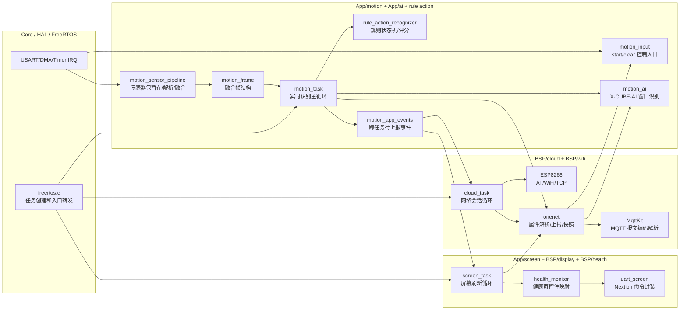

## 2. FreeRTOS 任务分工

`Core/Src/freertos.c` 现在只负责创建任务和把任务入口转发到应用层 runner。

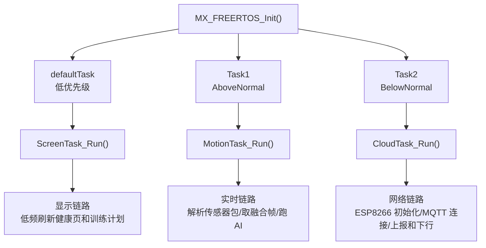

关键点：

- `MotionTask_Run()` 是实时链路核心，优先级最高。
- `CloudTask_Run()` 不直接跑识别，只消费 `motion_app_events` 中的待上报事件。
- `ScreenTask_Run()` 只读快照和刷新屏幕，不解析 MQTT payload。
- `APP_UART7_IS_SCREEN && APP_SCREEN_ISOLATION_ENABLED` 打开时，`Task1/Task2` 会被隔离掉，只保留屏幕调试链路。

## 3. 运动识别数据流

### 3.1 从传感器到融合帧

USART1 和 USART3 分别接上臂、前臂姿态节点。中断只做 DMA 长度计算和原始包暂存，不在 ISR 中做字符串解析。

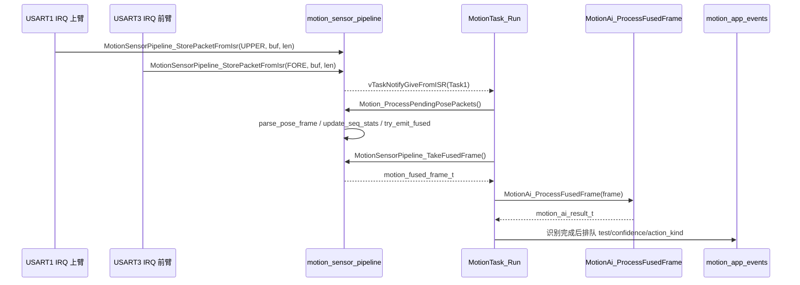

实现要点：

- `MotionSensorPipeline_StorePacketFromIsr()`：ISR 边界函数，只复制原始包、记录时间戳、通知运动任务。
- `Motion_ProcessPendingPosePackets()`：任务态处理暂存包，解析 CSV 字段，更新序号丢包统计。
- `try_emit_fused()`：当上臂和前臂时间差在阈值内，生成一帧 `motion_fused_frame_t`。
- `MotionSensorPipeline_TakeFusedFrame()`：运动任务唯一取融合帧入口，隐藏 pipeline 内部状态。
- `motion_fused_frame_t`：AI、规则识别、调试输出统一使用的融合帧结构。

### 3.2 运动任务内部流程

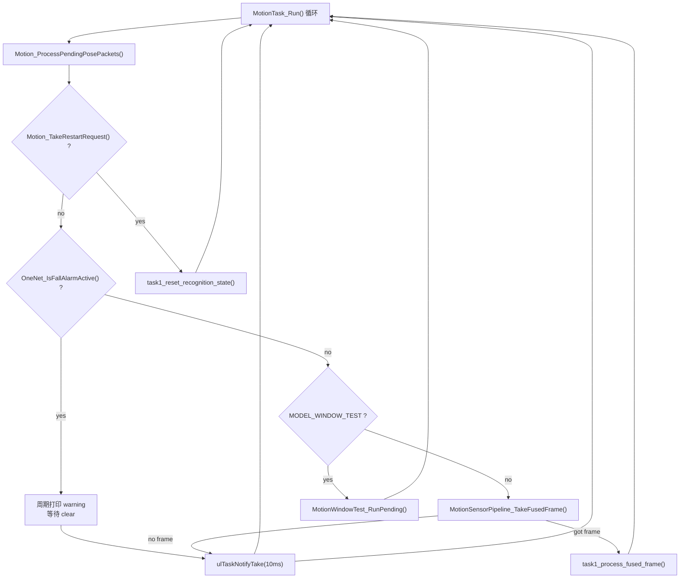

`task1_process_fused_frame()` 根据 `g_motion_output_mode` 分发：

- `MOTION_OUTPUT_MODE_CAPTURE`：只输出采集 CSV。
- `MOTION_OUTPUT_MODE_RECOGNITION_VERBOSE`：跑 AI，并输出详细识别 CSV。
- `MOTION_OUTPUT_MODE_SINGLE_ONCE`：等待 start 后跑一次，完成后排队云端上报。
- `MOTION_OUTPUT_MODE_BIO_AI_BRIEF`：输出生理数据和简要 AI 结果。
- `MOTION_OUTPUT_MODE_MODEL_WINDOW_TEST`：不取实时帧，运行固定窗口测试。
- `MOTION_OUTPUT_MODE_RULE_DEBUG`：走规则识别状态机，输出规则调试 CSV。

## 4. AI 与规则识别链路

### 4.1 AI 状态机

`motion_ai` 接收融合帧后，先建立静态基线，再填充窗口，最后按步长运行 X-CUBE-AI 推理。

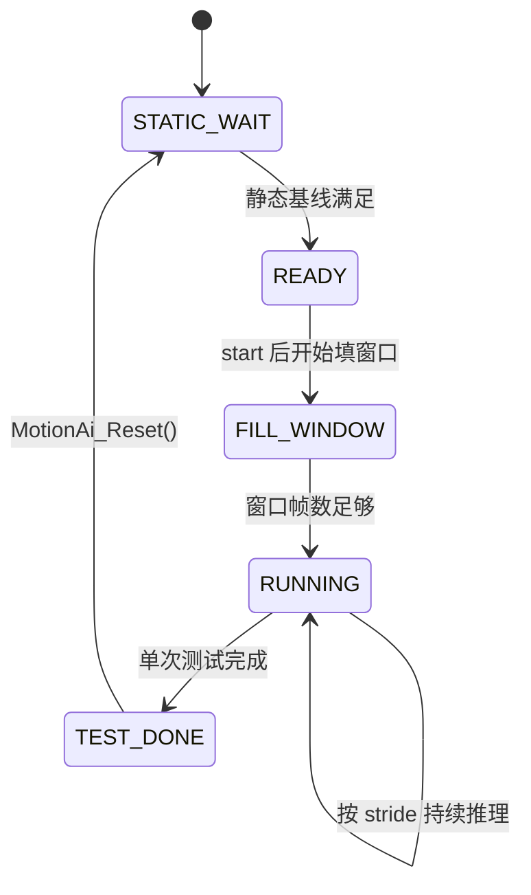

关键函数：

| 函数 | 作用 | 主要调用方 |
| --- | --- | --- |
| `MotionAi_Init()` | 初始化 AI 上下文和结果缓存 | `MotionTask_Run()` |
| `MotionAi_Reset()` | 清空基线、窗口、平滑结果 | start、模式切换、跌倒告警切换 |
| `MotionAi_ProcessFusedFrame()` | 消费一帧融合数据，推进 AI 状态机 | `task1_process_fused_frame()` |
| `MotionAi_SetSingleTestEnabled()` | 控制是否单次完成后停在 `TEST_DONE` | `motion_task` |
| `MotionAi_SetDemoOverride()` | 云端 `test` 下发后覆盖演示结果 | `onenet` |
| `MotionAi_SetLocalFallTriggerEnabled()` | 控制本地跌倒检测是否主动触发云端告警 | `onenet` |

### 4.2 规则识别状态机

规则识别主要用于调试和动作质量评分，不替代 AI 主识别链路。

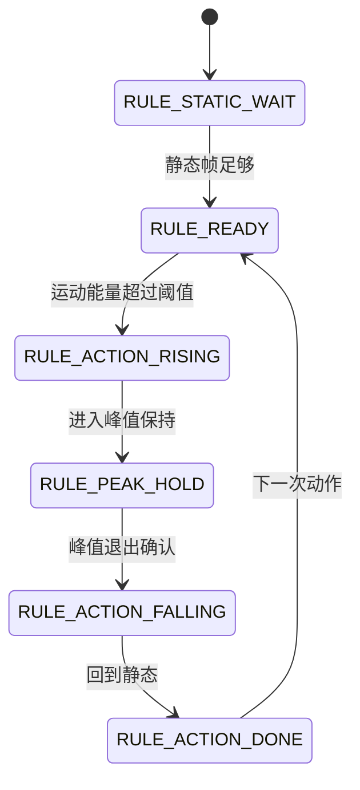

关键函数：

| 函数 | 作用 | 主要调用方 |
| --- | --- | --- |
| `RuleEngine_Init()` | 初始化规则状态机和默认模板 | `MotionTask_Run()` |
| `RuleEngine_ProcessRaw()` | 输入 6 轴姿态，计算能量并推进规则状态 | `task1_process_fused_frame()` |
| `Rule_RecognizeAction()` | 根据动作会话匹配模板 | `task1_output_rule_debug()` |
| `Rule_EvaluateResult()` | 汇总完整度、幅度、峰值保持评分 | 规则状态机内部 |
| `RuleEngine_GetResult()` | 读取最近一次规则识别结果 | 调试输出 |
| `RuleEngine_GetSession()` | 读取当前动作会话统计 | 调试输出 |

## 5. start / clear 控制流

本地 UART4 和云端 OneNet 都走统一的 `motion_input` 控制入口。

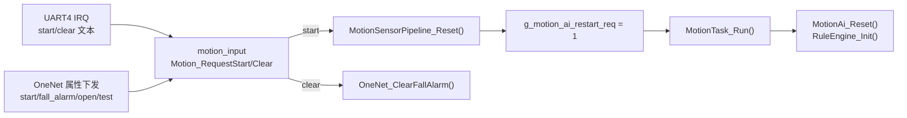

关键函数：

| 函数 | 作用 | 说明 |
| --- | --- | --- |
| `motion_uart4_handle_command()` | 解析 UART4 本地命令 | 只识别 `start` 和 `clear` |
| `Motion_RequestStart()` | 请求开始识别 | 清 pipeline，单次模式置位 `g_motion_single_armed`，再置位重启请求 |
| `Motion_RequestClear()` | 清除跌倒告警 | 当前实现转到 `OneNet_ClearFallAlarm()` |
| `Motion_TakeRestartRequest()` | 运动任务取走 start 请求 | 只有运动任务真正重置 AI/规则状态 |
| `task1_reset_recognition_state()` | 合并 AI + RuleEngine + 输出状态复位 | 防止多处分散复位导致状态不一致 |

## 6. 云端 OneNet 流程

### 6.1 网络任务主循环

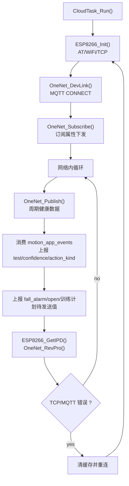

关键函数：

| 函数 | 作用 | 主要调用方 |
| --- | --- | --- |
| `ESP8266_Init()` | 配置 AT、连接 WiFi、建立 TCP | `CloudTask_Run()` |
| `ESP8266_SendData()` | 通过 TCP 发送 MQTT 原始字节 | `MqttKit` / `onenet` 间接调用 |
| `ESP8266_GetIPD()` | 从 ESP8266 缓存中提取下行 payload | `CloudTask_Run()` |
| `OneNet_DevLink()` | 构造并发送 MQTT CONNECT | `CloudTask_Run()` |
| `OneNet_Subscribe()` | 订阅属性下发 topic | `CloudTask_Run()` |
| `OneNet_Publish()` | 周期上报固定健康数据 | `CloudTask_Run()` |
| `OneNet_RevPro()` | 解析 MQTT 下行包并分发属性设置 | `CloudTask_Run()` |

### 6.2 云端属性下发到应用控制

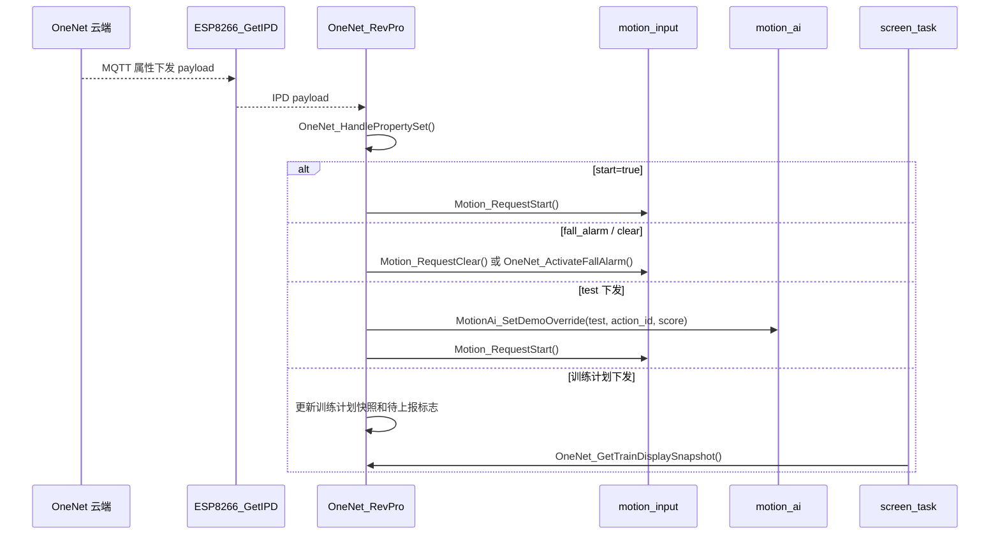

OneNet 相关关键数据：

- `ONENET_DP_TEST_KEY`：云端下发测试编号，解析后用于 AI 演示覆盖和后续上报。
- `ONENET_DP_START_KEY`：云端触发一次运动识别。
- `ONENET_DP_FALL_ALARM_KEY`：云端或本地控制跌倒告警状态。
- `ONENET_DP_OPEN_KEY`：门状态属性，当前由 OneNet 内部排队上报。
- `*_COUNT_KEY`：训练计划计数，屏幕任务通过快照读取。

## 7. 识别结果上报与屏幕联动

单次识别完成后，运动任务不直接阻塞发送 MQTT，而是把结果写入 `motion_app_events`，由网络任务低优先级发送。

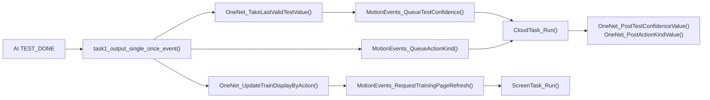

关键函数：

| 函数 | 作用 | 主要调用方 |
| --- | --- | --- |
| `MotionEvents_QueueTestConfidence()` | 缓存待上报的 `test + confidence` | 运动任务 |
| `MotionEvents_PeekTestConfidence()` | 网络任务读取待上报值 | 网络任务 |
| `MotionEvents_ClearTestConfidenceIfCurrent()` | 上报成功后清除当前值 | 网络任务 |
| `MotionEvents_EncodeActionKind()` | 给 action_kind 加交替低位，避免云端过滤重复值 | 运动任务 |
| `MotionEvents_RequestTrainingPageRefresh()` | 识别有效动作后通知屏幕强刷训练页 | 运动任务 |
| `MotionEvents_TakeTrainingPageRefresh()` | 屏幕任务取走刷新请求 | 屏幕任务 |

## 8. 屏幕刷新流程

屏幕显示分两层：

- `screen_task` 决定什么时候刷新、用什么数据刷新。
- `health_monitor` 知道健康页控件名和页面结构。
- `uart_screen` 只负责生成和发送 Nextion 指令。

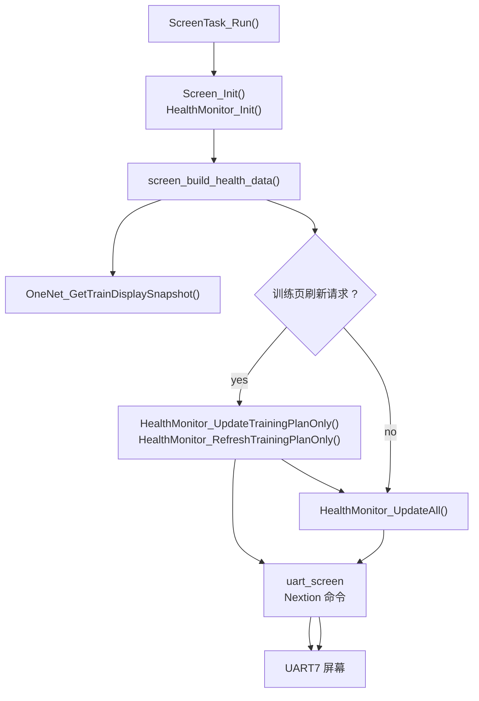

关键函数：

| 函数 | 作用 | 主要调用方 |
| --- | --- | --- |
| `screen_build_health_data()` | 拼装屏幕需要的时间、天气、健康和训练数据 | `ScreenTask_Run()` |
| `HealthMonitor_UpdateAll()` | 更新健康页全部控件 | `ScreenTask_Run()` |
| `HealthMonitor_UpdateTrainingPlanOnly()` | 只更新训练计划数字 | 强制刷新训练页时 |
| `HealthMonitor_RefreshTrainingPlanOnly()` | 对 Nextion 控件执行 `ref` | 页面切换后处理显示残留 |
| `Screen_Nextion_SetText()` | 设置文本控件 | `health_monitor` |
| `Screen_Nextion_SetValue()` | 设置数值控件 | `health_monitor` |
| `Screen_Nextion_SetPicture()` | 设置图片控件 | `health_monitor` |

## 9. 文件和模块速查

| 模块 | 主要文件 | 当前职责 |
| --- | --- | --- |
| FreeRTOS 入口 | `Core/Src/freertos.c` | 创建任务、启动定时器、转发三个任务入口 |
| 中断边界 | `Core/Src/stm32h7xx_it.c` | USART1/3/4 IRQ，DMA 长度计算，调用 pipeline 或 motion_input |
| 串口初始化 | `Core/Src/usart.c` | UART/DMA 初始化，USART6 DMA idle 回调喂给 ESP8266 |
| 姿态融合 | `App/motion/motion_sensor_pipeline.*` | 原始包暂存、解析、时间对齐、融合帧生成 |
| 融合帧结构 | `App/motion/motion_frame.h` | 定义 `motion_fused_frame_t` 和生理数据快照 |
| 运动控制入口 | `App/motion/motion_input.*` | 统一处理 start/clear，隐藏 AI 重启请求 |
| 运动任务 | `App/motion/motion_task.*` | 实时识别循环、输出模式分发、上报事件排队 |
| 跨任务事件 | `App/motion/motion_app_events.*` | 在运动、网络、屏幕任务之间传递轻量事件 |
| AI 识别 | `App/ai/motion_ai.*` | 基线、窗口、X-CUBE-AI 推理、跌倒本地检测 |
| 规则识别 | `App/rule action/rule_action_recognizer.*` | 规则状态机、动作模板匹配、动作评分 |
| 网络任务 | `App/cloud/cloud_task.*` | ESP8266/MQTT 会话循环、定时上报、下行处理 |
| OneNet 协议 | `BSP/cloud/onenet.*` | MQTT topic/payload、属性解析、上报队列、训练计划快照 |
| MQTT 编解码 | `BSP/cloud/MqttKit.*` | MQTT 报文打包和解析工具 |
| ESP8266 | `BSP/wifi/ESP8266.*` | AT 命令、WiFi/TCP、+IPD 缓存解析 |
| 屏幕任务 | `App/screen/screen_task.*` | 周期构造健康数据，刷新健康页和训练页 |
| 健康页映射 | `BSP/health/health_monitor.*` | 健康页控件和训练计划控件更新 |
| Nextion 底层 | `BSP/display/uart_screen.*` | Nextion 指令字符串和 UART 发送 |

## 10. 阅读代码建议顺序

建议按这个顺序看代码：

1. `Core/Src/freertos.c`：先确认系统启动后有哪些任务。
2. `App/motion/motion_task.c`：理解实时运动识别主循环。
3. `App/motion/motion_sensor_pipeline.c`：理解传感器数据如何变成融合帧。
4. `App/ai/motion_ai.c`：理解融合帧如何进入 AI 状态机。
5. `BSP/cloud/onenet.c` + `App/cloud/cloud_task.c`：理解云端下发和上报。
6. `App/screen/screen_task.c` + `BSP/health/health_monitor.c`：理解屏幕数据来源和控件更新。
7. `Core/Src/stm32h7xx_it.c`：最后看中断边界，确认 ISR 只做轻量转发。

## 11. 当前仍保留的历史痕迹

以下内容没有删除，只作为后续可清理候选：

- `Core/Inc/Backup/*` 和 `Core/Src/Backup/*`：CubeMX 或历史备份文件。
- `Core/Src/stm32h7xx_it.c` 中的 `Calibrate_*` 变量、`extract_ypr()` 和禁用的旧校准逻辑。
- 部分旧中文注释存在编码显示异常，建议后续只在确认不影响逻辑时再统一清理。

## 12. 当前模块边界原则

- ISR 只做边界工作：算长度、存包、转发命令。
- `freertos.c` 只做任务创建，不放业务主循环。
- pipeline 只负责传感器包到融合帧，不直接调用 AI 或云端。
- 运动任务可以调用 AI、规则识别和事件队列，但不阻塞发送 MQTT。
- 网络任务负责连接和上报，不直接处理传感器实时数据。
- 屏幕任务只读取快照，不理解 MQTT payload 细节。

